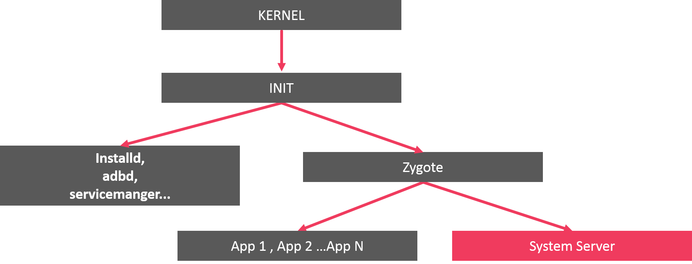

# adb shell

ADB (Android Debug Bridge) este un instrument de linie de comandă care permite interacțiunea cu un dispozitiv Android pentru a efectua diverse acțiuni de dezvoltare și depanare. adb are mai multe subcomenzi, dintre care "shell" permite deschiderea unei console direct pe dispozitivul android. Comanda se poate rula pe dispozitive reale sau pe dispozitive emulate. 

Pentru a vedea dispozitivele conectate: 

```sh
adb devices
List of devices attached
ZY224F8Q2G      device
emulator-5554   device
```

Rularea comenzii în cazul în care există mai multe dispozitive se face cu specificarea dispozitivului: 

```sh
adb -s emulator-5554 shell
```

# Comenzi în shell

O parte din comenzi sunt comenzile obișnuite Linux. Shell-ul disponibil este o versiune redusă a sh: 

```sh
 echo $SHELL
/system/bin/sh
```

## ls /

```
emu64xa:/ $ ls
acct        cache        debug_ramdisk    linkerconfig  odm_dlkm     sdcard                  system_dlkm
adb_keys    config       dev              lost+found    oem          second_stage_resources  system_ext
apex        d            etc              metadata      postinstall  storage                 vendor
bin         data         init             mnt           proc         sys                     vendor_dlkm
bugreports  data_mirror  init.environ.rc  odm           product      system
```

## ls /etc

```
NOTICE.xml.gz        displayconfig                 ld.config.arm64.txt        res
audio_effects.xml    event-log-tags                libnfc-nci.conf            sanitizer.libraries.txt
binfmt_misc          fonts.xml                     linker.config.pb           seccomp_policy
boot-image.bprof     fs_config_dirs                media_profiles_V1_0.dtd    security
boot-image.prof      fs_config_files               mke2fs.conf                selinux
bpf                  fstab.postinstall             mkshrc                     sysconfig
cgroups.json         ftrace_synthetic_events.conf  motion_predictor_model.fb  task_profiles
classpaths           gps_debug.conf                passwd                     task_profiles.json
compatconfig         group                         permissions                ueventd.rc
cpuinfo.arm.txt      hosts                         preloaded-classes          vintf
cpuinfo.arm64.txt    init                          protolog.conf.json.gz      vndkcorevariant.libraries.txt
dirty-image-objects  ld.config.arm.txt             public.libraries.txt       xtables.lock
```

## ls /etc/init

```
android.hidl.allocator@1.0-service.rc  dumpstate.rc           logd.rc             recovery-persist.rc
android.system.suspend-service.rc      flags_health_check.rc  logtagd.rc          recovery-refresh.rc
apexd.rc                               gatekeeperd.rc         lpdumpd.rc          rss_hwm_reset.rc
atrace.rc                              gpuservice.rc          mdnsd.rc            servicemanager.rc
atrace_userdebug.rc                    gsid.rc                mediaextractor.rc   simpleperf.rc
audioserver.rc                         heapprofd.rc           mediametrics.rc     snapuserd.rc
blank_screen.rc                        hw                     mediaserver.rc      storaged.rc
bootanim.rc                            hwservicemanager.rc    mtectrl.rc          surfaceflinger.rc
bootstat-debug.rc                      idmap2d.rc             mtpd.rc             tombstoned.rc
bootstat.rc                            incidentd.rc           ndk_translation.rc  traced_perf.rc
bpfloader.rc                           init-debug.rc          netd.rc             uncrypt.rc
cameraserver.rc                        installd.rc            odsign.rc           update_engine.rc
clean_scratch_files.rc                 keystore2.rc           otapreopt.rc        update_verifier.rc
cppreopts.rc                           llkd-debuggable.rc     perfetto.rc         usbd.rc
credstore.rc                           llkd.rc                prng_seeder.rc      vold.rc
dmesgd.rc                              lmkd.rc                profcollectd.rc     wifi.rc
drmserver.rc                           logcatd.rc             racoon.rc           wificond.rc
```

## cat /proc/cpuinfo

Informații despre procesor pe un dispozitiv emulat

```
processor       : 0
vendor_id       : GenuineIntel
cpu family      : 6
model           : 6
model name      : Android virtual processor
stepping        : 3
microcode       : 0x1
cpu MHz         : 0.001
cache size      : 16384 KB
physical id     : 0
siblings        : 4
core id         : 0
cpu cores       : 4
apicid          : 0
initial apicid  : 0
fpu             : yes
fpu_exception   : yes
cpuid level     : 28
wp              : yes
flags           : fpu de pse tsc msr pae mce cx8 apic sep mtrr pge mca cmov pse36 clflush mmx fxsr sse sse2 ht syscall nx lm rep_good nopl xtopology cpuid tsc_known_freq pni ssse3 cx16 sse4_1 sse4_2 x2apic popcnt tsc_deadline_timer hypervisor lahf_lm abm cpuid_fault pti
bugs            : cpu_meltdown spectre_v1 spectre_v2 spec_store_bypass l1tf mds swapgs itlb_multihit mmio_unknown
bogomips        : 5376.02
clflush size    : 64
cache_alignment : 64
address sizes   : 40 bits physical, 48 bits virtual
power management:

.....
```

Informnații despre procesor pe un dispozitiv real (Motorola ZPlay)

```sh
processor       : 0
model name      : ARMv7 Processor rev 4 (v7l)
BogoMIPS        : 38.00
Features        : half thumb fastmult vfp edsp neon vfpv3 tls vfpv4 idiva idivt vfpd32 lpae evtstrm aes pmull sha1 sha2 crc32
CPU implementer : 0x41
CPU architecture: 7
CPU variant     : 0x0
CPU part        : 0xd03
CPU revision    : 4

processor       : 1
model name      : ARMv7 Processor rev 4 (v7l)
BogoMIPS        : 38.00
Features        : half thumb fastmult vfp edsp neon vfpv3 tls vfpv4 idiva idivt vfpd32 lpae evtstrm aes pmull sha1 sha2 crc32
CPU implementer : 0x41
CPU architecture: 7
CPU variant     : 0x0
CPU part        : 0xd03
CPU revision    : 4

processor       : 2
model name      : ARMv7 Processor rev 4 (v7l)
BogoMIPS        : 38.00
Features        : half thumb fastmult vfp edsp neon vfpv3 tls vfpv4 idiva idivt vfpd32 lpae evtstrm aes pmull sha1 sha2 crc32
CPU implementer : 0x41
CPU architecture: 7
CPU variant     : 0x0
CPU part        : 0xd03
CPU revision    : 4

processor       : 3
model name      : ARMv7 Processor rev 4 (v7l)
BogoMIPS        : 38.00
Features        : half thumb fastmult vfp edsp neon vfpv3 tls vfpv4 idiva idivt vfpd32 lpae evtstrm aes pmull sha1 sha2 crc32
CPU implementer : 0x41
CPU architecture: 7
CPU variant     : 0x0
CPU part        : 0xd03
CPU revision    : 4

processor       : 4
model name      : ARMv7 Processor rev 4 (v7l)
BogoMIPS        : 38.00
Features        : half thumb fastmult vfp edsp neon vfpv3 tls vfpv4 idiva idivt vfpd32 lpae evtstrm aes pmull sha1 sha2 crc32
CPU implementer : 0x41
CPU architecture: 7
CPU variant     : 0x0
CPU part        : 0xd03
CPU revision    : 4

processor       : 5
model name      : ARMv7 Processor rev 4 (v7l)
BogoMIPS        : 38.00
Features        : half thumb fastmult vfp edsp neon vfpv3 tls vfpv4 idiva idivt vfpd32 lpae evtstrm aes pmull sha1 sha2 crc32
CPU implementer : 0x41
CPU architecture: 7
CPU variant     : 0x0
CPU part        : 0xd03
CPU revision    : 4

processor       : 6
model name      : ARMv7 Processor rev 4 (v7l)
BogoMIPS        : 38.00
Features        : half thumb fastmult vfp edsp neon vfpv3 tls vfpv4 idiva idivt vfpd32 lpae evtstrm aes pmull sha1 sha2 crc32
CPU implementer : 0x41
CPU architecture: 7
CPU variant     : 0x0
CPU part        : 0xd03
CPU revision    : 4

processor       : 7
model name      : ARMv7 Processor rev 4 (v7l)
BogoMIPS        : 38.00
Features        : half thumb fastmult vfp edsp neon vfpv3 tls vfpv4 idiva idivt vfpd32 lpae evtstrm aes pmull sha1 sha2 crc32
CPU implementer : 0x41
CPU architecture: 7
CPU variant     : 0x0
CPU part        : 0xd03
CPU revision    : 4

Hardware        : Qualcomm Technologies, Inc MSM8953
Revision        : 8400
Serial          : b75b11fe00000000
Processor       : ARMv7 Processor rev 4 (v7l)
Device          : albus
Radio           : EMEA_APAC
MSM Hardware    : MSM8953
```

## ps -A

```
...
root            96     1   10857084   1600 0                   0 S init
root            97     1   10869604   3112 0                   0 S ueventd
prng_seeder    152     1   10882700   2816 0                   0 S prng_seeder
logd           160     1   10870160   5512 0                   0 S logd
lmkd           162     1   10876192   2908 0                   0 S lmkd
system         163     1   10854352   2688 0                   0 S servicemanager
system         164     1   10868464   1824 0                   0 S hwservicemanager
root           178     1   10839704   4304 0                   0 S vold
tombstoned     219     1   10769792   2452 0                   0 S tombstoned
root           354     1   10903128   2080 0                   0 S dhcpclient
statsd         367     1   10821432   3380 0                   0 S statsd
root           368     1   11004196   4756 0                   0 S netd
root           369     1   14305624  83804 0                   0 S zygote64
system         373     1   10870036   1384 0                   0 S android.hidl.allocator@1.0-service
audioserver    374     1   10883588   4024 0                   0 S android.hardware.audio.service
hsm            375     1   10862572   1432 0                   0 S android.hardware.authsecret-service.example
system         376     1   10879932   3180 0                   0 S android.hardware.camera.provider.ranchu
system         377     1   10898580   3200 0                   0 S android.hardware.camera.provider@2.7-service-google
system         378     1   10858068   1860 0                   0 S android.hardware.gatekeeper@1.0-service.software
system         379     1   10914736   3580 0                   0 S android.hardware.graphics.allocator@3.0-service.ranchu
system         380     1   10862648   3508 0                   0 S android.hardware.health-service.example
media          381     1   10885008   2712 0                   0 S android.hardware.media.c2@1.0-service-goldfish
system         382     1   10883296   3444 0                   0 S android.hardware.neuralnetworks-service-sample-all
system         383     1   10809336   3076 0                   0 S android.hardware.neuralnetworks-service-sample-limited
system         385     1   10937196   2460 0                   0 S android.hardware.neuralnetworks-shim-service-sample
system         386     1   10821896   3344 0                   0 S android.hardware.sensors-service.multihal
system         388     1   10844340   2328 0                   0 S android.hardware.thermal@2.0-service.mock
system         389     1   10808928   3252 0                   0 S android.hardware.usb-service.example
wifi           390     1   10817004   2932 0                   0 S android.hardware.wifi-service
bluetooth      391     1   10894812   3164 0                   0 S android.hardware.bluetooth-service.default
media          392     1   10791236   3104 0                   0 S android.hardware.cas-service.example
context_hub    393     1   10881068   2984 0                   0 S android.hardware.contexthub-service.example
nobody         394     1   10772432   2812 0                   0 S android.hardware.biometrics.face-service.example
system         395     1   11066196   4668 0                   0 S android.hardware.graphics.composer3-service.ranchu
nobody         396     1   10866676   2516 0                   0 S android.hardware.identity-service.example
nobody         397     1   10914164   2800 0                   0 S android.hardware.lights-service.example
root           398   368   10818728   2548 0                   0 S iptables-restore
root           399   368   10798248   2260 0                   0 S ip6tables-restore
nobody         401     1   10844560   2800 0                   0 S android.hardware.power-service.example
system         404     1   10844208   2956 0                   0 S android.hardware.power.stats-service.example
system         406     1   10817656   2932 0                   0 S android.hardware.rebootescrow-service.default
nobody         407     1   10799560   2816 0                   0 S android.hardware.vibrator-service.example
media          408     1   10837664   2948 0                   0 S android.hardware.drm-service.widevine
audioserver    409     1   11168860   9764 0                   0 S audioserver
credstore      412     1   10800752   2476 0                   0 S credstore
gpu_service    413     1   10821440   2892 0                   0 S gpuservice
system         419     1   11296648  12656 0                   0 S surfaceflinger
shell          445     1   10845876   6308 0                   0 R adbd
drm            450     1   10942340   3028 0                   0 S drmserver
mdnsr          460     1   10786016   2356 0                   0 S mdnsd
nobody         464     1   10803324   1800 0                   0 S traced_probes
nobody         466     1   10774144   2036 0                   0 S traced
logd           470     1   10847900   2788 0                   0 S logcat
bluetooth      471     1   10880972   1080 0                   0 S bt_vhci_forwarder
cameraserver   475     1   11293924   4736 0                   0 S cameraserver
incidentd      483     1   10886220   2868 0                   0 S incidentd
root           484     1   10884868   2800 0                   0 S installd
mediaex        485     1   11178892   7104 0                   0 S media.extractor
media          486     1   10810416   3024 0                   0 S media.metrics
media          487     1   11430612   9088 0                   0 S mediaserver
root           489     1   10901628   3528 0                   0 S storaged
wifi           490     1   10812596   3468 0                   0 S wificond
radio          491     1   10972512   3568 0                   0 S libgoldfish-rild
mediacodec     492     1   11323272   5496 0                   0 S media.swcodec
system         498     1   10864088   3180 0                   0 S gatekeeperd
system         558   369   15883728 244440 0                   0 S system_server
wifi           759     1   10849076   3320 0                   0 S wpa_supplicant
gps            820     1   10820636   2608 0                   0 S android.hardware.gnss-service.ranchu
webview_zyg+   837   369   14248096  48296 0                   0 S webview_zygote
network_sta+   861   369   13753724  83056 0                   0 S com.android.networkstack.process
secure_elem+   928   369   13733848  61852 0                   0 S com.android.se
radio          952   369   13785516  93144 0                   0 S com.android.phone
system         997     1   10788572   3144 0                   0 S android.hardware.biometrics.fingerprint-service.ranchu
u0_a189       1012   369   13733712  61344 0                   0 S com.google.android.ext.services
u0_a169       1080   369   13889648 120568 0                   0 S com.google.android.apps.nexuslauncher
u0_a147       1268   369   13948140 114700 0                   0 S com.google.android.inputmethod.latin
u0_a188       1321   369   13779460  80880 0                   0 S com.google.android.providers.media.module
u0_a125       1361   369   14155544 116996 0                   0 S com.google.android.as
u0_a85        1379   369   13738128  72032 0                   0 S android.process.acore
u0_a132       1406   369   14622204 105336 0                   0 S com.google.android.googlequicksearchbox:interactor
u0_a131       1440   369   13873324  91036 0                   0 S com.google.android.apps.messaging:rcs
system        1446   369   13732476  60288 0                   0 S com.android.emulator.multidisplay
u0_a131       1490   369   14066072 134988 0                   0 S com.google.android.apps.messaging
u0_a128       1539   369   14091028 186036 0                   0 S com.google.android.gms.persistent
u0_a132       1605   369   31670440 208136 0                   0 S com.google.android.googlequicksearchbox:search
u0_a120       1631   369   13737320  64892 0                   0 S com.google.android.as.oss
u0_a128       1823   369   14155648 169380 0                   0 S com.google.android.gms
u0_a128       1866   369   13749216  65544 0                   0 S com.google.process.gservices
u0_a128       2196   369   13740904  63412 0                   0 S com.google.process.gapps
u0_a171       2237   369   13765008  77972 0                   0 S com.google.android.permissioncontroller
u0_a154       2854   369   13942056 112512 0                   0 S com.google.android.contacts
u0_a130       3003   369   13948380 115252 0                   0 S com.google.android.dialer
u0_a128       3039   369   14061236 122216 0                   0 S com.google.android.gms.unstable
u0_a142       3069   369   14737972 109456 0                   0 S com.google.android.gm
u0_a139       3238   369   18856408 109912 0                   0 S com.google.android.youtube
u0_a118       3933   369   14010492 161592 0                   0 S com.google.android.settings.intelligence
u0_a167       4137   369   14131564 201384 0                   0 S com.android.systemui
u0_a128       4190   369   13883884 117316 0                   0 S com.google.android.gms.ui
system        4679   369   13878124 111848 0                   0 S com.android.settings
shell         5014   445   10779264   3500 sigsuspend          0 S sh
root          5018     2          0      0 0                   0 I [kworker/1:0-virtio_vsock]
u0_a150       5045   369   30714248  99200 0                   0 S com.android.chrome
....

```

## getprop

În Android, driverul de proprietăți de sistem (System Properties Driver) este un mecanism utilizat pentru a stoca și accesa variabile de configurare la nivel de sistem. Aceste proprietăți sunt esențiale pentru configurarea și funcționarea dispozitivului și sunt accesibile prin intermediul interfeței android.os.SystemProperties în aplicațiile Android sau prin comanda ADB pentru debugging.

```
[apex.all.ready]: [true]
[bluetooth.device.class_of_device]: [90,2,12]
[bluetooth.profile.a2dp.source.enabled]: [true]
[bluetooth.profile.avrcp.target.enabled]: [true]
[bluetooth.profile.bap.broadcast.assist.enabled]: [false]
[bluetooth.profile.bap.unicast.client.enabled]: [false]
[bluetooth.profile.bas.client.enabled]: [false]
[bluetooth.profile.ccp.server.enabled]: [false]
[bluetooth.profile.csip.set_coordinator.enabled]: [false]
[bluetooth.profile.gatt.enabled]: [true]
[bluetooth.profile.hap.client.enabled]: [false]
[bluetooth.profile.hfp.ag.enabled]: [true]
[bluetooth.profile.hid.device.enabled]: [true]
[bluetooth.profile.hid.host.enabled]: [true]
[bluetooth.profile.map.server.enabled]: [true]
[bluetooth.profile.mcp.server.enabled]: [true]
[bluetooth.profile.opp.enabled]: [true]
[bluetooth.profile.pan.nap.enabled]: [true]
[bluetooth.profile.pan.panu.enabled]: [true]
[bluetooth.profile.pbap.server.enabled]: [true]
[bluetooth.profile.vcp.controller.enabled]: [false]
[bootreceiver.enable]: [1]
[build.version.extensions.ad_services]: [7]
[build.version.extensions.r]: [7]
[build.version.extensions.s]: [7]
[build.version.extensions.t]: [7]
[build.version.extensions.u]: [7]
[cache_key.bluetooth.bluetooth_adapter_get_connection_state]: [5924177414518523826]
[cache_key.bluetooth.bluetooth_adapter_get_profile_connection_state]: [5924177414518523824]
[cache_key.bluetooth.bluetooth_adapter_get_state]: [5924177414518523830]
[cache_key.bluetooth.bluetooth_adapter_is_offloaded_filtering_supported]: [5924177414518523825]
[cache_key.bluetooth.bluetooth_device_get_bond_state]: [5924177414518523827]
[cache_key.bluetooth.bluetooth_map_get_connection_state]: [5924177414518523828]
[cache_key.bluetooth.bluetooth_sap_get_connection_state]: [5924177414518523829]
[cache_key.display_info]: [-2023918921010078701]
[cache_key.get_packages_for_uid]: [-2023918921010078685]
[cache_key.has_system_feature]: [-2023918921010078923]
[cache_key.is_compat_change_enabled]: [-2023918921010078684]
[cache_key.is_interactive]: [-2023918921010078936]
[cache_key.is_power_save_mode]: [-2023918921010078682]
[cache_key.is_user_unlocked]: [-2023918921010078867]
[cache_key.location_enabled]: [-2023918921010078910]
[cache_key.package_info]: [-2023918921010078683]
[cache_key.system_server.accounts_data]: [-2023918921010078854]
[cache_key.system_server.device_policy_manager_caches]: [-2023918921010078912]
[cache_key.system_server.get_credential_type]: [-2023918921010078909]
[cache_key.telephony.phone_account_to_subid]: [9104381100125818337]
[cache_key.telephony.subscription_manager_service]: [9104381100125818330]
[camera.enable_landscape_to_portrait]: [true]
[dalvik.vm.appimageformat]: [lz4]
[dalvik.vm.dex2oat-Xms]: [64m]
[dalvik.vm.dex2oat-Xmx]: [512m]
[dalvik.vm.dex2oat-max-image-block-size]: [524288]
[dalvik.vm.dex2oat-minidebuginfo]: [true]
[dalvik.vm.dex2oat-resolve-startup-strings]: [true]
[dalvik.vm.dex2oat64.enabled]: [true]
[dalvik.vm.dexopt.secondary]: [true]
[dalvik.vm.dexopt.thermal-cutoff]: [2]
[dalvik.vm.heapgrowthlimit]: [192m]
[dalvik.vm.heapmaxfree]: [8m]
[dalvik.vm.heapminfree]: [512k]
[dalvik.vm.heapsize]: [512m]
[dalvik.vm.heapstartsize]: [8m]
[dalvik.vm.heaptargetutilization]: [0.75]
[dalvik.vm.image-dex2oat-Xms]: [64m]
[dalvik.vm.image-dex2oat-Xmx]: [64m]
[dalvik.vm.isa.x86_64.features]: [default]
[dalvik.vm.isa.x86_64.variant]: [x86_64]
[dalvik.vm.lockprof.threshold]: [500]
[dalvik.vm.madvise.artfile.size]: [4294967295]
[dalvik.vm.madvise.odexfile.size]: [104857600]
[dalvik.vm.madvise.vdexfile.size]: [104857600]
[dalvik.vm.minidebuginfo]: [true]
[dalvik.vm.usap_pool_enabled]: [false]
[dalvik.vm.usap_pool_refill_delay_ms]: [3000]
[dalvik.vm.usap_pool_size_max]: [3]
[dalvik.vm.usap_pool_size_min]: [1]
[dalvik.vm.usap_refill_threshold]: [1]
[dalvik.vm.useartservice]: [true]
[dalvik.vm.usejit]: [true]
[debug.atrace.tags.enableflags]: [0]
[debug.force_rtl]: [false]
[debug.hwui.renderer]: [skiagl]
[debug.sf.vsync_reactor_ignore_present_fences]: [true]
[debug.stagefright.c2inputsurface]: [-1]
[debug.stagefright.ccodec]: [4]
[debug.tracing.battery_stats.audio]: [0]
[debug.tracing.battery_stats.brightness]: [2]
[debug.tracing.battery_stats.data_conn]: [13]
[debug.tracing.battery_stats.mobile_radio]: [0]
[debug.tracing.battery_stats.phone_scanning]: [0]
[debug.tracing.battery_stats.phone_signal_strength]: [2]
[debug.tracing.battery_stats.phone_state]: [0]
[debug.tracing.battery_stats.running]: [1]
[debug.tracing.battery_stats.screen]: [1]
[debug.tracing.battery_stats.sensor]: [1]
[debug.tracing.battery_stats.wake_lock]: [1]
[debug.tracing.battery_stats.wifi]: [1]
[debug.tracing.battery_stats.wifi_multicast]: [0]
[debug.tracing.battery_stats.wifi_radio]: [0]
[debug.tracing.battery_stats.wifi_scan]: [0]
[debug.tracing.battery_stats.wifi_signal_strength]: [4]
[debug.tracing.battery_stats.wifi_suppl]: [10]
[debug.tracing.battery_status]: [4]
[debug.tracing.device_state]: [0:DEFAULT]
[debug.tracing.mcc]: [310]
[debug.tracing.mnc]: [260]
[debug.tracing.plug_type]: [0]
[debug.tracing.screen_brightness]: [0.39763778]
[dev.bootcomplete]: [1]
[dev.mnt.blk.metadata]: [vdd1]
[dev.mnt.blk.product]: [vda2]
[dev.mnt.blk.root]: [vda2]
[dev.mnt.blk.system_dlkm]: [vda2]
[dev.mnt.blk.system_ext]: [vda2]
[dev.mnt.blk.vendor]: [vda2]
[dev.mnt.dev.metadata]: [vdd1]
[dev.mnt.dev.product]: [dm-3]
[dev.mnt.dev.root]: [dm-5]
[dev.mnt.dev.system_dlkm]: [dm-1]
[dev.mnt.dev.system_ext]: [dm-2]
[dev.mnt.dev.vendor]: [dm-4]
[dev.mnt.rootdisk.metadata]: [vdd]
[dev.mnt.rootdisk.product]: [vda]
[dev.mnt.rootdisk.root]: [vda]
[dev.mnt.rootdisk.system_dlkm]: [vda]
[dev.mnt.rootdisk.system_ext]: [vda]
[dev.mnt.rootdisk.vendor]: [vda]
[gsm.current.phone-type]: [1]
[gsm.network.type]: [LTE]
[gsm.operator.alpha]: [T-Mobile]
[gsm.operator.iso-country]: [us]
[gsm.operator.isroaming]: [false]
[gsm.operator.numeric]: [310260]
[gsm.sim.operator.alpha]: [T-Mobile]
[gsm.sim.operator.iso-country]: [us]
[gsm.sim.operator.numeric]: [310260]
[gsm.sim.state]: [LOADED]
[gsm.version.baseband]: [1.0.0.0]
[gsm.version.ril-impl]: [android reference-ril 1.0]
[hwservicemanager.ready]: [true]
[init.svc.adbd]: [running]
[init.svc.android-hardware-media-c2-goldfish-hal-1-0]: [running]
[init.svc.apexd]: [stopped]
[init.svc.apexd-bootstrap]: [stopped]
[init.svc.apexd-snapshotde]: [stopped]
[init.svc.art_boot]: [stopped]
[init.svc.audioserver]: [running]
[init.svc.bootanim]: [stopped]
[init.svc.boringssl_self_test64]: [stopped]
[init.svc.boringssl_self_test64_vendor]: [stopped]
[init.svc.boringssl_self_test_apex64]: [stopped]
[init.svc.bpfloader]: [stopped]
[init.svc.bt_vhci_forwarder]: [running]
[init.svc.cameraserver]: [running]
[init.svc.console]: [running]
[init.svc.credstore]: [running]
[init.svc.derive_classpath]: [stopped]
[init.svc.derive_sdk]: [stopped]
[init.svc.dhcpclient_wifi]: [running]
[init.svc.dmesgd]: [stopped]
[init.svc.drm]: [running]
[init.svc.gatekeeperd]: [running]
[init.svc.goldfish-logcat]: [running]
[init.svc.gpu]: [running]
[init.svc.heapprofd]: [stopped]
[init.svc.hidl_memory]: [running]
[init.svc.hwservicemanager]: [running]
[init.svc.idmap2d]: [stopped]
[init.svc.incidentd]: [running]
[init.svc.installd]: [running]
[init.svc.keystore2]: [running]
[init.svc.lmkd]: [running]
[init.svc.logd]: [running]
[init.svc.logd-auditctl]: [stopped]
[init.svc.logd-reinit]: [stopped]
[init.svc.mdnsd]: [running]
[init.svc.media]: [running]
[init.svc.media.swcodec]: [running]
[init.svc.mediadrm]: [running]
[init.svc.mediaextractor]: [running]
[init.svc.mediametrics]: [running]
[init.svc.netd]: [running]
[init.svc.neuralnetworks_hal_service_aidl_sample_all]: [running]
[init.svc.neuralnetworks_hal_service_aidl_sample_limited]: [running]
[init.svc.neuralnetworks_hal_service_shim_sample]: [running]
[init.svc.odsign]: [stopped]
[init.svc.prng_seeder]: [running]
[init.svc.qemu-adb-keys]: [stopped]
[init.svc.qemu-adb-setup]: [stopped]
[init.svc.qemu-device-state]: [stopped]
[init.svc.qemu-props]: [running]
[init.svc.qemu-props-bootcomplete]: [stopped]
[init.svc.ranchu-net]: [stopped]
[init.svc.ranchu-setup]: [stopped]
[init.svc.servicemanager]: [running]
[init.svc.statsd]: [running]
[init.svc.storaged]: [running]
[init.svc.surfaceflinger]: [running]
[init.svc.system_suspend]: [running]
[init.svc.tombstoned]: [running]
[init.svc.traced]: [running]
[init.svc.traced_perf]: [stopped]
[init.svc.traced_probes]: [running]
[init.svc.ueventd]: [running]
[init.svc.update_verifier_nonencrypted]: [stopped]
[init.svc.usbd]: [stopped]
[init.svc.vold]: [running]
[init.svc.wificond]: [running]
[init.svc.wpa_supplicant]: [running]
[init.svc.zygote]: [running]
[log.tag.APM_AudioPolicyManager]: [D]
[log.tag.stats_log]: [I]
[logd.logpersistd.enable]: [true]
[logd.ready]: [true]
[media.mediadrmservice.enable]: [true]
[net.bt.name]: [Android]
[odsign.key.done]: [1]
[odsign.verification.done]: [1]
[odsign.verification.success]: [1]
[partition.system.verified]: [2]
[partition.system.verified.check_at_most_once]: [0]
[partition.system.verified.hash_alg]: [sha256]
[partition.system.verified.root_digest]: [c2943f34b8bc3fc1810421483ba61eca027d9cfeae84bb6eb6d809bf16b2c8a2]
[persist.debug.dalvik.vm.core_platform_api_policy]: [just-warn]
[persist.device_config.nnapi_native.current_feature_level]: [7]
[persist.device_config.nnapi_native.telemetry_enable]: [false]
[persist.device_config.runtime_native.metrics.reporting-mods]: [2]
[persist.device_config.runtime_native.metrics.reporting-mods-server]: [2]
[persist.device_config.runtime_native.metrics.reporting-num-mods]: [100]
[persist.device_config.runtime_native.metrics.reporting-num-mods-server]: [100]
[persist.device_config.runtime_native.metrics.reporting-spec]: [1,5,30,60,600]
[persist.device_config.runtime_native.metrics.reporting-spec-server]: [1,10,60,3600,*]
[persist.device_config.runtime_native.metrics.write-to-statsd]: [true]
[persist.device_config.runtime_native.use_app_image_startup_cache]: [true]
[persist.device_config.runtime_native_boot.disable_lock_profiling]: [false]
[persist.device_config.runtime_native_boot.enable_uffd_gc_2]: [false]
[persist.device_config.runtime_native_boot.force_disable_uffd_gc]: [false]
[persist.device_config.runtime_native_boot.iorap_blacklisted_packages]: []
[persist.device_config.runtime_native_boot.iorap_perfetto_enable]: [false]
[persist.device_config.runtime_native_boot.iorap_readahead_enable]: [false]
[persist.device_config.runtime_native_boot.iorapd_options]: []
[persist.radio.is_vonr_enabled_0]: [false]
[persist.sys.boot.reason]: []
[persist.sys.boot.reason.history]: [reboot,1732006385
reboot,factory_reset,1731934106
reboot,1731933991]
[persist.sys.dalvik.vm.lib.2]: [libart.so]
[persist.sys.disable_rescue]: [true]
[persist.sys.displayinset.top]: [0]
[persist.sys.fuse]: [true]
[persist.sys.gps.lpp]: [2]
[persist.sys.lmk.reportkills]: [true]
[persist.sys.timezone]: [Europe/Bucharest]
[persist.sys.usb.config]: [adb]
[persist.traced.enable]: [1]
[persist.wm.extensions.enabled]: [true]
[pm.dexopt.ab-ota]: [speed-profile]
[pm.dexopt.bg-dexopt]: [speed-profile]
[pm.dexopt.boot-after-mainline-update]: [verify]
[pm.dexopt.boot-after-ota]: [verify]
[pm.dexopt.cmdline]: [verify]
[pm.dexopt.first-boot]: [verify]
[pm.dexopt.inactive]: [verify]
[pm.dexopt.install]: [speed-profile]
[pm.dexopt.install-bulk]: [speed-profile]
[pm.dexopt.install-bulk-downgraded]: [verify]
[pm.dexopt.install-bulk-secondary]: [verify]
[pm.dexopt.install-bulk-secondary-downgraded]: [extract]
[pm.dexopt.install-fast]: [skip]
[pm.dexopt.post-boot]: [extract]
[pm.dexopt.shared]: [speed]
[qemu.sf.lcd_density]: [420]
[remote_provisioning.enable_rkpd]: [true]
[remote_provisioning.hostname]: [remoteprovisioning.googleapis.com]
[ro.actionable_compatible_property.enabled]: [true]
[ro.adb.secure]: [0]
[ro.allow.mock.location]: [0]
[ro.apex.updatable]: [true]
[ro.baseband]: [unknown]
[ro.board.platform]: []
[ro.boot.avb_version]: [1.2]
[ro.boot.boot_devices]: [pci0000:00/0000:00:03.0]
[ro.boot.bootreason]: [reboot]
[ro.boot.dalvik.vm.heapsize]: [512m]
[ro.boot.debug.hwui.renderer]: [skiagl]
[ro.boot.dynamic_partitions]: [true]
[ro.boot.hardware]: [ranchu]
[ro.boot.hardware.gltransport]: [pipe]
[ro.boot.hardware.vulkan]: [ranchu]
[ro.boot.logcat]: [*:V]
[ro.boot.opengles.version]: [196608]
[ro.boot.qemu]: [1]
[ro.boot.qemu.avd_name]: [kriklik]
[ro.boot.qemu.camera_hq_edge_processing]: [0]
[ro.boot.qemu.camera_protocol_ver]: [1]
[ro.boot.qemu.cpuvulkan.version]: [4202496]
[ro.boot.qemu.gltransport.drawFlushInterval]: [800]
[ro.boot.qemu.gltransport.name]: [pipe]
[ro.boot.qemu.hwcodec.avcdec]: [2]
[ro.boot.qemu.hwcodec.hevcdec]: [2]
[ro.boot.qemu.hwcodec.vpxdec]: [2]
[ro.boot.qemu.settings.system.screen_off_timeout]: [2147483647]
[ro.boot.qemu.virtiowifi]: [1]
[ro.boot.qemu.vsync]: [60]
[ro.boot.serialno]: [EMULATOR35X2X10X0]
[ro.boot.vbmeta.digest]: [451e57ed688ff746d2c636d52169ade253e2bc5bb30a5c3ff23679ca15d3bcd3]
[ro.boot.vbmeta.hash_alg]: [sha256]
[ro.boot.vbmeta.size]: [6656]
[ro.boot.veritymode]: [enforcing]
[ro.bootimage.build.date]: [Thu Jul 11 18:22:01 UTC 2024]
[ro.bootimage.build.date.utc]: [1720722121]
[ro.bootimage.build.fingerprint]: [google/sdk_gphone64_x86_64/emu64xa:14/UE1A.230829.050/12077443:userdebug/dev-keys]
[ro.bootimage.build.id]: [UE1A.230829.050]
[ro.bootimage.build.tags]: [dev-keys]
[ro.bootimage.build.type]: [userdebug]
[ro.bootimage.build.version.incremental]: [12077443]
[ro.bootimage.build.version.release]: [14]
[ro.bootimage.build.version.release_or_codename]: [14]
[ro.bootimage.build.version.sdk]: [34]
[ro.bootloader]: [unknown]
[ro.bootmode]: [unknown]
[ro.build.ab_update]: [false]
[ro.build.characteristics]: [emulator]
[ro.build.date]: [Thu Jul 11 18:22:01 UTC 2024]
[ro.build.date.utc]: [1720722121]
[ro.build.description]: [sdk_gphone64_x86_64-userdebug 14 UE1A.230829.050 12077443 dev-keys]
[ro.build.display.id]: [sdk_gphone64_x86_64-userdebug 14 UE1A.230829.050 12077443 dev-keys]
[ro.build.fingerprint]: [google/sdk_gphone64_x86_64/emu64xa:14/UE1A.230829.050/12077443:userdebug/dev-keys]
[ro.build.flavor]: [sdk_gphone64_x86_64-userdebug]
[ro.build.host]: [r-d3d21742fc70d910-jcvw]
[ro.build.id]: [UE1A.230829.050]
[ro.build.product]: [emu64xa]
[ro.build.tags]: [dev-keys]
[ro.build.type]: [userdebug]
[ro.build.user]: [android-build]
[ro.build.version.all_codenames]: [REL]
[ro.build.version.base_os]: []
[ro.build.version.codename]: [REL]
[ro.build.version.incremental]: [12077443]
[ro.build.version.known_codenames]: [Base,Base11,Cupcake,Donut,Eclair,Eclair01,EclairMr1,Froyo,Gingerbread,GingerbreadMr1,Honeycomb,HoneycombMr1,HoneycombMr2,IceCreamSandwich,IceCreamSandwichMr1,JellyBean,JellyBeanMr1,JellyBeanMr2,Kitkat,KitkatWatch,Lollipop,LollipopMr1,M,N,NMr1,O,OMr1,P,Q,R,S,Sv2,Tiramisu,UpsideDownCake]
[ro.build.version.min_supported_target_sdk]: [28]
[ro.build.version.preview_sdk]: [0]
[ro.build.version.preview_sdk_fingerprint]: [REL]
[ro.build.version.release]: [14]
[ro.build.version.release_or_codename]: [14]
[ro.build.version.release_or_preview_display]: [14]
[ro.build.version.sdk]: [34]
[ro.build.version.security_patch]: [2023-09-05]
[ro.carrier]: [unknown]
[ro.com.android.dataroaming]: [true]
[ro.com.google.acsa]: [true]
[ro.com.google.locationfeatures]: [1]
[ro.config.alarm_alert]: [Alarm_Classic.ogg]
[ro.config.notification_sound]: [pixiedust.ogg]
[ro.config.ringtone]: [Ring_Synth_04.ogg]
[ro.control_privapp_permissions]: [enforce]
[ro.cp_system_other_odex]: [0]
[ro.cpuvulkan.version]: [4202496]
[ro.crypto.dm_default_key.options_format.version]: [2]
[ro.crypto.metadata.enabled]: [true]
[ro.crypto.state]: [encrypted]
[ro.crypto.type]: [file]
[ro.crypto.uses_fs_ioc_add_encryption_key]: [true]
[ro.crypto.volume.filenames_mode]: [aes-256-cts]
[ro.dalvik.vm.enable_uffd_gc]: [false]
[ro.dalvik.vm.isa.arm]: [x86]
[ro.dalvik.vm.isa.arm64]: [x86_64]
[ro.dalvik.vm.native.bridge]: [libndk_translation.so]
[ro.debuggable]: [1]
[ro.enable.native.bridge.exec]: [1]
[ro.force.debuggable]: [0]
[ro.fuse.bpf.is_running]: [true]
[ro.hardware]: [ranchu]
[ro.hardware.egl]: [emulation]
[ro.hardware.gralloc]: [ranchu]
[ro.hardware.power]: [ranchu]
[ro.hardware.vulkan]: [ranchu]
[ro.hwui.use_vulkan]: []
[ro.kernel.qemu]: [1]
[ro.kernel.version]: [6.1]
[ro.logd.kernel]: [true]
[ro.logd.size]: [1M]
[ro.logd.size.stats]: [64K]
[ro.monkey]: [1]
[ro.ndk_translation.flags]: [accurate-sigsegv]
[ro.ndk_translation.version]: [0.2.3]
[ro.nnapi.extensions.deny_on_product]: [true]
[ro.odm.build.date]: [Thu Jul 11 18:22:01 UTC 2024]
[ro.odm.build.date.utc]: [1720722121]
[ro.odm.build.fingerprint]: [google/sdk_gphone64_x86_64/emu64xa:14/UE1A.230829.050/12077443:userdebug/dev-keys]
[ro.odm.build.version.incremental]: [12077443]
[ro.opengles.version]: [196608]
[ro.organization_owned]: [false]
[ro.postinstall.fstab.prefix]: [/system]
[ro.product.board]: [goldfish_x86_64]
[ro.product.bootimage.brand]: [google]
[ro.product.bootimage.device]: [emu64xa]
[ro.product.bootimage.manufacturer]: [Google]
[ro.product.bootimage.model]: [sdk_gphone64_x86_64]
[ro.product.bootimage.name]: [sdk_gphone64_x86_64]
[ro.product.brand]: [google]
[ro.product.build.date]: [Thu Jul 11 18:22:01 UTC 2024]
[ro.product.build.date.utc]: [1720722121]
[ro.product.build.fingerprint]: [google/sdk_gphone64_x86_64/emu64xa:14/UE1A.230829.050/12077443:userdebug/dev-keys]
[ro.product.build.id]: [UE1A.230829.050]
[ro.product.build.tags]: [dev-keys]
[ro.product.build.type]: [userdebug]
[ro.product.build.version.incremental]: [12077443]
[ro.product.build.version.release]: [14]
[ro.product.build.version.release_or_codename]: [14]
[ro.product.build.version.sdk]: [34]
[ro.product.cpu.abi]: [x86_64]
[ro.product.cpu.abilist]: [x86_64,arm64-v8a]
[ro.product.cpu.abilist32]: []
[ro.product.cpu.abilist64]: [x86_64,arm64-v8a]
[ro.product.cpu.pagesize.max]: [65536]
[ro.product.device]: [emu64xa]
[ro.product.first_api_level]: [34]
[ro.product.locale]: [en-US]
[ro.product.manufacturer]: [Google]
[ro.product.model]: [sdk_gphone64_x86_64]
[ro.product.name]: [sdk_gphone64_x86_64]
[ro.product.odm.brand]: [google]
[ro.product.odm.device]: [emu64xa]
[ro.product.odm.manufacturer]: [Google]
[ro.product.odm.model]: [sdk_gphone64_x86_64]
[ro.product.odm.name]: [sdk_gphone64_x86_64]
[ro.product.product.brand]: [google]
[ro.product.product.device]: [emu64xa]
[ro.product.product.manufacturer]: [Google]
[ro.product.product.model]: [sdk_gphone64_x86_64]
[ro.product.product.name]: [sdk_gphone64_x86_64]
[ro.product.system.brand]: [google]
[ro.product.system.device]: [generic]
[ro.product.system.manufacturer]: [Google]
[ro.product.system.model]: [mainline]
[ro.product.system.name]: [mainline]
[ro.product.system_dlkm.brand]: [google]
[ro.product.system_dlkm.device]: [emu64xa]
[ro.product.system_dlkm.manufacturer]: [Google]
[ro.product.system_dlkm.model]: [sdk_gphone64_x86_64]
[ro.product.system_dlkm.name]: [sdk_gphone64_x86_64]
[ro.product.system_ext.brand]: [google]
[ro.product.system_ext.device]: [emu64xa]
[ro.product.system_ext.manufacturer]: [Google]
[ro.product.system_ext.model]: [sdk_gphone64_x86_64]
[ro.product.system_ext.name]: [sdk_gphone64_x86_64]
[ro.product.vendor.brand]: [google]
[ro.product.vendor.device]: [emu64xa]
[ro.product.vendor.manufacturer]: [Google]
[ro.product.vendor.model]: [sdk_gphone64_x86_64]
[ro.product.vendor.name]: [sdk_gphone64_x86_64]
[ro.product.vendor_dlkm.brand]: [google]
[ro.product.vendor_dlkm.device]: [emu64xa]
[ro.product.vendor_dlkm.manufacturer]: [Google]
[ro.product.vendor_dlkm.model]: [sdk_gphone64_x86_64]
[ro.product.vendor_dlkm.name]: [sdk_gphone64_x86_64]
[ro.product.vndk.version]: [34]
[ro.property_service.version]: [2]
[ro.revision]: [0]
[ro.secure]: [1]
[ro.serialno]: [EMULATOR35X2X10X0]
[ro.setupwizard.mode]: [DISABLED]
[ro.soc.manufacturer]: [AOSP]
[ro.soc.model]: [ranchu]
[ro.surface_flinger.has_HDR_display]: [false]
[ro.surface_flinger.has_wide_color_display]: [false]
[ro.surface_flinger.protected_contents]: [false]
[ro.surface_flinger.supports_background_blur]: [1]
[ro.surface_flinger.use_color_management]: [false]
[ro.system.build.date]: [Thu Jul 11 18:22:01 UTC 2024]
[ro.system.build.date.utc]: [1720722121]
[ro.system.build.fingerprint]: [google/sdk_gphone64_x86_64/emu64xa:14/UE1A.230829.050/12077443:userdebug/dev-keys]
[ro.system.build.id]: [UE1A.230829.050]
[ro.system.build.tags]: [dev-keys]
[ro.system.build.type]: [userdebug]
[ro.system.build.version.incremental]: [12077443]
[ro.system.build.version.release]: [14]
[ro.system.build.version.release_or_codename]: [14]
[ro.system.build.version.sdk]: [34]
[ro.system.product.cpu.abilist]: [x86_64,arm64-v8a]
[ro.system.product.cpu.abilist32]: []
[ro.system.product.cpu.abilist64]: [x86_64,arm64-v8a]
[ro.system_dlkm.build.date]: [Thu Jul 11 18:22:01 UTC 2024]
[ro.system_dlkm.build.date.utc]: [1720722121]
[ro.system_dlkm.build.fingerprint]: [google/sdk_gphone64_x86_64/emu64xa:14/UE1A.230829.050/12077443:userdebug/dev-keys]
[ro.system_dlkm.build.id]: [UE1A.230829.050]
[ro.system_dlkm.build.tags]: [dev-keys]
[ro.system_dlkm.build.type]: [userdebug]
[ro.system_dlkm.build.version.incremental]: [12077443]
[ro.system_dlkm.build.version.release]: [14]
[ro.system_dlkm.build.version.release_or_codename]: [14]
[ro.system_dlkm.build.version.sdk]: [34]
[ro.system_ext.build.date]: [Thu Jul 11 18:22:01 UTC 2024]
[ro.system_ext.build.date.utc]: [1720722121]
[ro.system_ext.build.fingerprint]: [google/sdk_gphone64_x86_64/emu64xa:14/UE1A.230829.050/12077443:userdebug/dev-keys]
[ro.system_ext.build.id]: [UE1A.230829.050]
[ro.system_ext.build.tags]: [dev-keys]
[ro.system_ext.build.type]: [userdebug]
[ro.system_ext.build.version.incremental]: [12077443]
[ro.system_ext.build.version.release]: [14]
[ro.system_ext.build.version.release_or_codename]: [14]
[ro.system_ext.build.version.sdk]: [34]
[ro.test_harness]: [1]
[ro.treble.enabled]: [true]
[ro.vendor.api_level]: [34]
[ro.vendor.build.date]: [Thu Jul 11 18:22:01 UTC 2024]
[ro.vendor.build.date.utc]: [1720722121]
[ro.vendor.build.fingerprint]: [google/sdk_gphone64_x86_64/emu64xa:14/UE1A.230829.050/12077443:userdebug/dev-keys]
[ro.vendor.build.id]: [UE1A.230829.050]
[ro.vendor.build.security_patch]: [2023-09-05]
[ro.vendor.build.tags]: [dev-keys]
[ro.vendor.build.type]: [userdebug]
[ro.vendor.build.version.incremental]: [12077443]
[ro.vendor.build.version.release]: [14]
[ro.vendor.build.version.release_or_codename]: [14]
[ro.vendor.build.version.sdk]: [34]
[ro.vendor.product.cpu.abilist]: [x86_64,arm64-v8a]
[ro.vendor.product.cpu.abilist32]: []
[ro.vendor.product.cpu.abilist64]: [x86_64,arm64-v8a]
[ro.vendor_dlkm.build.date]: [Thu Jul 11 18:22:01 UTC 2024]
[ro.vendor_dlkm.build.date.utc]: [1720722121]
[ro.vendor_dlkm.build.fingerprint]: [google/sdk_gphone64_x86_64/emu64xa:14/UE1A.230829.050/12077443:userdebug/dev-keys]
[ro.vendor_dlkm.build.id]: [UE1A.230829.050]
[ro.vendor_dlkm.build.tags]: [dev-keys]
[ro.vendor_dlkm.build.type]: [userdebug]
[ro.vendor_dlkm.build.version.incremental]: [12077443]
[ro.vendor_dlkm.build.version.release]: [14]
[ro.vendor_dlkm.build.version.release_or_codename]: [14]
[ro.vendor_dlkm.build.version.sdk]: [34]
[ro.vndk.version]: [34]
[ro.wifi.channels]: []
[ro.zygote]: [zygote64]
[ro.zygote.disable_gl_preload]: [1]
[security.perf_harden]: [1]
[selinux.restorecon_recursive]: [/data/misc_ce/0]
[service.sf.present_timestamp]: [0]
[servicemanager.ready]: [true]
[setupwizard.feature.deferred_setup_notification]: [false]
[setupwizard.feature.deferred_setup_suggestion]: [false]
[sys.boot.reason]: [reboot]
[sys.boot.reason.last]: [reboot]
[sys.boot_completed]: [1]
[sys.bootstat.first_boot_completed]: [1]
[sys.fuse.transcode_enabled]: [true]
[sys.init.perf_lsm_hooks]: [1]
[sys.rescue_boot_count]: [1]
[sys.sysctl.extra_free_kbytes]: [30375]
[sys.system_server.start_count]: [1]
[sys.system_server.start_elapsed]: [11058]
[sys.system_server.start_uptime]: [11058]
[sys.usb.config]: [adb]
[sys.usb.configfs]: [0]
[sys.usb.controller]: [dummy_udc.0]
[sys.usb.state]: [adb]
[sys.use_memfd]: [false]
[sys.user.0.ce_available]: [true]
[sys.wifitracing.started]: [1]
[vendor.qemu.sf.fake_camera]: [back]
[vendor.qemu.timezone]: [Europe/Bucharest]
[vendor.qemu.vport.bluetooth]: [/dev/vport7p2]
[vendor.qemu.vport.modem]: [/dev/vport8p1]
[vold.has_adoptable]: [1]
[vold.has_compress]: [0]
[vold.has_quota]: [1]
[vold.has_reserved]: [1]
```


## init reaction to property change

sistemul init al Androidului permite utilizarea proprietăților în scripturile de inițializare ale serviciilor. 

Fișierul /etc/init/logcatd.rc este un script utilizat de sistemele Android pentru a configura și controla serviciul logcatd, care gestionează capturarea și înregistrarea jurnalelor de sistem (logs) ale dispozitivului Android. Acest fișier este specific subsistemului init, responsabil pentru inițializarea serviciilor și proceselor la pornirea dispozitivului.


```bash
#
# init scriptures for logcatd persistent logging.
#
# Make sure any property changes are only performed with /data mounted, after
# post-fs-data state because otherwise behavior is undefined. The exceptions
# are device adjustments for logcatd service properties (persist.* overrides
# notwithstanding) for logd.logpersistd.size logd.logpersistd.rotate_kbytes and
# logd.logpersistd.buffer.

# persist to non-persistent trampolines to permit device properties can be
# overridden when /data mounts, or during runtime.
on property:persist.logd.logpersistd.count=*
    # expect /init to report failure if property empty (default)
    setprop persist.logd.logpersistd.size ${persist.logd.logpersistd.count}

on property:persist.logd.logpersistd.size=*
    setprop logd.logpersistd.size ${persist.logd.logpersistd.size}

on property:persist.logd.logpersistd.rotate_kbytes=*
    setprop logd.logpersistd.rotate_kbytes ${persist.logd.logpersistd.rotate_kbytes}

on property:persist.logd.logpersistd.buffer=*
    setprop logd.logpersistd.buffer ${persist.logd.logpersistd.buffer}

on property:persist.logd.logpersistd=logcatd
    setprop logd.logpersistd logcatd

# enable, prep and start logcatd service
on load_persist_props_action
    setprop logd.logpersistd.enable true

on property:logd.logpersistd.enable=true && property:logd.logpersistd=logcatd
    # log group should be able to read persisted logs
    mkdir /data/misc/logd 0750 logd log
    start logcatd

# stop logcatd service and clear data
on property:logd.logpersistd.enable=true && property:logd.logpersistd=clear
    setprop persist.logd.logpersistd ""
    stop logcatd
    # logd for clear of only our files in /data/misc/logd
    exec - logd log -- /system/bin/logcat -c -f /data/misc/logd/logcat -n ${logd.logpersistd.size:-256}
    setprop logd.logpersistd ""

# stop logcatd service
on property:logd.logpersistd=stop
    setprop persist.logd.logpersistd ""
    stop logcatd
    setprop logd.logpersistd ""

on property:logd.logpersistd.enable=false
    stop logcatd

# logcatd service
service logcatd /system/bin/logcatd -L -b ${logd.logpersistd.buffer:-all} -v threadtime -v usec -v printable -D -f /data/misc/logd/logcat -r ${logd.logpersistd.rotate_kbytes:-2048} -n ${logd.logpersistd.size:-256} --id=${ro.build.id}
    class late_start
    disabled
    # logd for write to /data/misc/logd, log group for read from log daemon
    user logd
    group log
    task_profiles ServiceCapacityLow
    oom_score_adjust -600

```

Când pornim usb debugging pe un dispozitiv Android se va seta o valoare in property store:  sys.usb.config=adb. Init monitorizează această valoare și dacă este setată va porni serviciul adb pe dispozitiv. In fișierul /vendor/etc/init/hw/init.rc sau în alte fișiere (în funcție de fabricant - ex: /vendor/etc/init/hw/init.mmi.usb.rc) se găsesc linii de tipul acesta:

```
on property:sys.usb.config=adb && property:sys.usb.configfs=0
    write /sys/class/android_usb/android0/enable 0
    write /sys/class/android_usb/android0/idVendor 18d1
    write /sys/class/android_usb/android0/idProduct 4EE7
    write /sys/class/android_usb/android0/functions ${sys.usb.config}
    write /sys/class/android_usb/android0/enable 1
    start adbd
    setprop sys.usb.state ${sys.usb.config}
```

Fișierul principal executat pe un Android standard este /etc/init/hw/init.rc, alte versiuni pot avea alte fișiere similare, cum ar fi /vendor/etc/init/hw/init.mmi.rc


```bash

# Copyright (C) 2012 The Android Open Source Project
#
# IMPORTANT: Do not create world writable files or directories.
# This is a common source of Android security bugs.
#

import /init.environ.rc
import /system/etc/init/hw/init.usb.rc
import /init.${ro.hardware}.rc
import /vendor/etc/init/hw/init.${ro.hardware}.rc
import /system/etc/init/hw/init.usb.configfs.rc
import /system/etc/init/hw/init.${ro.zygote}.rc

# Cgroups are mounted right before early-init using list from /etc/cgroups.json
on early-init
    # Disable sysrq from keyboard
    write /proc/sys/kernel/sysrq 0

    # Android doesn't need kernel module autoloading, and it causes SELinux
    # denials.  So disable it by setting modprobe to the empty string.  Note: to
    # explicitly set a sysctl to an empty string, a trailing newline is needed.
    write /proc/sys/kernel/modprobe \n

    # Set the security context of /adb_keys if present.
    restorecon /adb_keys

    # Set the security context of /postinstall if present.
    restorecon /postinstall

    mkdir /acct/uid

    # memory.pressure_level used by lmkd
    chown root system /dev/memcg/memory.pressure_level
    chmod 0040 /dev/memcg/memory.pressure_level
    # app mem cgroups, used by activity manager, lmkd and zygote
    mkdir /dev/memcg/apps/ 0755 system system
    # cgroup for system_server and surfaceflinger
    mkdir /dev/memcg/system 0550 system system

    # symlink the Android specific /dev/tun to Linux expected /dev/net/tun
    mkdir /dev/net 0755 root root
    symlink ../tun /dev/net/tun

    # set RLIMIT_NICE to allow priorities from 19 to -20
    setrlimit nice 40 40

    # Allow up to 32K FDs per process
    setrlimit nofile 32768 32768

    # set RLIMIT_MEMLOCK to 64KB
    setrlimit memlock 65536 65536

    # Set up linker config subdirectories based on mount namespaces
    mkdir /linkerconfig/bootstrap 0755
    mkdir /linkerconfig/default 0755

    # Disable dm-verity hash prefetching, since it doesn't help performance
    # Read more in b/136247322
    write /sys/module/dm_verity/parameters/prefetch_cluster 0

    # Generate empty ld.config.txt for early executed processes which rely on
    # /system/lib libraries.
    write /linkerconfig/bootstrap/ld.config.txt \#
    write /linkerconfig/default/ld.config.txt \#
    chmod 644 /linkerconfig/bootstrap/ld.config.txt
    chmod 644 /linkerconfig/default/ld.config.txt

    # Mount bootstrap linker configuration as current
    mount none /linkerconfig/bootstrap /linkerconfig bind rec

    start ueventd

    # Run apexd-bootstrap so that APEXes that provide critical libraries
    # become available. Note that this is executed as exec_start to ensure that
    # the libraries are available to the processes started after this statement.
    exec_start apexd-bootstrap

    # Generate linker config based on apex mounted in bootstrap namespace
    update_linker_config

    # These must already exist by the time boringssl_self_test32 / boringssl_self_test64 run.
    mkdir /dev/boringssl 0755 root root
    mkdir /dev/boringssl/selftest 0755 root root

    # Mount tracefs (with GID=AID_READTRACEFS)
    mount tracefs tracefs /sys/kernel/tracing gid=3012

    # create sys dirctory
    mkdir /dev/sys 0755 system system
    mkdir /dev/sys/fs 0755 system system
    mkdir /dev/sys/block 0755 system system

    # Create location for fs_mgr to store abbreviated output from filesystem
    # checker programs.
    mkdir /dev/fscklogs 0770 root system

on init
    sysclktz 0

    # Mix device-specific information into the entropy pool
    copy /proc/cmdline /dev/urandom
    copy /system/etc/prop.default /dev/urandom

    symlink /proc/self/fd/0 /dev/stdin
    symlink /proc/self/fd/1 /dev/stdout
    symlink /proc/self/fd/2 /dev/stderr

    # Create energy-aware scheduler tuning nodes
    mkdir /dev/stune/foreground
    mkdir /dev/stune/background
    mkdir /dev/stune/top-app
    mkdir /dev/stune/rt
    chown system system /dev/stune
    chown system system /dev/stune/foreground
    chown system system /dev/stune/background
    chown system system /dev/stune/top-app
    chown system system /dev/stune/rt
    chown system system /dev/stune/tasks
    chown system system /dev/stune/foreground/tasks
    chown system system /dev/stune/background/tasks
    chown system system /dev/stune/top-app/tasks
    chown system system /dev/stune/rt/tasks
    chown system system /dev/stune/cgroup.procs
    chown system system /dev/stune/foreground/cgroup.procs
    chown system system /dev/stune/background/cgroup.procs
    chown system system /dev/stune/top-app/cgroup.procs
    chown system system /dev/stune/rt/cgroup.procs
    chmod 0664 /dev/stune/tasks
    chmod 0664 /dev/stune/foreground/tasks
    chmod 0664 /dev/stune/background/tasks
    chmod 0664 /dev/stune/top-app/tasks
    chmod 0664 /dev/stune/rt/tasks
    chmod 0664 /dev/stune/cgroup.procs
    chmod 0664 /dev/stune/foreground/cgroup.procs
    chmod 0664 /dev/stune/background/cgroup.procs
    chmod 0664 /dev/stune/top-app/cgroup.procs
    chmod 0664 /dev/stune/rt/cgroup.procs

    # cpuctl hierarchy for devices using utilclamp
    mkdir /dev/cpuctl/foreground
    mkdir /dev/cpuctl/background
    mkdir /dev/cpuctl/top-app
    mkdir /dev/cpuctl/rt
    mkdir /dev/cpuctl/system
    mkdir /dev/cpuctl/system-background
    mkdir /dev/cpuctl/dex2oat
    chown system system /dev/cpuctl
    chown system system /dev/cpuctl/foreground
    chown system system /dev/cpuctl/background
    chown system system /dev/cpuctl/top-app
    chown system system /dev/cpuctl/rt
    chown system system /dev/cpuctl/system
    chown system system /dev/cpuctl/system-background
    chown system system /dev/cpuctl/dex2oat
    chown system system /dev/cpuctl/tasks
    chown system system /dev/cpuctl/foreground/tasks
    chown system system /dev/cpuctl/background/tasks
    chown system system /dev/cpuctl/top-app/tasks
    chown system system /dev/cpuctl/rt/tasks
    chown system system /dev/cpuctl/system/tasks
    chown system system /dev/cpuctl/system-background/tasks
    chown system system /dev/cpuctl/dex2oat/tasks
    chown system system /dev/cpuctl/cgroup.procs
    chown system system /dev/cpuctl/foreground/cgroup.procs
    chown system system /dev/cpuctl/background/cgroup.procs
    chown system system /dev/cpuctl/top-app/cgroup.procs
    chown system system /dev/cpuctl/rt/cgroup.procs
    chown system system /dev/cpuctl/system/cgroup.procs
    chown system system /dev/cpuctl/system-background/cgroup.procs
    chown system system /dev/cpuctl/dex2oat/cgroup.procs
    chmod 0664 /dev/cpuctl/tasks
    chmod 0664 /dev/cpuctl/foreground/tasks
    chmod 0664 /dev/cpuctl/background/tasks
    chmod 0664 /dev/cpuctl/top-app/tasks
    chmod 0664 /dev/cpuctl/rt/tasks
    chmod 0664 /dev/cpuctl/system/tasks
    chmod 0664 /dev/cpuctl/system-background/tasks
    chmod 0664 /dev/cpuctl/dex2oat/tasks
    chmod 0664 /dev/cpuctl/cgroup.procs
    chmod 0664 /dev/cpuctl/foreground/cgroup.procs
    chmod 0664 /dev/cpuctl/background/cgroup.procs
    chmod 0664 /dev/cpuctl/top-app/cgroup.procs
    chmod 0664 /dev/cpuctl/rt/cgroup.procs
    chmod 0664 /dev/cpuctl/system/cgroup.procs
    chmod 0664 /dev/cpuctl/system-background/cgroup.procs
    chmod 0664 /dev/cpuctl/dex2oat/cgroup.procs

    # Create a cpu group for NNAPI HAL processes
    mkdir /dev/cpuctl/nnapi-hal
    chown system system /dev/cpuctl/nnapi-hal
    chown system system /dev/cpuctl/nnapi-hal/tasks
    chown system system /dev/cpuctl/nnapi-hal/cgroup.procs
    chmod 0664 /dev/cpuctl/nnapi-hal/tasks
    chmod 0664 /dev/cpuctl/nnapi-hal/cgroup.procs
    write /dev/cpuctl/nnapi-hal/cpu.uclamp.min 1
    write /dev/cpuctl/nnapi-hal/cpu.uclamp.latency_sensitive 1

    # Create a cpu group for camera daemon processes
    mkdir /dev/cpuctl/camera-daemon
    chown system system /dev/cpuctl/camera-daemon
    chown system system /dev/cpuctl/camera-daemon/tasks
    chown system system /dev/cpuctl/camera-daemon/cgroup.procs
    chmod 0664 /dev/cpuctl/camera-daemon/tasks
    chmod 0664 /dev/cpuctl/camera-daemon/cgroup.procs

    # Create an stune group for camera-specific processes
    mkdir /dev/stune/camera-daemon
    chown system system /dev/stune/camera-daemon
    chown system system /dev/stune/camera-daemon/tasks
    chown system system /dev/stune/camera-daemon/cgroup.procs
    chmod 0664 /dev/stune/camera-daemon/tasks
    chmod 0664 /dev/stune/camera-daemon/cgroup.procs

    # Create an stune group for NNAPI HAL processes
    mkdir /dev/stune/nnapi-hal
    chown system system /dev/stune/nnapi-hal
    chown system system /dev/stune/nnapi-hal/tasks
    chown system system /dev/stune/nnapi-hal/cgroup.procs
    chmod 0664 /dev/stune/nnapi-hal/tasks
    chmod 0664 /dev/stune/nnapi-hal/cgroup.procs
    write /dev/stune/nnapi-hal/schedtune.boost 1
    write /dev/stune/nnapi-hal/schedtune.prefer_idle 1

    # Create blkio group and apply initial settings.
    # This feature needs kernel to support it, and the
    # device's init.rc must actually set the correct values.
    mkdir /dev/blkio/background
    chown system system /dev/blkio
    chown system system /dev/blkio/background
    chown system system /dev/blkio/tasks
    chown system system /dev/blkio/background/tasks
    chown system system /dev/blkio/cgroup.procs
    chown system system /dev/blkio/background/cgroup.procs
    chmod 0664 /dev/blkio/tasks
    chmod 0664 /dev/blkio/background/tasks
    chmod 0664 /dev/blkio/cgroup.procs
    chmod 0664 /dev/blkio/background/cgroup.procs
    write /dev/blkio/blkio.weight 1000
    write /dev/blkio/background/blkio.weight 200
    write /dev/blkio/background/blkio.bfq.weight 10
    write /dev/blkio/blkio.group_idle 0
    write /dev/blkio/background/blkio.group_idle 0

    restorecon_recursive /mnt

    mount configfs none /config nodev noexec nosuid
    chmod 0770 /config/sdcardfs
    chown system package_info /config/sdcardfs

    # Mount binderfs
    mkdir /dev/binderfs
    mount binder binder /dev/binderfs stats=global
    chmod 0755 /dev/binderfs

    # Mount fusectl
    mount fusectl none /sys/fs/fuse/connections

    symlink /dev/binderfs/binder /dev/binder
    symlink /dev/binderfs/hwbinder /dev/hwbinder
    symlink /dev/binderfs/vndbinder /dev/vndbinder

    chmod 0666 /dev/binderfs/hwbinder
    chmod 0666 /dev/binderfs/binder
    chmod 0666 /dev/binderfs/vndbinder

    mkdir /mnt/secure 0700 root root
    mkdir /mnt/secure/asec 0700 root root
    mkdir /mnt/asec 0755 root system
    mkdir /mnt/obb 0755 root system
    mkdir /mnt/media_rw 0750 root external_storage
    mkdir /mnt/user 0755 root root
    mkdir /mnt/user/0 0755 root root
    mkdir /mnt/user/0/self 0755 root root
    mkdir /mnt/user/0/emulated 0755 root root
    mkdir /mnt/user/0/emulated/0 0755 root root

    # Prepare directories for pass through processes
    mkdir /mnt/pass_through 0700 root root
    mkdir /mnt/pass_through/0 0710 root media_rw
    mkdir /mnt/pass_through/0/self 0710 root media_rw
    mkdir /mnt/pass_through/0/emulated 0710 root media_rw
    mkdir /mnt/pass_through/0/emulated/0 0710 root media_rw

    mkdir /mnt/expand 0771 system system
    mkdir /mnt/appfuse 0711 root root

    # Storage views to support runtime permissions
    mkdir /mnt/runtime 0700 root root
    mkdir /mnt/runtime/default 0755 root root
    mkdir /mnt/runtime/default/self 0755 root root
    mkdir /mnt/runtime/read 0755 root root
    mkdir /mnt/runtime/read/self 0755 root root
    mkdir /mnt/runtime/write 0755 root root
    mkdir /mnt/runtime/write/self 0755 root root
    mkdir /mnt/runtime/full 0755 root root
    mkdir /mnt/runtime/full/self 0755 root root

    # Symlink to keep legacy apps working in multi-user world
    symlink /storage/self/primary /mnt/sdcard
    symlink /mnt/user/0/primary /mnt/runtime/default/self/primary

    write /proc/sys/kernel/panic_on_oops 1
    write /proc/sys/kernel/hung_task_timeout_secs 0
    write /proc/cpu/alignment 4

    # scheduler tunables
    # Disable auto-scaling of scheduler tunables with hotplug. The tunables
    # will vary across devices in unpredictable ways if allowed to scale with
    # cpu cores.
    write /proc/sys/kernel/sched_tunable_scaling 0
    write /proc/sys/kernel/sched_latency_ns 10000000
    write /proc/sys/kernel/sched_wakeup_granularity_ns 2000000
    write /proc/sys/kernel/sched_child_runs_first 0

    write /proc/sys/kernel/randomize_va_space 2
    write /proc/sys/vm/mmap_min_addr 32768
    write /proc/sys/net/ipv4/ping_group_range "0 2147483647"
    write /proc/sys/net/unix/max_dgram_qlen 2400

    # Assign reasonable ceiling values for socket rcv/snd buffers.
    # These should almost always be overridden by the target per the
    # the corresponding technology maximums.
    write /proc/sys/net/core/rmem_max  262144
    write /proc/sys/net/core/wmem_max  262144

    # reflect fwmark from incoming packets onto generated replies
    write /proc/sys/net/ipv4/fwmark_reflect 1
    write /proc/sys/net/ipv6/fwmark_reflect 1

    # set fwmark on accepted sockets
    write /proc/sys/net/ipv4/tcp_fwmark_accept 1

    # disable icmp redirects
    write /proc/sys/net/ipv4/conf/all/accept_redirects 0
    write /proc/sys/net/ipv6/conf/all/accept_redirects 0

    # /proc/net/fib_trie leaks interface IP addresses
    chmod 0400 /proc/net/fib_trie

    # sets up initial cpusets for ActivityManager
    # this ensures that the cpusets are present and usable, but the device's
    # init.rc must actually set the correct cpus
    mkdir /dev/cpuset/foreground
    copy /dev/cpuset/cpus /dev/cpuset/foreground/cpus
    copy /dev/cpuset/mems /dev/cpuset/foreground/mems
    mkdir /dev/cpuset/background
    copy /dev/cpuset/cpus /dev/cpuset/background/cpus
    copy /dev/cpuset/mems /dev/cpuset/background/mems

    # system-background is for system tasks that should only run on
    # little cores, not on bigs
    mkdir /dev/cpuset/system-background
    copy /dev/cpuset/cpus /dev/cpuset/system-background/cpus
    copy /dev/cpuset/mems /dev/cpuset/system-background/mems

    # restricted is for system tasks that are being throttled
    # due to screen off.
    mkdir /dev/cpuset/restricted
    copy /dev/cpuset/cpus /dev/cpuset/restricted/cpus
    copy /dev/cpuset/mems /dev/cpuset/restricted/mems

    mkdir /dev/cpuset/top-app
    copy /dev/cpuset/cpus /dev/cpuset/top-app/cpus
    copy /dev/cpuset/mems /dev/cpuset/top-app/mems

    # create a cpuset for camera daemon processes
    mkdir /dev/cpuset/camera-daemon
    copy /dev/cpuset/cpus /dev/cpuset/camera-daemon/cpus
    copy /dev/cpuset/mems /dev/cpuset/camera-daemon/mems

    # change permissions for all cpusets we'll touch at runtime
    chown system system /dev/cpuset
    chown system system /dev/cpuset/foreground
    chown system system /dev/cpuset/background
    chown system system /dev/cpuset/system-background
    chown system system /dev/cpuset/top-app
    chown system system /dev/cpuset/restricted
    chown system system /dev/cpuset/camera-daemon
    chown system system /dev/cpuset/tasks
    chown system system /dev/cpuset/foreground/tasks
    chown system system /dev/cpuset/background/tasks
    chown system system /dev/cpuset/system-background/tasks
    chown system system /dev/cpuset/top-app/tasks
    chown system system /dev/cpuset/restricted/tasks
    chown system system /dev/cpuset/camera-daemon/tasks
    chown system system /dev/cpuset/cgroup.procs
    chown system system /dev/cpuset/foreground/cgroup.procs
    chown system system /dev/cpuset/background/cgroup.procs
    chown system system /dev/cpuset/system-background/cgroup.procs
    chown system system /dev/cpuset/top-app/cgroup.procs
    chown system system /dev/cpuset/restricted/cgroup.procs
    chown system system /dev/cpuset/camera-daemon/cgroup.procs

    # set system-background to 0775 so SurfaceFlinger can touch it
    chmod 0775 /dev/cpuset/system-background

    chmod 0664 /dev/cpuset/foreground/tasks
    chmod 0664 /dev/cpuset/background/tasks
    chmod 0664 /dev/cpuset/system-background/tasks
    chmod 0664 /dev/cpuset/top-app/tasks
    chmod 0664 /dev/cpuset/restricted/tasks
    chmod 0664 /dev/cpuset/tasks
    chmod 0664 /dev/cpuset/camera-daemon/tasks
    chmod 0664 /dev/cpuset/foreground/cgroup.procs
    chmod 0664 /dev/cpuset/background/cgroup.procs
    chmod 0664 /dev/cpuset/system-background/cgroup.procs
    chmod 0664 /dev/cpuset/top-app/cgroup.procs
    chmod 0664 /dev/cpuset/restricted/cgroup.procs
    chmod 0664 /dev/cpuset/cgroup.procs
    chmod 0664 /dev/cpuset/camera-daemon/cgroup.procs
    # make the PSI monitor accessible to others
    chown system system /proc/pressure/memory
    chmod 0664 /proc/pressure/memory

    # qtaguid will limit access to specific data based on group memberships.
    #   net_bw_acct grants impersonation of socket owners.
    #   net_bw_stats grants access to other apps' detailed tagged-socket stats.
    chown root net_bw_acct /proc/net/xt_qtaguid/ctrl
    chown root net_bw_stats /proc/net/xt_qtaguid/stats

    # Allow everybody to read the xt_qtaguid resource tracking misc dev.
    # This is needed by any process that uses socket tagging.
    chmod 0644 /dev/xt_qtaguid

    mount bpf bpf /sys/fs/bpf nodev noexec nosuid

    # pstore/ramoops previous console log
    mount pstore pstore /sys/fs/pstore nodev noexec nosuid
    chown system log /sys/fs/pstore
    chmod 0550 /sys/fs/pstore
    chown system log /sys/fs/pstore/console-ramoops
    chmod 0440 /sys/fs/pstore/console-ramoops
    chown system log /sys/fs/pstore/console-ramoops-0
    chmod 0440 /sys/fs/pstore/console-ramoops-0
    chown system log /sys/fs/pstore/pmsg-ramoops-0
    chmod 0440 /sys/fs/pstore/pmsg-ramoops-0

    # enable armv8_deprecated instruction hooks
    write /proc/sys/abi/swp 1

    # Linux's execveat() syscall may construct paths containing /dev/fd
    # expecting it to point to /proc/self/fd
    symlink /proc/self/fd /dev/fd

    export DOWNLOAD_CACHE /data/cache

    # This allows the ledtrig-transient properties to be created here so
    # that they can be chown'd to system:system later on boot
    write /sys/class/leds/vibrator/trigger "transient"

    # This is used by Bionic to select optimized routines.
    write /dev/cpu_variant:${ro.bionic.arch} ${ro.bionic.cpu_variant}
    chmod 0444 /dev/cpu_variant:${ro.bionic.arch}
    write /dev/cpu_variant:${ro.bionic.2nd_arch} ${ro.bionic.2nd_cpu_variant}
    chmod 0444 /dev/cpu_variant:${ro.bionic.2nd_arch}

    # Allow system processes to read / write power state.
    chown system system /sys/power/state
    chown system system /sys/power/wakeup_count
    chmod 0660 /sys/power/state

    chown radio wakelock /sys/power/wake_lock
    chown radio wakelock /sys/power/wake_unlock
    chmod 0660 /sys/power/wake_lock
    chmod 0660 /sys/power/wake_unlock

    # Start logd before any other services run to ensure we capture all of their logs.
    start logd
    # Start lmkd before any other services run so that it can register them
    write /proc/sys/vm/watermark_boost_factor 0
    chown root system /sys/module/lowmemorykiller/parameters/adj
    chmod 0664 /sys/module/lowmemorykiller/parameters/adj
    chown root system /sys/module/lowmemorykiller/parameters/minfree
    chmod 0664 /sys/module/lowmemorykiller/parameters/minfree
    start lmkd

    # Start essential services.
    start servicemanager
    start hwservicemanager
    start vndservicemanager

# Run boringssl self test for each ABI.  Any failures trigger reboot to firmware.
on init && property:ro.product.cpu.abilist32=*
    exec_start boringssl_self_test32
on init && property:ro.product.cpu.abilist64=*
    exec_start boringssl_self_test64
on property:apexd.status=ready && property:ro.product.cpu.abilist32=*
    exec_start boringssl_self_test_apex32
on property:apexd.status=ready && property:ro.product.cpu.abilist64=*
    exec_start boringssl_self_test_apex64

service boringssl_self_test32 /system/bin/boringssl_self_test32
    reboot_on_failure reboot,boringssl-self-check-failed
    stdio_to_kmsg
    # Explicitly specify that boringssl_self_test32 doesn't require any capabilities
    capabilities
    user nobody

service boringssl_self_test64 /system/bin/boringssl_self_test64
    reboot_on_failure reboot,boringssl-self-check-failed
    stdio_to_kmsg
    # Explicitly specify that boringssl_self_test64 doesn't require any capabilities
    capabilities
    user nobody

service boringssl_self_test_apex32 /apex/com.android.conscrypt/bin/boringssl_self_test32
    reboot_on_failure reboot,boringssl-self-check-failed
    stdio_to_kmsg
    # Explicitly specify that boringssl_self_test_apex32 doesn't require any capabilities
    capabilities
    user nobody

service boringssl_self_test_apex64 /apex/com.android.conscrypt/bin/boringssl_self_test64
    reboot_on_failure reboot,boringssl-self-check-failed
    stdio_to_kmsg
    # Explicitly specify that boringssl_self_test_apex64 doesn't require any capabilities
    capabilities
    user nobody

# Healthd can trigger a full boot from charger mode by signaling this
# property when the power button is held.
on property:sys.boot_from_charger_mode=1
    class_stop charger
    trigger late-init

# Indicate to fw loaders that the relevant mounts are up.
on firmware_mounts_complete
    rm /dev/.booting

# Mount filesystems and start core system services.
on late-init
    trigger early-fs

    # Mount fstab in init.{$device}.rc by mount_all command. Optional parameter
    # '--early' can be specified to skip entries with 'latemount'.
    # /system and /vendor must be mounted by the end of the fs stage,
    # while /data is optional.
    trigger fs
    trigger post-fs

    # Mount fstab in init.{$device}.rc by mount_all with '--late' parameter
    # to only mount entries with 'latemount'. This is needed if '--early' is
    # specified in the previous mount_all command on the fs stage.
    # With /system mounted and properties form /system + /factory available,
    # some services can be started.
    trigger late-fs

    # Now we can mount /data. File encryption requires keymaster to decrypt
    # /data, which in turn can only be loaded when system properties are present.
    trigger post-fs-data

    # Should be before netd, but after apex, properties and logging is available.
    trigger load_bpf_programs

    # Now we can start zygote for devices with file based encryption
    trigger zygote-start

    # Remove a file to wake up anything waiting for firmware.
    trigger firmware_mounts_complete

    trigger early-boot
    trigger boot

on early-fs
    # Once metadata has been mounted, we'll need vold to deal with userdata checkpointing
    start vold

on post-fs
    exec - system system -- /system/bin/vdc checkpoint markBootAttempt

    # Once everything is setup, no need to modify /.
    # The bind+remount combination allows this to work in containers.
    mount rootfs rootfs / remount bind ro nodev

    # Mount default storage into root namespace
    mount none /mnt/user/0 /storage bind rec
    mount none none /storage slave rec

    # Make sure /sys/kernel/debug (if present) is labeled properly
    # Note that tracefs may be mounted under debug, so we need to cross filesystems
    restorecon --recursive --cross-filesystems /sys/kernel/debug

    # We chown/chmod /cache again so because mount is run as root + defaults
    chown system cache /cache
    chmod 0770 /cache
    # We restorecon /cache in case the cache partition has been reset.
    restorecon_recursive /cache

    # Create /cache/recovery in case it's not there. It'll also fix the odd
    # permissions if created by the recovery system.
    mkdir /cache/recovery 0770 system cache

    # Backup/restore mechanism uses the cache partition
    mkdir /cache/backup_stage 0700 system system
    mkdir /cache/backup 0700 system system

    #change permissions on vmallocinfo so we can grab it from bugreports
    chown root log /proc/vmallocinfo
    chmod 0440 /proc/vmallocinfo

    chown root log /proc/slabinfo
    chmod 0440 /proc/slabinfo

    chown root log /proc/pagetypeinfo
    chmod 0440 /proc/pagetypeinfo

    #change permissions on kmsg & sysrq-trigger so bugreports can grab kthread stacks
    chown root system /proc/kmsg
    chmod 0440 /proc/kmsg
    chown root system /proc/sysrq-trigger
    chmod 0220 /proc/sysrq-trigger
    chown system log /proc/last_kmsg
    chmod 0440 /proc/last_kmsg

    # make the selinux kernel policy world-readable
    chmod 0444 /sys/fs/selinux/policy

    # create the lost+found directories, so as to enforce our permissions
    mkdir /cache/lost+found 0770 root root

    restorecon_recursive /metadata
    mkdir /metadata/vold
    chmod 0700 /metadata/vold
    mkdir /metadata/password_slots 0771 root system
    mkdir /metadata/bootstat 0750 system log
    mkdir /metadata/ota 0700 root system
    mkdir /metadata/ota/snapshots 0700 root system
    mkdir /metadata/userspacereboot 0770 root system
    mkdir /metadata/watchdog 0770 root system

    mkdir /metadata/apex 0700 root system
    mkdir /metadata/apex/sessions 0700 root system
    # On some devices we see a weird behaviour in which /metadata/apex doesn't
    # have a correct label. To workaround this bug, explicitly call restorecon
    # on /metadata/apex. For most of the boot sequences /metadata/apex will
    # already have a correct selinux label, meaning that this call will be a
    # no-op.
    restorecon_recursive /metadata/apex

    mkdir /metadata/staged-install 0770 root system
    mkdir /metadata/sepolicy 0700 root root
on late-fs
    # Ensure that tracefs has the correct permissions.
    # This does not work correctly if it is called in post-fs.
    chmod 0755 /sys/kernel/tracing
    chmod 0755 /sys/kernel/debug/tracing

    # HALs required before storage encryption can get unlocked (FBE)
    class_start early_hal

    # Load trusted keys from dm-verity protected partitions
    exec -- /system/bin/fsverity_init --load-verified-keys

# Only enable the bootreceiver tracing instance for kernels 5.10 and above.
on late-fs && property:ro.kernel.version=4.9
    setprop bootreceiver.enable 0
on late-fs && property:ro.kernel.version=4.14
    setprop bootreceiver.enable 0
on late-fs && property:ro.kernel.version=4.19
    setprop bootreceiver.enable 0
on late-fs && property:ro.kernel.version=5.4
    setprop bootreceiver.enable 0
on late-fs
    # Bootreceiver tracing instance is enabled by default.
    setprop bootreceiver.enable ${bootreceiver.enable:-1}

on property:ro.product.cpu.abilist64=* && property:bootreceiver.enable=1
    # Set up a tracing instance for system_server to monitor error_report_end events.
    # These are sent by kernel tools like KASAN and KFENCE when a memory corruption
    # is detected. This is only needed for 64-bit systems.
    mkdir /sys/kernel/tracing/instances/bootreceiver 0700 system system
    restorecon_recursive /sys/kernel/tracing/instances/bootreceiver
    write /sys/kernel/tracing/instances/bootreceiver/buffer_size_kb 1
    write /sys/kernel/tracing/instances/bootreceiver/trace_options disable_on_free
    write /sys/kernel/tracing/instances/bootreceiver/events/error_report/error_report_end/enable 1

on post-fs-data

    mark_post_data

    # Start checkpoint before we touch data
    exec - system system -- /system/bin/vdc checkpoint prepareCheckpoint

    # We chown/chmod /data again so because mount is run as root + defaults
    chown system system /data
    chmod 0771 /data
    # We restorecon /data in case the userdata partition has been reset.
    restorecon /data

    # Make sure we have the device encryption key.
    installkey /data

    # Start bootcharting as soon as possible after the data partition is
    # mounted to collect more data.
    mkdir /data/bootchart 0755 shell shell encryption=Require
    bootchart start

    # Avoid predictable entropy pool. Carry over entropy from previous boot.
    copy /data/system/entropy.dat /dev/urandom

    mkdir /data/vendor 0771 root root encryption=Require
    mkdir /data/vendor/hardware 0771 root root

    # Start tombstoned early to be able to store tombstones.
    mkdir /data/anr 0775 system system encryption=Require
    mkdir /data/tombstones 0771 system system encryption=Require
    mkdir /data/vendor/tombstones 0771 root root
    mkdir /data/vendor/tombstones/wifi 0771 wifi wifi
    start tombstoned

    # Make sure that apexd is started in the default namespace
    enter_default_mount_ns

    # set up keystore directory structure first so that we can end early boot
    # and start apexd
    mkdir /data/misc 01771 system misc encryption=Require
    mkdir /data/misc/keystore 0700 keystore keystore
    # work around b/183668221
    restorecon /data/misc /data/misc/keystore

    # Boot level 30
    # odsign signing keys have MAX_BOOT_LEVEL=30
    # This is currently the earliest boot level, but we start at 30
    # to leave room for earlier levels.
    setprop keystore.boot_level 30

    # Now that /data is mounted and we have created /data/misc/keystore,
    # we can tell keystore to stop allowing use of early-boot keys,
    # and access its database for the first time to support creation and
    # use of MAX_BOOT_LEVEL keys.
    exec - system system -- /system/bin/vdc keymaster earlyBootEnded

    # Multi-installed APEXes are selected using persist props.
    # Load persist properties and override properties (if enabled) from /data,
    # before starting apexd.
    # /data/property should be created before `load_persist_props`
    mkdir /data/property 0700 root root encryption=Require
    load_persist_props

    start logd
    start logd-reinit

    # Some existing vendor rc files use 'on load_persist_props_action' to know
    # when persist props are ready. These are difficult to change due to GRF,
    # so continue triggering this action here even though props are already loaded
    # by the 'load_persist_props' call above.
    trigger load_persist_props_action

    # /data/apex is now available. Start apexd to scan and activate APEXes.
    #
    # To handle userspace reboots, make sure that apexd is started cleanly here
    # (set apexd.status="") and that it is restarted if it's already running.
    #
    # /data/apex uses encryption=None because direct I/O support is needed on
    # APEX files, but some devices don't support direct I/O on encrypted files.
    # Also, APEXes are public information, similar to the system image.
    # /data/apex/decompressed and /data/apex/ota_reserved override this setting;
    # they are encrypted so that files in them can be hard-linked into
    # /data/rollback which is encrypted.
    mkdir /data/apex 0755 root system encryption=None
    mkdir /data/apex/active 0755 root system
    mkdir /data/apex/backup 0700 root system
    mkdir /data/apex/decompressed 0755 root system encryption=Require
    mkdir /data/apex/hashtree 0700 root system
    mkdir /data/apex/sessions 0700 root system
    mkdir /data/app-staging 0751 system system encryption=DeleteIfNecessary
    mkdir /data/apex/ota_reserved 0700 root system encryption=Require
    setprop apexd.status ""
    restart apexd

    # create rest of basic filesystem structure
    mkdir /data/misc/recovery 0770 system log
    copy /data/misc/recovery/ro.build.fingerprint /data/misc/recovery/ro.build.fingerprint.1
    chmod 0440 /data/misc/recovery/ro.build.fingerprint.1
    chown system log /data/misc/recovery/ro.build.fingerprint.1
    write /data/misc/recovery/ro.build.fingerprint ${ro.build.fingerprint}
    chmod 0440 /data/misc/recovery/ro.build.fingerprint
    chown system log /data/misc/recovery/ro.build.fingerprint
    mkdir /data/misc/recovery/proc 0770 system log
    copy /data/misc/recovery/proc/version /data/misc/recovery/proc/version.1
    chmod 0440 /data/misc/recovery/proc/version.1
    chown system log /data/misc/recovery/proc/version.1
    copy /proc/version /data/misc/recovery/proc/version
    chmod 0440 /data/misc/recovery/proc/version
    chown system log /data/misc/recovery/proc/version
    mkdir /data/misc/bluedroid 02770 bluetooth bluetooth
    # Fix the access permissions and group ownership for 'bt_config.conf'
    chmod 0660 /data/misc/bluedroid/bt_config.conf
    chown bluetooth bluetooth /data/misc/bluedroid/bt_config.conf
    mkdir /data/misc/bluetooth 0770 bluetooth bluetooth
    mkdir /data/misc/bluetooth/logs 0770 bluetooth bluetooth
    mkdir /data/misc/nfc 0770 nfc nfc
    mkdir /data/misc/nfc/logs 0770 nfc nfc
    mkdir /data/misc/credstore 0700 credstore credstore
    mkdir /data/misc/gatekeeper 0700 system system
    mkdir /data/misc/keychain 0771 system system
    mkdir /data/misc/net 0750 root shell
    mkdir /data/misc/radio 0770 system radio
    mkdir /data/misc/sms 0770 system radio
    mkdir /data/misc/carrierid 0770 system radio
    mkdir /data/misc/apns 0770 system radio
    mkdir /data/misc/emergencynumberdb 0770 system radio
    mkdir /data/misc/network_watchlist 0774 system system
    mkdir /data/misc/textclassifier 0771 system system
    mkdir /data/misc/vpn 0770 system vpn
    mkdir /data/misc/shared_relro 0771 shared_relro shared_relro
    mkdir /data/misc/systemkeys 0700 system system
    mkdir /data/misc/threadnetwork 0770 thread_network thread_network
    mkdir /data/misc/wifi 0770 wifi wifi
    mkdir /data/misc/wifi/sockets 0770 wifi wifi
    mkdir /data/misc/wifi/wpa_supplicant 0770 wifi wifi
    mkdir /data/misc/ethernet 0770 system system
    mkdir /data/misc/dhcp 0770 dhcp dhcp
    mkdir /data/misc/user 0771 root root
    # give system access to wpa_supplicant.conf for backup and restore
    chmod 0660 /data/misc/wifi/wpa_supplicant.conf
    mkdir /data/local 0751 root root encryption=Require
    mkdir /data/misc/media 0700 media media
    mkdir /data/misc/audioserver 0700 audioserver audioserver
    mkdir /data/misc/cameraserver 0700 cameraserver cameraserver
    mkdir /data/misc/vold 0700 root root
    mkdir /data/misc/boottrace 0771 system shell
    mkdir /data/misc/update_engine 0700 root root
    mkdir /data/misc/update_engine_log 02750 root log
    mkdir /data/misc/trace 0700 root root
    # create location to store surface and window trace files
    mkdir /data/misc/wmtrace 0700 system system
    # create location to store accessibility trace files
    mkdir /data/misc/a11ytrace 0700 system system
    # profile file layout
    mkdir /data/misc/profiles 0771 system system
    mkdir /data/misc/profiles/cur 0771 system system
    mkdir /data/misc/profiles/ref 0771 system system
    mkdir /data/misc/profman 0770 system shell
    mkdir /data/misc/gcov 0770 root root
    mkdir /data/misc/installd 0700 root root
    mkdir /data/misc/apexdata 0711 root root
    mkdir /data/misc/apexrollback 0700 root root
    mkdir /data/misc/appcompat/ 0700 system system
    mkdir /data/misc/snapshotctl_log 0755 root root
    # create location to store pre-reboot information
    mkdir /data/misc/prereboot 0700 system system
    # directory used for on-device refresh metrics file.
    mkdir /data/misc/odrefresh 0777 system system
    # directory used for on-device signing key blob
    mkdir /data/misc/odsign 0710 root system
    # directory used for odsign metrics
    mkdir /data/misc/odsign/metrics 0770 root system

    # Directory for VirtualizationService temporary image files.
    # Delete any stale files owned by the old virtualizationservice uid (b/230056726).
    chmod 0770 /data/misc/virtualizationservice
    exec - virtualizationservice system -- /bin/rm -rf /data/misc/virtualizationservice
    mkdir /data/misc/virtualizationservice 0771 system system

    # /data/preloads uses encryption=None because it only contains preloaded
    # files that are public information, similar to the system image.
    mkdir /data/preloads 0775 system system encryption=None

    # For security reasons, /data/local/tmp should always be empty.
    # Do not place files or directories in /data/local/tmp
    mkdir /data/local/tmp 0771 shell shell
    mkdir /data/local/traces 0777 shell shell
    mkdir /data/app-private 0771 system system encryption=Require
    mkdir /data/app-ephemeral 0771 system system encryption=Require
    mkdir /data/app-asec 0700 root root encryption=Require
    mkdir /data/app-lib 0771 system system encryption=Require
    mkdir /data/app 0771 system system encryption=Require

    # create directory for updated font files.
    mkdir /data/fonts/ 0771 root root encryption=Require
    mkdir /data/fonts/files 0771 system system
    mkdir /data/fonts/config 0770 system system

    # Create directories to push tests to for each linker namespace.
    # Create the subdirectories in case the first test is run as root
    # so it doesn't end up owned by root.
    # Set directories to be executable by any process so that debuggerd,
    # aka crash_dump, can read any executables/shared libraries.
    mkdir /data/local/tests 0701 shell shell
    mkdir /data/local/tests/product 0701 shell shell
    mkdir /data/local/tests/system 0701 shell shell
    mkdir /data/local/tests/unrestricted 0701 shell shell
    mkdir /data/local/tests/vendor 0701 shell shell

    # create dalvik-cache, so as to enforce our permissions
    mkdir /data/dalvik-cache 0771 root root encryption=Require
    # create the A/B OTA directory, so as to enforce our permissions
    mkdir /data/ota 0771 root root encryption=Require

    # create the OTA package directory. It will be accessed by GmsCore (cache
    # group), update_engine and update_verifier.
    mkdir /data/ota_package 0770 system cache encryption=Require

    # create resource-cache and double-check the perms
    mkdir /data/resource-cache 0771 system system encryption=Require
    chown system system /data/resource-cache
    chmod 0771 /data/resource-cache

    # Ensure that lost+found exists and has the correct permissions.  Linux
    # filesystems expect this directory to exist; it's where the fsck tool puts
    # any recovered files that weren't present in any directory.  It must be
    # unencrypted, as fsck must be able to write to it.
    mkdir /data/lost+found 0770 root root encryption=None

    # create directory for DRM plug-ins - give drm the read/write access to
    # the following directory.
    mkdir /data/drm 0770 drm drm encryption=Require

    # create directory for MediaDrm plug-ins - give drm the read/write access to
    # the following directory.
    mkdir /data/mediadrm 0770 mediadrm mediadrm encryption=Require

    # NFC: create data/nfc for nv storage
    mkdir /data/nfc 0770 nfc nfc encryption=Require
    mkdir /data/nfc/param 0770 nfc nfc

    # Create all remaining /data root dirs so that they are made through init
    # and get proper encryption policy installed
    mkdir /data/backup 0700 system system encryption=Require
    mkdir /data/ss 0700 system system encryption=Require

    mkdir /data/system 0775 system system encryption=Require
    mkdir /data/system/environ 0700 system system
    # b/183861600 attempt to fix selinux label before running derive_classpath service
    restorecon /data/system/environ
    mkdir /data/system/dropbox 0700 system system
    mkdir /data/system/heapdump 0700 system system
    mkdir /data/system/users 0775 system system
    # Mkdir and set SELinux security contexts for shutdown-checkpoints.
    # TODO(b/270286197): remove these after couple releases.
    mkdir /data/system/shutdown-checkpoints 0700 system system
    restorecon_recursive /data/system/shutdown-checkpoints

    # Create the parent directories of the user CE and DE storage directories.
    # These parent directories must use encryption=None, since each of their
    # subdirectories uses a different encryption policy (a per-user one), and
    # encryption policies apply recursively.  These directories should never
    # contain any subdirectories other than the per-user ones.  /data/media/obb
    # is an exception that exists for legacy reasons.
    mkdir /data/media 0770 media_rw media_rw encryption=None
    mkdir /data/misc_ce 01771 system misc encryption=None
    mkdir /data/misc_de 01771 system misc encryption=None
    mkdir /data/system_ce 0770 system system encryption=None
    mkdir /data/system_de 0770 system system encryption=None
    mkdir /data/user 0711 system system encryption=None
    mkdir /data/user_de 0711 system system encryption=None
    mkdir /data/vendor_ce 0771 root root encryption=None
    mkdir /data/vendor_de 0771 root root encryption=None

    # Set the casefold flag on /data/media.  For upgrades, a restorecon can be
    # needed first to relabel the directory from media_rw_data_file.
    restorecon /data/media
    exec - media_rw media_rw -- /system/bin/chattr +F /data/media

    # A tmpfs directory, which will contain all apps and sdk sandbox CE and DE
    # data directory that bind mount from the original source.
    mount tmpfs tmpfs /data_mirror nodev noexec nosuid mode=0700,uid=0,gid=1000
    restorecon /data_mirror
    mkdir /data_mirror/data_ce 0700 root root
    mkdir /data_mirror/data_de 0700 root root
    mkdir /data_mirror/misc_ce 0700 root root
    mkdir /data_mirror/misc_de 0700 root root

    # Create CE and DE data directory for default volume
    mkdir /data_mirror/data_ce/null 0700 root root
    mkdir /data_mirror/data_de/null 0700 root root
    mkdir /data_mirror/misc_ce/null 0700 root root
    mkdir /data_mirror/misc_de/null 0700 root root

    # Bind mount CE and DE data directory to mirror's default volume directory.
    # Note that because the /data mount has the "shared" propagation type, the
    # later bind mount of /data/data onto /data/user/0 will automatically
    # propagate to /data_mirror/data_ce/null/0 as well.
    mount none /data/user /data_mirror/data_ce/null bind rec
    mount none /data/user_de /data_mirror/data_de/null bind rec
    mount none /data/misc_ce /data_mirror/misc_ce/null bind rec
    mount none /data/misc_de /data_mirror/misc_de/null bind rec

    # Create mirror directory for jit profiles
    mkdir /data_mirror/cur_profiles 0700 root root
    mount none /data/misc/profiles/cur /data_mirror/cur_profiles bind rec
    mkdir /data_mirror/ref_profiles 0700 root root
    mount none /data/misc/profiles/ref /data_mirror/ref_profiles bind rec

    mkdir /data/cache 0770 system cache encryption=Require
    mkdir /data/cache/recovery 0770 system cache
    mkdir /data/cache/backup_stage 0700 system system
    mkdir /data/cache/backup 0700 system system

    # Delete these if need be, per b/139193659
    mkdir /data/rollback 0700 system system encryption=DeleteIfNecessary
    mkdir /data/rollback-observer 0700 system system encryption=DeleteIfNecessary
    mkdir /data/rollback-history 0700 system system encryption=DeleteIfNecessary

    # Create root dir for Incremental Service
    mkdir /data/incremental 0771 system system encryption=Require

    # Create directories for statsd
    mkdir /data/misc/stats-active-metric/ 0770 statsd system
    mkdir /data/misc/stats-data/ 0770 statsd system
    mkdir /data/misc/stats-data/restricted-data 0770 statsd system
    mkdir /data/misc/stats-metadata/ 0770 statsd system
    mkdir /data/misc/stats-service/ 0770 statsd system
    mkdir /data/misc/train-info/ 0770 statsd system

    # Wait for apexd to finish activating APEXes before starting more processes.
    wait_for_prop apexd.status activated
    perform_apex_config

    # Create directories for boot animation.
    mkdir /data/bootanim 0755 system system encryption=DeleteIfNecessary

    exec_start derive_sdk

    init_user0

    # Set SELinux security contexts on upgrade or policy update.
    restorecon --recursive --skip-ce /data

    # Define and export *CLASSPATH variables
    # Must start before 'odsign', as odsign depends on *CLASSPATH variables
    exec_start derive_classpath
    load_exports /data/system/environ/classpath

    # Start ART's oneshot boot service to propagate boot experiment flags to
    # dalvik.vm.*. This needs to be done before odsign since odrefresh uses and
    # validates those properties against the signed cache-info.xml.
    exec_start art_boot

    # Start the on-device signing daemon, and wait for it to finish, to ensure
    # ART artifacts are generated if needed.
    # Must start after 'derive_classpath' to have *CLASSPATH variables set.
    start odsign

    # Before we can lock keys and proceed to the next boot stage, wait for
    # odsign to be done with the key
    wait_for_prop odsign.key.done 1

    # Lock the fs-verity keyring, so no more keys can be added
    exec -- /system/bin/fsverity_init --lock

    # Bump the boot level to 1000000000; this prevents further on-device signing.
    # This is a special value that shuts down the thread which listens for
    # further updates.
    setprop keystore.boot_level 1000000000

    # Allow apexd to snapshot and restore device encrypted apex data in the case
    # of a rollback. This should be done immediately after DE_user data keys
    # are loaded. APEXes should not access this data until this has been
    # completed and apexd.status becomes "ready".
    exec_start apexd-snapshotde

    # sys.memfd_use set to false by default, which keeps it disabled
    # until it is confirmed that apps and vendor processes don't make
    # IOCTLs on ashmem fds any more.
    setprop sys.use_memfd false

    # Set fscklog permission
    chown root system /dev/fscklogs/log
    chmod 0770 /dev/fscklogs/log

    # Enable FUSE by default
    setprop persist.sys.fuse true

    # Update dm-verity state and set partition.*.verified properties.
    verity_update_state

# It is recommended to put unnecessary data/ initialization from post-fs-data
# to start-zygote in device's init.rc to unblock zygote start.
on zygote-start && property:ro.crypto.state=unencrypted
    wait_for_prop odsign.verification.done 1
    # A/B update verifier that marks a successful boot.
    exec_start update_verifier_nonencrypted
    start statsd
    start netd
    start zygote
    start zygote_secondary

on zygote-start && property:ro.crypto.state=unsupported
    wait_for_prop odsign.verification.done 1
    # A/B update verifier that marks a successful boot.
    exec_start update_verifier_nonencrypted
    start statsd
    start netd
    start zygote
    start zygote_secondary

on zygote-start && property:ro.crypto.state=encrypted && property:ro.crypto.type=file
    wait_for_prop odsign.verification.done 1
    # A/B update verifier that marks a successful boot.
    exec_start update_verifier_nonencrypted
    start statsd
    start netd
    start zygote
    start zygote_secondary

on boot && property:ro.config.low_ram=true
    # Tweak background writeout
    write /proc/sys/vm/dirty_expire_centisecs 200
    write /proc/sys/vm/dirty_background_ratio  5

on boot
    # basic network init
    ifup lo
    hostname localhost
    domainname localdomain

    # IPsec SA default expiration length
    write /proc/sys/net/core/xfrm_acq_expires 3600

    # Memory management.  Basic kernel parameters, and allow the high
    # level system server to be able to adjust the kernel OOM driver
    # parameters to match how it is managing things.
    write /proc/sys/vm/overcommit_memory 1
    write /proc/sys/vm/min_free_order_shift 4

    # System server manages zram writeback
    chown root system /sys/block/zram0/idle
    chmod 0664 /sys/block/zram0/idle
    chown root system /sys/block/zram0/writeback
    chmod 0664 /sys/block/zram0/writeback

    # to access F2FS sysfs on dm-<num> directly
    mkdir /dev/sys/fs/by-name 0755 system system
    symlink /sys/fs/f2fs/${dev.mnt.dev.data} /dev/sys/fs/by-name/userdata

    # dev.mnt.dev.data=dm-N, dev.mnt.blk.data=sdaN/mmcblk0pN, dev.mnt.rootdisk.data=sda/mmcblk0, or
    # dev.mnt.dev.data=sdaN/mmcblk0pN, dev.mnt.blk.data=sdaN/mmcblk0pN, dev.mnt.rootdisk.data=sda/mmcblk0
    mkdir /dev/sys/block/by-name 0755 system system
    symlink /sys/class/block/${dev.mnt.dev.data} /dev/sys/block/by-name/userdata
    symlink /sys/class/block/${dev.mnt.rootdisk.data} /dev/sys/block/by-name/rootdisk

    # F2FS tuning. Set cp_interval larger than dirty_expire_centisecs, 30 secs,
    # to avoid power consumption when system becomes mostly idle. Be careful
    # to make it too large, since it may bring userdata loss, if they
    # are not aware of using fsync()/sync() to prepare sudden power-cut.
    write /dev/sys/fs/by-name/userdata/cp_interval 200
    write /dev/sys/fs/by-name/userdata/gc_urgent_sleep_time 50
    write /dev/sys/fs/by-name/userdata/iostat_period_ms 1000
    write /dev/sys/fs/by-name/userdata/iostat_enable 1

    # set readahead multiplier for POSIX_FADV_SEQUENTIAL files
    write /dev/sys/fs/by-name/userdata/seq_file_ra_mul 16

    # limit discard size to 128MB in order to avoid long IO latency
    # for filesystem tuning first (dm or sda)
    # this requires enabling selinux entry for sda/mmcblk0 in vendor side
    write /dev/sys/block/by-name/userdata/queue/discard_max_bytes 134217728
    write /dev/sys/block/by-name/rootdisk/queue/discard_max_bytes 134217728

    # Permissions for System Server and daemons.
    chown system system /sys/power/autosleep

    chown system system /sys/devices/system/cpu/cpufreq/interactive/timer_rate
    chmod 0660 /sys/devices/system/cpu/cpufreq/interactive/timer_rate
    chown system system /sys/devices/system/cpu/cpufreq/interactive/timer_slack
    chmod 0660 /sys/devices/system/cpu/cpufreq/interactive/timer_slack
    chown system system /sys/devices/system/cpu/cpufreq/interactive/min_sample_time
    chmod 0660 /sys/devices/system/cpu/cpufreq/interactive/min_sample_time
    chown system system /sys/devices/system/cpu/cpufreq/interactive/hispeed_freq
    chmod 0660 /sys/devices/system/cpu/cpufreq/interactive/hispeed_freq
    chown system system /sys/devices/system/cpu/cpufreq/interactive/target_loads
    chmod 0660 /sys/devices/system/cpu/cpufreq/interactive/target_loads
    chown system system /sys/devices/system/cpu/cpufreq/interactive/go_hispeed_load
    chmod 0660 /sys/devices/system/cpu/cpufreq/interactive/go_hispeed_load
    chown system system /sys/devices/system/cpu/cpufreq/interactive/above_hispeed_delay
    chmod 0660 /sys/devices/system/cpu/cpufreq/interactive/above_hispeed_delay
    chown system system /sys/devices/system/cpu/cpufreq/interactive/boost
    chmod 0660 /sys/devices/system/cpu/cpufreq/interactive/boost
    chown system system /sys/devices/system/cpu/cpufreq/interactive/boostpulse
    chown system system /sys/devices/system/cpu/cpufreq/interactive/input_boost
    chmod 0660 /sys/devices/system/cpu/cpufreq/interactive/input_boost
    chown system system /sys/devices/system/cpu/cpufreq/interactive/boostpulse_duration
    chmod 0660 /sys/devices/system/cpu/cpufreq/interactive/boostpulse_duration
    chown system system /sys/devices/system/cpu/cpufreq/interactive/io_is_busy
    chmod 0660 /sys/devices/system/cpu/cpufreq/interactive/io_is_busy

    chown system system /sys/class/leds/vibrator/trigger
    chown system system /sys/class/leds/vibrator/activate
    chown system system /sys/class/leds/vibrator/brightness
    chown system system /sys/class/leds/vibrator/duration
    chown system system /sys/class/leds/vibrator/state
    chown system system /sys/class/timed_output/vibrator/enable
    chown system system /sys/class/leds/keyboard-backlight/brightness
    chown system system /sys/class/leds/lcd-backlight/brightness
    chown system system /sys/class/leds/button-backlight/brightness
    chown system system /sys/class/leds/jogball-backlight/brightness
    chown system system /sys/class/leds/red/brightness
    chown system system /sys/class/leds/green/brightness
    chown system system /sys/class/leds/blue/brightness
    chown system system /sys/class/leds/red/device/grpfreq
    chown system system /sys/class/leds/red/device/grppwm
    chown system system /sys/class/leds/red/device/blink
    chown system system /sys/module/sco/parameters/disable_esco
    chown system system /sys/kernel/ipv4/tcp_wmem_min
    chown system system /sys/kernel/ipv4/tcp_wmem_def
    chown system system /sys/kernel/ipv4/tcp_wmem_max
    chown system system /sys/kernel/ipv4/tcp_rmem_min
    chown system system /sys/kernel/ipv4/tcp_rmem_def
    chown system system /sys/kernel/ipv4/tcp_rmem_max
    chown root radio /proc/cmdline
    chown root system /proc/bootconfig

    # Define default initial receive window size in segments.
    setprop net.tcp_def_init_rwnd 60

    # Start standard binderized HAL daemons
    class_start hal

    class_start core

on nonencrypted
    class_start main
    class_start late_start

on property:sys.init_log_level=*
    loglevel ${sys.init_log_level}

on charger
    class_start charger

on property:sys.boot_completed=1
    bootchart stop
    # Setup per_boot directory so other .rc could start to use it on boot_completed
    exec - system system -- /bin/rm -rf /data/per_boot
    mkdir /data/per_boot 0700 system system encryption=Require key=per_boot_ref

# system server cannot write to /proc/sys files,
# and chown/chmod does not work for /proc/sys/ entries.
# So proxy writes through init.
on property:sys.sysctl.extra_free_kbytes=*
    exec -- /system/bin/extra_free_kbytes.sh ${sys.sysctl.extra_free_kbytes}

# Allow users to drop caches
on property:perf.drop_caches=3
    write /proc/sys/vm/drop_caches 3
    setprop perf.drop_caches 0

# "tcp_default_init_rwnd" Is too long!
on property:net.tcp_def_init_rwnd=*
    write /proc/sys/net/ipv4/tcp_default_init_rwnd ${net.tcp_def_init_rwnd}

# perf_event_open syscall security:
# Newer kernels have the ability to control the use of the syscall via SELinux
# hooks. init tests for this, and sets sys_init.perf_lsm_hooks to 1 if the
# kernel has the hooks. In this case, the system-wide perf_event_paranoid
# sysctl is set to -1 (unrestricted use), and the SELinux policy is used for
# controlling access. On older kernels, the paranoid value is the only means of
# controlling access. It is normally 3 (allow only root), but the shell user
# can lower it to 1 (allowing thread-scoped pofiling) via security.perf_harden.
on load_bpf_programs && property:sys.init.perf_lsm_hooks=1
    write /proc/sys/kernel/perf_event_paranoid -1
on property:security.perf_harden=0 && property:sys.init.perf_lsm_hooks=""
    write /proc/sys/kernel/perf_event_paranoid 1
on property:security.perf_harden=1 && property:sys.init.perf_lsm_hooks=""
    write /proc/sys/kernel/perf_event_paranoid 3

# Additionally, simpleperf profiler uses debug.* and security.perf_harden
# sysprops to be able to indirectly set these sysctls.
on property:security.perf_harden=0
    write /proc/sys/kernel/perf_event_max_sample_rate ${debug.perf_event_max_sample_rate:-100000}
    write /proc/sys/kernel/perf_cpu_time_max_percent ${debug.perf_cpu_time_max_percent:-25}
    write /proc/sys/kernel/perf_event_mlock_kb ${debug.perf_event_mlock_kb:-516}
# Default values.
on property:security.perf_harden=1
    write /proc/sys/kernel/perf_event_max_sample_rate 100000
    write /proc/sys/kernel/perf_cpu_time_max_percent 25
    write /proc/sys/kernel/perf_event_mlock_kb 516

# This property can be set only on userdebug/eng. See neverallow rule in
# /system/sepolicy/private/property.te .
on property:security.lower_kptr_restrict=1
    write /proc/sys/kernel/kptr_restrict 0

on property:security.lower_kptr_restrict=0
    write /proc/sys/kernel/kptr_restrict 2


# on shutdown
# In device's init.rc, this trigger can be used to do device-specific actions
# before shutdown. e.g disable watchdog and mask error handling

## Daemon processes to be run by init.
##
service ueventd /system/bin/ueventd
    class core
    critical
    seclabel u:r:ueventd:s0
    user root
    shutdown critical

service console /system/bin/sh
    class core
    console
    disabled
    user shell
    group shell log readproc
    seclabel u:r:shell:s0
    setenv HOSTNAME console
    shutdown critical

on property:ro.debuggable=1
    # Give writes to the same group for the trace folder on debug builds,
    # it's further protected by selinux policy.
    # The folder is used to store method traces.
    chmod 0773 /data/misc/trace
    # Give writes and reads to anyone for the window trace folder on debug builds,
    # it's further protected by selinux policy.
    chmod 0777 /data/misc/wmtrace
    # Give reads to anyone for the accessibility trace folder on debug builds.
    chmod 0775 /data/misc/a11ytrace

on init && property:ro.debuggable=1
    start console

on userspace-reboot-requested
  # TODO(b/135984674): reset all necessary properties here.
  setprop sys.boot_completed ""
  setprop dev.bootcomplete ""
  setprop sys.init.updatable_crashing ""
  setprop sys.init.updatable_crashing_process_name ""
  setprop sys.user.0.ce_available ""
  setprop sys.shutdown.requested ""
  setprop service.bootanim.exit ""
  setprop service.bootanim.progress ""

on userspace-reboot-fs-remount
  # Make sure that vold is running.
  # This is mostly a precaution measure in case vold for some reason wasn't running when
  # userspace reboot was initiated.
  start vold
  exec - system system -- /system/bin/vdc checkpoint resetCheckpoint
  exec - system system -- /system/bin/vdc checkpoint markBootAttempt
  # Unmount /data_mirror mounts in the reverse order of corresponding mounts.
  umount /data_mirror/data_ce/null/0
  umount /data_mirror/data_ce/null
  umount /data_mirror/data_de/null
  umount /data_mirror/cur_profiles
  umount /data_mirror/ref_profiles
  umount /data_mirror
  remount_userdata
  start bootanim

on userspace-reboot-resume
  trigger userspace-reboot-fs-remount
  trigger post-fs-data
  trigger zygote-start
  trigger early-boot
  trigger boot

on property:sys.boot_completed=1 && property:sys.init.userspace_reboot.in_progress=1
  setprop sys.init.userspace_reboot.in_progress ""

# Multi-Gen LRU Experiment
on property:persist.device_config.mglru_native.lru_gen_config=none
  write /sys/kernel/mm/lru_gen/enabled 0
on property:persist.device_config.mglru_native.lru_gen_config=core
  write /sys/kernel/mm/lru_gen/enabled 1
on property:persist.device_config.mglru_native.lru_gen_config=core_and_mm_walk
  write /sys/kernel/mm/lru_gen/enabled 3
on property:persist.device_config.mglru_native.lru_gen_config=core_and_nonleaf_young
  write /sys/kernel/mm/lru_gen/enabled 5
on property:persist.device_config.mglru_native.lru_gen_config=all
  write /sys/kernel/mm/lru_gen/enabled 7


```

## Servicemanager

Android ServiceManager este un component esențial al sistemului de operare Android, responsabil pentru gestionarea și furnizarea serviciilor între diferite procese. Acesta funcționează ca un registru centralizat, care permite aplicațiilor și componentelor sistemului să se conecteze și să interacționeze cu servicii partajate, cum ar fi serviciile de rețea, locație sau media. ServiceManager se află într-un proces de sistem dedicat și asigură comunicarea interproces între aplicații, facilitând accesul la resursele comune ale sistemului fără a necesita procese separate pentru fiecare serviciu.

```bash
emu64xa:/etc $ cat init/servicemanager.rc
service servicemanager /system/bin/servicemanager
    class core animation
    user system
    group system readproc
    critical
    file /dev/kmsg w
    onrestart setprop servicemanager.ready false
    onrestart restart --only-if-running apexd
    onrestart restart audioserver
    onrestart restart gatekeeperd
    onrestart class_restart --only-enabled main
    onrestart class_restart --only-enabled hal
    onrestart class_restart --only-enabled early_hal
    task_profiles ServiceCapacityLow
    shutdown critical
```

## zygote

Zygote este un proces esențial în sistemul de operare Android, responsabil pentru inițializarea și crearea altor procese Android. La pornirea unui dispozitiv Android, Zygote este lansat ca un proces de sistem, iar acesta încarcă bibliotecile și resursele comune necesare pentru aplicațiile Android. Când o aplicație Android este lansată, Zygote creează o copie a sa, un proces copil, care se inițializează rapid și partajează multe dintre resursele deja încărcate de Zygote, economisind astfel timp și resurse. Acest mecanism de clonare rapidă a proceselor este esențial pentru performanța și eficiența sistemului Android.





