# Dezvoltare Android pe platforma Linux, fara Android Studio

<!-- TOC -->

- [Dezvoltare Android pe platforma Linux, fara Android Studio](#dezvoltare-android-pe-platforma-linux-fara-android-studio)
- [Instalrea JAVA DEVELOPMENT KIT](#instalrea-java-development-kit)
- [Instalarea Android Command Line Tools](#instalarea-android-command-line-tools)
  - [Descarcati Android Command-Line Tools](#descarcati-android-command-line-tools)
  - [Instalarea Android Command-Line Tools](#instalarea-android-command-line-tools-1)
    - [1.2 Creati un director pentru Android SDK](#12-creati-un-director-pentru-android-sdk)
    - [1.3 Dezarhivati fisierul descarcat](#13-dezarhivati-fisierul-descarcat)
    - [1.4 Redenumiti directorul extras](#14-redenumiti-directorul-extras)
    - [1.5 Adaugati noile directoare la PATH prin intermediul fișierului bashrc](#15-adaugati-noile-directoare-la-path-prin-intermediul-fișierului-bashrc)
    - [1.6 Verificați instalarea](#16-verificați-instalarea)
  - [2 Instalați pachetele esențiale ale SDK-ului](#2-instalați-pachetele-esențiale-ale-sdk-ului)
    - [Care sunt restul instrumentelor](#care-sunt-restul-instrumentelor)
    - [Versiuni Android](#versiuni-android)
    - [Instalarea propriu-zisa](#instalarea-propriu-zisa)
    - [Adaugati calea catre emulator in variabila PATH in ~/.bashrc](#adaugati-calea-catre-emulator-in-variabila-path-in-bashrc)
  - [3. Install Gradle](#3-install-gradle)
    - [3.1.  Descărcați cea mai recentă versiune de Gradle de la https://gradle.org/releases](#31--descărcați-cea-mai-recentă-versiune-de-gradle-de-la-httpsgradleorgreleases)
    - [3.2. Dezarhivați arhica in directorul /opt](#32-dezarhivați-arhica-in-directorul-opt)
    - [3.3. Creați un simlink de la /opt/gradle-version catre /opt/gradle](#33-creați-un-simlink-de-la-optgradle-version-catre-optgradle)
    - [3.4. Adăugați directorul bin din /opt/gradle la calea dvs.](#34-adăugați-directorul-bin-din-optgradle-la-calea-dvs)
    - [3.5. Testați instalarea](#35-testați-instalarea)
  - [Final steps](#final-steps)
  - [Initializarea instrumentelor de lucru](#initializarea-instrumentelor-de-lucru)
- [Acces telefon hardware](#acces-telefon-hardware)
  - [Pregatirea dispozitivului](#pregatirea-dispozitivului)
    - [Activarea optiunilor de dezvoltare](#activarea-optiunilor-de-dezvoltare)
    - [Cateva comenzi adb](#cateva-comenzi-adb)
    - [adb shell pm list packages](#adb-shell-pm-list-packages)
    - [adb logcat](#adb-logcat)
    - [screenshot](#screenshot)
    - [screen recording](#screen-recording)
    - [adb shell getprop](#adb-shell-getprop)
    - [adb shell settings put](#adb-shell-settings-put)
    - [Alte comenzi](#alte-comenzi)
  - [Scrcpy](#scrcpy)
    - [Instalare](#instalare)
    - [Utilizare](#utilizare)

<!-- /TOC -->

# Instalrea JAVA DEVELOPMENT KIT

Pe versiuni recente de linux puteti instala pachetul disponibil in distributie (openjdk)

ubuntu sau derivatele acestuia: 

sudo apt update 
sudo apt upgrade

sudo apt install default-jdk


Verificati disponibilitatea comenzilor "java" și javac.

# Instalarea Android Command Line Tools

## Descarcati Android Command-Line Tools 

https://developer.android.com/studio#command-tools

Navigați la adresa de mai sus si cautati in josul paginii. 


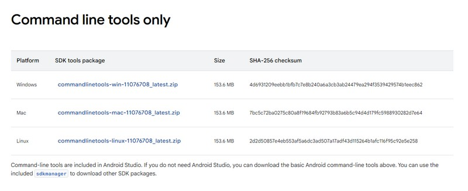

Descarcati versiunea pentru Linux. Vi se va solicita acceptarea unei licente. 

## Instalarea Android Command-Line Tools

### 1.2 Creati un director pentru Android SDK

```bash
mkdir -p ~/Android/Sdk/cmdline-tools
```

### 1.3 Dezarhivati fisierul descarcat

```bash
unzip commandlinetools.zip -d ~/Android/Sdk/cmdline-tools
```

### 1.4 Redenumiti directorul extras

```bash
mv ~/Android/Sdk/cmdline-tools/cmdline-tools ~/Android/Sdk/cmdline-tools/latest
```

### 1.5 Adaugati noile directoare la PATH prin intermediul fișierului bashrc

```bash
nano ~/.bashrc
```

Adaugati următoarele linii la finalul fișierului

```bash
export ANDROID_SDK_ROOT=$HOME/Android/Sdk
export PATH=$PATH:$ANDROID_SDK_ROOT/cmdline-tools/latest/bin
export PATH=$PATH:$ANDROID_SDK_ROOT/platform-tools
```

Salvați și închideți fișierul (Ctrl+X, apoi Y, apoi Enter în nano). Dupa editarea fișierului de profil trebuie să reîncărcați profilul:

```bash
source ~/.bashrc
```

### 1.6 Verificați instalarea

```bash
sdkmanager --version

11.0
```

Ar trebui să vedeți versiunea sdkmanager instalată în terminal.

## 2 Instalați pachetele esențiale ale SDK-ului

### Care sunt restul instrumentelor

Pentru dezvoltarea aplicatiilor android sunt necesare mai multe tipuri de componente, biblioteci, platforme, etc. Acestea, impreuna cu versiunile lor, pot fi vazute cu ajutorul comenzii `sdkmanager.bat --list`. Aceasta lista va afisa urmatoarele componente: 

**add-ons;addon-google_apis-google**

Conține API-urile Google necesare pentru simularea serviciilor Google Play pe dispozitivele Android. Este folosit pentru a dezvolta aplicații care se bazează pe serviciile Google, cum ar fi autentificarea, notificările push și altele.

**build-tools**

Include un set de instrumente necesare pentru a construi aplicații Android, cum ar fi aapt (Android Asset Packaging Tool), dx (dexer) și zipalign. Este esențial pentru procesul de construire a aplicațiilor.

**cmake**

CMake este un sistem de automatizare a construcțiilor, folosit pentru a compila aplicațiile C/C++ pe platformele Android. Este necesar pentru construirea aplicațiilor native în Android.

**cmdline-tools**

Acesta este pachetul care conține instrumentele de linie de comandă pentru SDK-ul Android. Incluzând sdkmanager și avdmanager, permite gestionarea SDK-ului și crearea de dispozitive virtuale Android (AVD).

**emulator**

Pachetul Emulator conține emulatorul Android, care permite rularea aplicațiilor Android într-un mediu virtualizat. Acesta simulează un dispozitiv Android pe computerul tău, oferind o platformă pentru testare.

**extras**

conține pachete suplimentare care nu sunt esențiale pentru construirea aplicațiilor, dar pot oferi funcționalități adiționale, cum ar fi instrumentele de dezvoltare sau pachetele SDK pentru diverse API-uri și platforme.

**ndk**

NDK (Native Development Kit) este un set de instrumente care permite dezvoltarea aplicațiilor Android folosind limbaje de programare native, cum ar fi C și C++. NDK este folosit pentru aplicațiile care necesită performanță ridicată.

**platforms**

Acesta este pachetul care conține platformele Android necesare pentru a construi aplicații pentru diverse versiuni ale sistemului de operare Android. Fiecare platformă este asociată cu un anumit API Level.

**skiaparser**

Instrument care analizează fișierele .skia utilizate de Android pentru gestionarea graficii. Este folosit în mod special pentru optimizarea performanței grafice și a renderizării în aplicațiile Android.

**sources**

sursele sistemului de operare Android. Aceste surse sunt utile pentru dezvoltatori care vor să studieze sau să modifice codul sursă al Android pentru a înțelege mai bine funcționarea internă a platformei.

**system-images**

Imagini de sistem folosite pentru a crea dispozitive virtuale Android (AVD). Ele includ imagini de sistem pentru diverse versiuni ale Android și arhitecturi de procesor (armeabi-v7a, x86, etc.), permițând testarea aplicațiilor pe diferite configurații.


Pentru dezvoltarea aplicatiilor Android este nevoie de cateva dintre aceste elemente: 

 - build-tools
 - emulator
 - platform-tools
 - imagini de sistem
 - platforme

Evident, daca dorim sa construim o aplicatie care sa aiba cod nativ (c/c++) este nevoie si de alte componente, cum ar fi cmake si ndk.

### Versiuni Android

Android are mai multe versiuni, incepand de la Android 1 si terminand cu Android 15. Fiecare versiune are una sau mai multe API-uri corespunzatoare (subversiuni). Versiunile initiale au de obicei mai multe niveluri API in timp ce versiunile mai recente au una sau 2. Din acest motiv, desi versiunea principala de Android cea mai recenta este 15, ea corespunde cu API Level 35. Din punct de vedere al dezvoltarii, aplicatiile noastre trebuie sa fie compilate pentru un anumit nivel API. Acestea de obicei nu vor rula si pe nivele inferioare, daca dorim ca aplicatia noastra sa ruleze pe mai multe dispozitive este o idee buna sa "tintim" un nivel de API inferior. 

Un nivel API (API level) reprezintă o versiune specifică a sistemului de operare Android, care definește setul de funcționalități și caracteristici disponibile pentru dezvoltatori. Fiecare versiune a Android are un nivel API corespunzător. Impreuna cu acest nivel API va trebui sa avem in timpul dezvoltarii pachetul SDK corespunzator acestui nivel. 

O lista a acestor versiuni si neveluri API se gaseste la urmatoarea adresa: 

https://apilevels.com/


### Instalarea propriu-zisa

Instalrea propriu-zisa se face cu ajutorul utilitarului sdkmanager caruia i se da o comanda de tipul urmator: 

```bash
sdkmanager "platform-tools" "platforms;android-34" "build-tools;34.0.0" 
sdkmanager "emulator"

```
### Adaugati calea catre emulator in variabila PATH in ~/.bashrc

```bash
export PATH=$PATH:$ANDROID_SDK_ROOT/emulator
```


## 3. Install Gradle

Gradle este un sistem de automatizare a construirii aplicatiilor. Este frecvent utilizat în dezvoltarea aplicațiilor Android, dar poate fi folosit și pentru alte tipuri de proiecte (Java, C++, proiecte web).

Gradle gestionează cu ușurință bibliotecile externe (de exemplu, prin integrarea cu Maven Central sau alte repository-uri) si permite automatizarea întregului flux de lucru, de la compilare la testare și livrare.

### 3.1.  Descărcați cea mai recentă versiune de Gradle de la https://gradle.org/releases

Versiunea curentă de Gradle acum este 8.11, apărută pe 11 Nov 2024. Distributia apare în două variante:

- Binary-only
- Complete, with docs and sources

Puteti alege varianta Binary-only, documentația este disponibilă on-line oricum.

### 3.2. Dezarhivați arhica in directorul /opt

```bash
sudo unzip commandlinetools.zip -d /opt
```

### 3.3. Creați un simlink de la /opt/gradle-version catre /opt/gradle

```bash
ln -s /opt/gradle-8.11/ /opt/gradle
```

### 3.4. Adăugați directorul bin din /opt/gradle la calea dvs.

Editați din nou fișierul ~/.bashrc și adăugați următoarele linii:

```bash
export PATH=$PATH:/opt/gradle/bin
```

### 3.5. Testați instalarea

```bash

gradle -v

------------------------------------------------------------
Gradle 8.11
------------------------------------------------------------

Build time:    2024-11-11 13:58:01 UTC
Revision:      b2ef976169a05b3c76d04f0fa76a940859f96fa4

Kotlin:        2.0.20
Groovy:        3.0.22
Ant:           Apache Ant(TM) version 1.10.14 compiled on August 16 2023
Launcher JVM:  21.0.5 (Oracle Corporation 21.0.5+9-LTS-239)
Daemon JVM:    /usr/lib/jvm/jdk-21.0.5-oracle-x64 (no JDK specified, using current Java home)
OS:            Linux 5.15.153.1-microsoft-standard-WSL2 amd64

```

## Final steps

Adăugați userul dvs. la grupul kvm (pentru a putea executa emulatorul)

```bash
 sudo usermod -aG kvm sorin
``` 

## Initializarea instrumentelor de lucru

Descărcați platforma și creați fișierul pentru emulator

```bash
sdkmanager "system-images;android-34;google_apis;x86_64"

avdmanager create avd -n 'kriklik' -k "system-images;android-34;google_apis;x86_64" -d pixel_7

emulator -list-avds
kriklik

```

Porniți emulatorul

```bash
emulator -avd kriklik
emulator -avd kriklik -no-snapshot-save 
```

Dacă doriți, puteți șterge fișierul pentru emulator.

```bash
 avdmanager delete avd -n kriklik

AVD 'kriklik' deleted.
```


# Acces telefon hardware

## Pregatirea dispozitivului

Pentru a putea conecta telefonul la computer in scopul operatiilor de dezvoltare sunt necesare cateva operatii de pregatire pe terminalul Android. 

### Activarea optiunilor de dezvoltare

Cautati in grupul de setari pe telefon o optiune numita "About phone" 

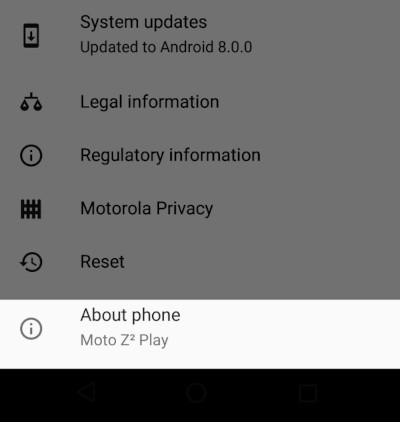

In interiorul acesteia, identificati intrarea numita "Build number"

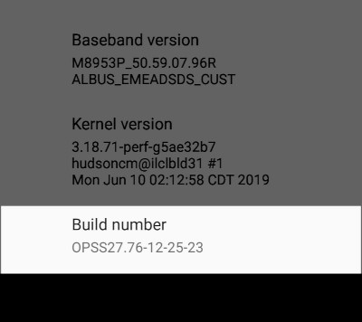

apasati de 7 ori pe optiunea "Build number". Dupa cateva apasari, va aparea o atentionare care va va spune ca mai aveti un anumit numar de apasari pana cand deveniti developer: 

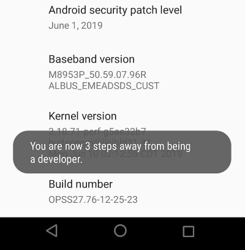

Dupa finalizarea celor 7 apasari, apare o alta atentionare care va spune ca ati devenit developper - optiunile pentru dezvoltatori au fost activate

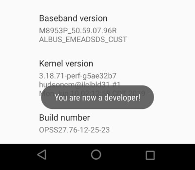

Optiunile pentru dezvoltare sunt disponibile sub forma unui meniu suplimentar in zona de setari a telefonului: 

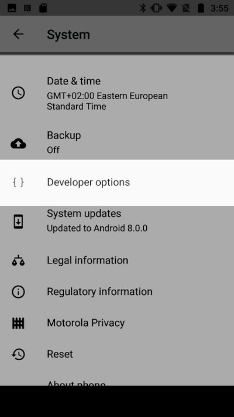

Daca intrati in sectiunea la care duce acest meniu (si va trebui sa o faceti) veti observa in primul rand un slider care permite oprirea acestor optiuni: 

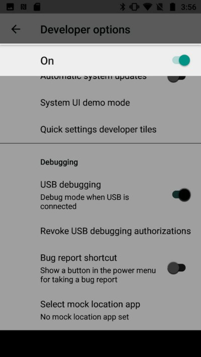

si apoi o serie de optiuni care trebuie activate pentru a putea accesa telefonul de pe computer in modul de dezvoltare, cea mai importanta dintre ele fiind USB debugging: 

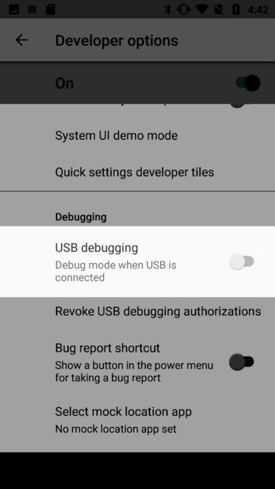

La activarea acestei optiuni va aparea un dialog care va solicita o confirmare. Evident, aceasta trebuie acceptata. 

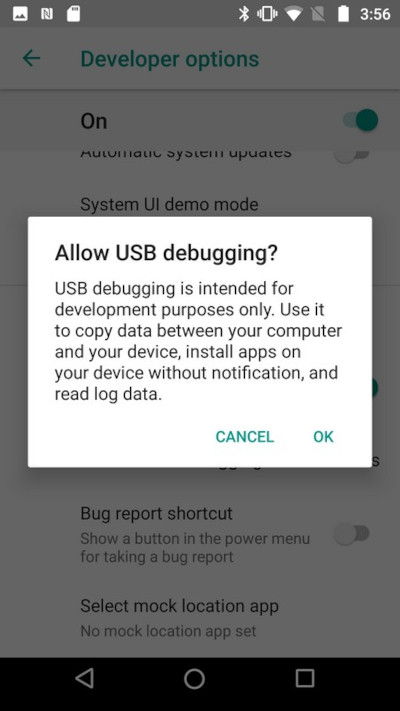


Alte optiuni utile in acelasi ecran (dar nu obligatorii) sunt OEM Unlockin, Stay Awake, Allow Mock Locations. O parte dintre ele sunt insotite de dialoguri de confirmare, altele nu. 

Dupa activarea acestor optiuni, conectati telefonul la PC folosind un cablu USB. Va aparea un nou dialog de confirmare, de aceasta data direct legat de pc-ul conectat: 

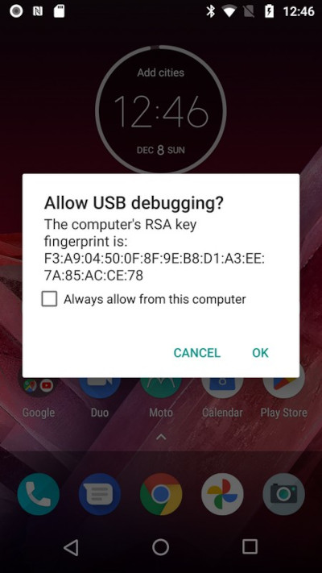

Confirmati aceasta conexiune, apoi, verificati tipul de conexiune USB care s-a stabilit cu computerul. Aceasta este de obicei disponibila dupa conectare in sectiunea de notificari: 

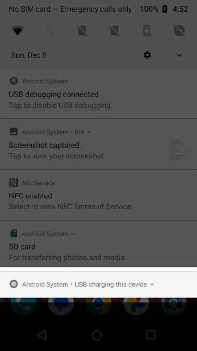

De cele mai multe ori, la initierea unei conextiuni noi, aceasta este pusa pe "Charging", va trebui modificata in "Transfer files"

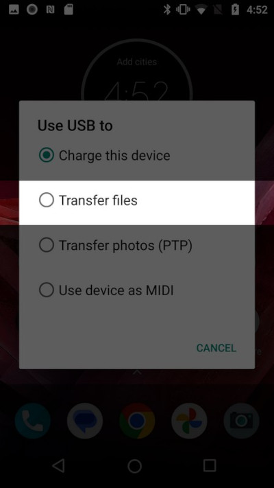

Daca conexiunea este corecta, veti observa o notificare venita de la sistemul de operare: 

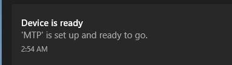


Daca toptul a mers bine si aveti instalat pachetul "platform tools", comanda adb va va afisa dispozitivul prezent: 

```sh
C:\Users\MYUSER\Android\platform-tools> adb devices
List of devices attached
ZY224F8Q2G      device
```

Ocazional, se poate intampla ca dispozitivul sa fie afisat ca fiind neautorizat, caz in care va trebui sa verificati dispozitivul unde va aparea un nou dialog de confirmare.  

```sh
C:\Users\MYUSER\Android\platform-tools> adb devices
* daemon not running; starting now at tcp:5037
* daemon started successfully
List of devices attached
ZY224F8Q2G      unauthorized
```

### Cateva comenzi adb

### adb shell pm list packages

```sh
C:\Users\MYUSER\Android\platform-tools> adb shell pm list packages
package:com.android.cts.priv.ctsshim
package:com.aura.oobe.ml
package:com.google.android.youtube
package:com.google.android.ext.services
package:com.motorola.motocare
package:com.android.providers.telephony
package:com.android.sdm.plugins.connmo
package:com.google.android.googlequicksearchbox
package:com.android.providers.calendar
package:com.android.providers.media
package:com.google.android.apps.docs.editors.docs
package:com.qti.service.colorservice
...

```

### adb logcat

```sh
C:\Users\MYUSER\Android\platform-tools> adb logcat
--------- beginning of system
12-07 23:47:59.505   638   843 I SFPerfTracer:      triggers: (rate: 0:6) (8441 sw vsyncs) (0 skipped) (588:6468 vsyncs) (590:15013)
12-07 23:47:59.596  2777  4285 I chatty  : uid=1000(system) Binder:2777_B expire 22 lines
12-07 23:47:59.856  2777  3475 I chatty  : uid=1000(system) Binder:2777_3 expire 13 lines
12-07 23:48:01.124  2777  2777 I chatty  : uid=1000 system_server expire 11 lines
12-07 23:48:01.655  2777  3608 I chatty  : uid=1000(system) VoldConnector expire 11 lines
12-07 23:48:01.819  2777 13625 I chatty  : uid=1000(system) Binder:2777_19 expire 13 lines
12-07 23:48:06.348  2777  2822 I chatty  : uid=1000(system) android.fg expire 12 lines
12-07 23:48:06.354  2777  3873 I chatty  : uid=1000(system) Binder:2777_8 expire 11 lines
12-07 23:48:06.395  2777  3690 I chatty  : uid=1000(system) ConnectivitySer expire 15 lines
```

### screenshot 

adb shell screencap -p /sdcard/screen.jpg
adb pull /sdcard/screen.jpg

### screen recording

Inregistrarea ecranului se opreste automat dupa 3 minute sau poate fi oprita cu Ctrl-C

```sh
adb shell screenrecord /sdcard/screen.mp4
adb pull /sdcard/screen.mp4
```


### adb shell getprop

Android mentine o baza de date de proprietati (un fel de registry) care poate fi vizualizat: 

```sh
(base) PS C:\Users\MYUSER\Android\platform-tools> adb shell getprop
[DEVICE_PROVISIONED]: [1]
[af.fast_track_multiplier]: [1]
[audio.deep_buffer.media]: [true]
[audio.dolby.ds2.enabled]: [true]
[audio.offload.buffer.size.kb]: [64]
[audio.offload.disable]: [false]
...
```

### adb shell settings put

Valorile din aceasta baza de date pot fi modificate

```sh
adb shell settings put system screen_off_timeout 60000
```

### Alte comenzi

adb shell ps
adb shell input tap 500 500


```sh
adb shell dumpsys battery
Current Battery Service state:
  AC powered: false
  USB powered: true
  Wireless powered: false
  MOD powered: false
  Max charging current: 500000
  Max charging voltage: 5000000
  Charge counter: 3059000
  status: 5
  health: 2
  present: true
  level: 100
  scale: 100
  voltage: 4378
  temperature: 260
  technology: Li-ion
  mod level: -1
  mod status: 1
  mod flag: 0
  mod type: 0
  mod power source: 0
```

```sh
adb shell ifconfig wlan0
wlan0     Link encap:UNSPEC    Driver wcnss_wlan
          inet addr:192.168.27.110  Bcast:192.168.27.255  Mask:255.255.255.0
          inet6 addr: fe80::8ab4:a6ff:fec9:b03d/64 Scope: Link
          UP BROADCAST RUNNING MULTICAST  MTU:1500  Metric:1
          RX packets:947981 errors:0 dropped:0 overruns:0 frame:0
          TX packets:192772 errors:0 dropped:0 overruns:0 carrier:0
          collisions:0 txqueuelen:1000
          RX bytes:1224398272 TX bytes:17229241
```

Lista proceselor care ruleaza in linux

```sh
(base) PS C:\Users\MYUSER\Android\platform-tools> adb shell ps
USER           PID  PPID     VSZ    RSS WCHAN            ADDR S NAME
root             1     0   18232   1976 SyS_epoll_wait      0 S init
root             2     0       0      0 kthreadd            0 S [kthreadd]
root             3     2       0      0 smpboot_thread_fn   0 S [ksoftirqd/0]
root             5     2       0      0 worker_thread       0 S [kworker/0:0H]
root             7     2       0      0 rcu_gp_kthread      0 S [rcu_preempt]
root             8     2       0      0 rcu_gp_kthread      0 S [rcu_sched]
root             9     2       0      0 rcu_gp_kthread      0 S [rcu_bh]
root            10     2       0      0 rcu_nocb_kthread    0 S [rcuop/0]
root            11     2       0      0 rcu_nocb_kthread    0 S [rcuos/0]
```

## Scrcpy

### Instalare

Scrcpy este un utilitar opern-source care permite afisarea continua a ecranului unui dispozitiv mobil pe ecranul unui PC, cu ajutorul unei conexiuni USB debugging. Aceasta conexiune este oricum deschisa pentru instalarea aplicatiilor si procesul de dezvoltare. Cu ajutorul acestui instrument, presupunand ca exista un dispozitiv mobil hardware, se pot dezvolta aplicatii Android in conditii similare cu prezenta unui emulator intr-o masina virtuala. 

Descarcati scrcpy de pe site. 
https://scrcpy.org/

Pe sisteme de tip ubuntu sau derivate scrcpy se poate instala cu ajutorul managerului de pachete: 

```sh
sudo apt install scrcpy
```

Veti obtine o arhiva zip. Dezarhivati arhiva intr-un director oarecare. Puteti porni scrcpy direct din directorul dezarhivat sau puteti adauga si acest director la PATH sau puteti plasa un symlink pe desktop. 

### Utilizare

Odata stabilita conexiunea USB, programul poate fi lansat direct cu ajutorul comenzii scrcpy simplu sau insotita de optiuni

`scrcpy --help` afiseaza toate optiunile disponibile

`scrcpy --max-size 1024` reduce dimensiunea ferestrei afisate

`scrcpy --bit-rate 2M` reduce latimea de banda video

`scrcpy --record file.mp4` porneste inregistrarea ecranului

`scrcpy --stay-awake` mentine ecranul telefonului pornit

`scrcpy --crop 1080:1920:0:0` afiseaza doar o portiune din ecranul telefonului
