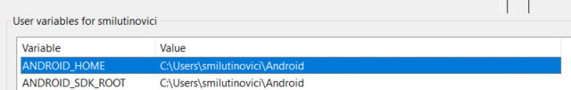
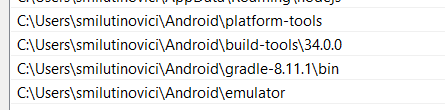

# Install Java Devlopment Kit

https://www.oracle.com/java/technologies/downloads/#jdk21-windows


https://www.oracle.com/java/technologies/downloads/#jdk21-windows

Windows Command line (CMD) rulata ca administrator:

```sh
setx JAVA_HOME "C:\Program Files\Java\jdk-21"
setx PATH "%PATH%;%JAVA_HOME%\bin"
```

Testarea instalarii corecte: dupa inchiderea consolei ar trebui ca cele doua comenzi: java si javac sa devina disponibile in consola

```sh
PS C:\Users\smilutinovici> java
Usage: java [options] <mainclass> [args...]
           (to execute a class)
   or  java [options] -jar <jarfile> [args...]
           (to execute a jar file)
   or  java [options] -m <module>[/<mainclass>] [args...]
       java [options] --module <module>[/<mainclass>] [args...]
           (to execute the main class in a module)
   or  java [options] <sourcefile> [args]
           (to execute a single source-file program)

 Arguments following the main class, source file, -jar <jarfile>,
 -m or --module <module>/<mainclass> are passed as the arguments to
 main class.
 
 ....
 
 ```

 ```sh
PS C:\Users\smilutinovici> javac
Usage: javac <options> <source files>
where possible options include:
  @<filename>                  Read options and filenames from file
  -Akey[=value]                Options to pass to annotation processors
  --add-modules <module>(,<module>)*
        Root modules to resolve in addition to the initial modules,
        or all modules on the module path if <module> is ALL-MODULE-PATH.
  --boot-class-path <path>, -bootclasspath <path>
        Override location of bootstrap class files
  --class-path <path>, -classpath <path>, -cp <path>
        Specify where to find user class files and annotation processors
  -d <directory>               Specify where to place generated class files
  -deprecation
        Output source locations where deprecated APIs are used
  --enable-preview
        Enable preview language features.
        To be used in conjunction with either -source or --release.

...
```

# Descarcati Android Command-Line Tools 

https://developer.android.com/studio#command-tools

Extract it to a directory, e.g., C:\Users\MYUSER\Android

Va rezulta un director C:\Users\MYUSER\Android\cmdline-tools

# Set up Android SDK

Lista api-urilor

https://apilevels.com/

```sh
cd C:\Users\MYUSER\Android\cmdline-tools\latest\bin

.\sdkmanager.bat --sdk_root=C:\Users\MYUSER\Android "platform-tools" "build-tools;34.0.0" "platforms;android-34"

```


# Add the following paths to your Path environment variable:

C:\Users\MYUSER\Android\platform-tools
C:\Users\MYUSER\Android\build-tools\34.0.0


# Install gradle

Descarcati gradle from https://gradle.org/releases/

Dezarhivati gradle intr-un director oarecare

"C:\Users\MYUSER\Android\gradle-8.11.1"

# Adaugati calea in PATH

Verificati disponibilitatea comenzii adb la linia de comanda. 





# Instalati o platforma

```sh
sdkmanager.bat --install "system-images;android-34;google_apis;x86_64"
```

# Instalati emulatorul

```sh
 sdkmanager "emulator"
 ```

# Verificati toate componentele

```sh
sdkmanager.bat --list_installed
```

```sh
Installed packages:
  Path                                        | Version | Description                                | Location
  -------                                     | ------- | -------                                    | -------
  build-tools;34.0.0                          | 34.0.0  | Android SDK Build-Tools 34                 | build-tools\34.0.0
  emulator                                    | 35.2.10 | Android Emulator                           | emulator
  platform-tools                              | 35.0.2  | Android SDK Platform-Tools                 | platform-tools
  platforms;android-34                        | 3       | Android SDK Platform 34                    | platforms\android-34
  system-images;android-34;google_apis;x86_64 | 14      | Google APIs Intel x86_64 Atom System Image | system-images\android-34\google_apis\x86_64
```

# Creati un avd

```sh
avdmanager.bat create avd -n 'winkril' -k  "system-images;android-34;google_apis;x86_64" -d pixel_7
```

# Porniti emulatorul

```sh
emulator.exe -avd winkril
```

# Lista de dispozitive existente

```sh
adb.exe devices

List of devices attached
emulator-5554   device

```

# Instalati aplicatia pe dispozitiv

```sh
adb -s emulator-5554 install .\app\build\outputs\apk\debug\app-debug.apk
 ```

# Verificati existenta aplicatiei (powershell)

```sh
adb shell pm list packages | grep {application_name}
```


