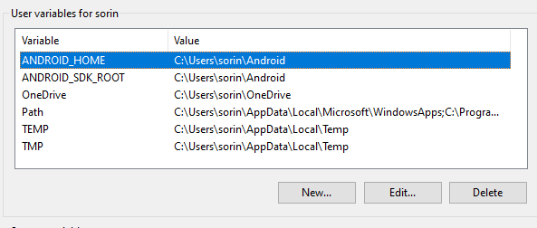
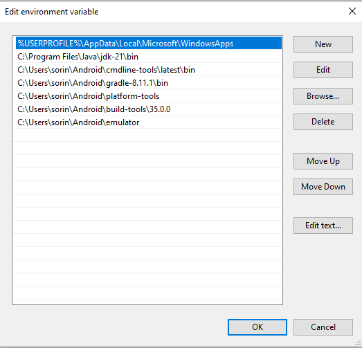

# Dezvoltare Android pe platforma Windows, fara Android Studio

<!-- TOC -->

- [Dezvoltare Android pe platforma Windows, fara Android Studio](#dezvoltare-android-pe-platforma-windows-fara-android-studio)
- [Instalrea JAVA DEVELOPMENT KIT](#instalrea-java-development-kit)
    - [Descarcarea Java SE](#descarcarea-java-se)
    - [Instalarea Java SE](#instalarea-java-se)
    - [Setarea PATH-ului](#setarea-path-ului)
    - [Verificarea existentei comenzilor](#verificarea-existentei-comenzilor)
- [Instalarea Android Command Line Tools](#instalarea-android-command-line-tools)
    - [Descarcati Android Command-Line Tools](#descarcati-android-command-line-tools)
    - [Instalarea Android Command-Line Tools](#instalarea-android-command-line-tools)
    - [Adaugati directorul "bin" al cmdline-tools la PATH](#adaugati-directorul-bin-al-cmdline-tools-la-path)
    - [Adaugati variabile la environment: ANDROID_HOME si ANDROID_SDK_ROOT](#adaugati-variabile-la-environment-android_home-si-android_sdk_root)
    - [Instalarea restului instrumentelor](#instalarea-restului-instrumentelor)
        - [Care sunt restul instrumentelor](#care-sunt-restul-instrumentelor)
        - [Versiuni Android](#versiuni-android)
        - [Instalarea propriu-zisa](#instalarea-propriu-zisa)
- [Instalare gradle](#instalare-gradle)
    - [Adaugati calea in PATH](#adaugati-calea-in-path)
- [Verificati disponibilitatea comenzilor](#verificati-disponibilitatea-comenzilor)
    - [adb](#adb)
    - [gradle](#gradle)
    - [avdmanager](#avdmanager)
    - [emulator](#emulator)
    - [Verificati toate componentele folosind sdkmanager](#verificati-toate-componentele-folosind-sdkmanager)
- [Emulator](#emulator)
    - [Creati un avd](#creati-un-avd)
    - [Porniti emulatorul](#porniti-emulatorul)
    - [Lista de dispozitive existente](#lista-de-dispozitive-existente)
    - [Instalati aplicatia pe dispozitiv](#instalati-aplicatia-pe-dispozitiv)
    - [Verificati existenta aplicatiei powershell](#verificati-existenta-aplicatiei-powershell)
- [Instalari partiale](#instalari-partiale)
    - [Platform tools](#platform-tools)
- [Acces telefon hardware](#acces-telefon-hardware)
    - [Pregatirea dispozitivului](#pregatirea-dispozitivului)
        - [Activarea optiunilor de dezvoltare](#activarea-optiunilor-de-dezvoltare)
        - [Cateva comenzi adb](#cateva-comenzi-adb)
        - [adb shell pm list packages](#adb-shell-pm-list-packages)
        - [adb logcat](#adb-logcat)
        - [screenshot](#screenshot)
        - [screen recording](#screen-recording)
        - [adb shell getprop](#adb-shell-getprop)
        - [adb shell settings put](#adb-shell-settings-put)
        - [Alte comenzi](#alte-comenzi)
        - [Conectarea unui dispozitiv USB la o masina virtuala](#conectarea-unui-dispozitiv-usb-la-o-masina-virtuala)
- [Alte instrumente utile](#alte-instrumente-utile)
    - [git](#git)
    - [Windows terminal](#windows-terminal)
        - [Descarcarea directa din repository](#descarcarea-directa-din-repository)
        - [Alte variante](#alte-variante)
    - [Scrcpy](#scrcpy)
        - [Instalare](#instalare)
        - [Utilizare](#utilizare)

<!-- /TOC -->
# Instalrea JAVA DEVELOPMENT KIT

JAVA de obicei este distribuita in doua feluri: JRE (Java Runtime Edition) si JDK (Java Development Kit). Pentru orice dezvoltare avem nevoie de JDK. JDK poate fi descarcat fie de la OpenJDK, fie direct de la Oracke de pe pagina, ca parte din distributia numita "Java Standard Edition" - Java SE. Vom lucra cu Java SE 21 (cea mai recenta versiune este 23). 

## Descarcarea Java SE

https://www.oracle.com/java/technologies/downloads/#jdk21-windows


Descarcati X64 Installer. Va trebui sa obtineti un fisier numit jdk-21_windows-x64_bin.exe. Rulati acest fisier. Aveti nevoie de drepturi de administrator pe masina respectiva. 

## Instalarea Java SE


Urmariti pasii installerului


Retineti calea in care va fi instalata distributia si care va aparea in al doilea ecran al installerului


Dupa finalizarea instalarii, comanda `$env:Path - split ';'` in powershell va afisa toate componentele path-ului disponibil. 


## Setarea PATH-ului

Se observa aparitia caii `C:\Program Files\Commoon Files\Oracle\Java\javapath` care asigura disponibilitatea in powershell a comenzilor java (pornirea masinii virtuale) si javac (compilarea surselor). Acestea insa sunt pozitionate intr-un director separat, care contine foarte putine fisiere: 


Acestea sunt suficiente pentru a rula si compila programe java dar in realitate distributia contine mult mai multe instrumente care pot fi utile (instrumente de inspectie a arhivelor jar, instrumente de semnare a acestora, instrumente de debug, etc.). Este in general o idee buna sa adaugam si directorul "bin" din distributia jdk (plasata in locul retinut anterior) la path-ul userului curent. Pentru aceasta, apelati  


Alegeti variabila PATH si apasati butonul Edit


Apoi apasati butonul "New" si scrieti calea catre jdk, inclusiv directorul "bin". 


## Verificarea existentei comenzilor

Dupa salvarea dialogului respectiv, puteti verifica in powershell (deschizand o noua sesiune) disponibilitatea comenzilor java, javac, jar, jpackage, etc. 


```sh
PS C:\Users\smilutinovici> java
Usage: java [options] <mainclass> [args...]
           (to execute a class)
   or  java [options] -jar <jarfile> [args...]
           (to execute a jar file)
   or  java [options] -m <module>[/<mainclass>] [args...]
       java [options] --module <module>[/<mainclass>] [args...]
           (to execute the main class in a module)
   or  java [options] <sourcefile> [args]
           (to execute a single source-file program)

 Arguments following the main class, source file, -jar <jarfile>,
 -m or --module <module>/<mainclass> are passed as the arguments to
 main class.
 
 ....
 
 ```

 ```sh
PS C:\Users\smilutinovici> javac
Usage: javac <options> <source files>
where possible options include:
  @<filename>                  Read options and filenames from file
  -Akey[=value]                Options to pass to annotation processors
  --add-modules <module>(,<module>)*
        Root modules to resolve in addition to the initial modules,
        or all modules on the module path if <module> is ALL-MODULE-PATH.
  --boot-class-path <path>, -bootclasspath <path>
        Override location of bootstrap class files
  --class-path <path>, -classpath <path>, -cp <path>
        Specify where to find user class files and annotation processors
  -d <directory>               Specify where to place generated class files
  -deprecation
        Output source locations where deprecated APIs are used
  --enable-preview
        Enable preview language features.
        To be used in conjunction with either -source or --release.

...
```

```sh
PS C:\Users\sorin> jar
Usage: jar [OPTION...] [ [--release VERSION] [-C dir] files] ...
Try `jar --help' for more information.
```

```sh
 jpackage
Usage: jpackage <options>
Use jpackage --help (or -h) for a list of possible options
```

# Instalarea Android Command Line Tools

## Descarcati Android Command-Line Tools 

https://developer.android.com/studio#command-tools

Navigati la adresa de mai sus si cautati in josul paginii. 


Descarcati versiunea pentru windows. Vi se va solicita acceptarea unei licente. 

## Instalarea Android Command-Line Tools

Extrageti fisierele din arhiva respectiva intr-un director care va deveni spatiul principal in care veti pozitiona toate instrumentele de dezvoltare. De exemplu, C:\Users\MYUSER\Android

Va rezulta un director C:\Users\MYUSER\Android\cmdline-tools care contine, printre altele, un subdirector "bin"

Mutati continutul acestui director intrpun subdirector "latest", astfel incat instrumentele sa fie plasate in C:\Users\MYUSER\Android\cmdline-tools\latest

## Adaugati directorul "bin" al cmdline-tools la PATH


Dupa adaugarea acestuia, comanda "sdkmanager.bat" trebuie sa devina disponibila intr-o sesiune noua de PowerShell. 

```sh
PS C:\Users\sorin> sdkmanager.bat
Usage:
  sdkmanager [--uninstall] [<common args>] [--package_file=<file>] [<packages>...]
  sdkmanager --update [<common args>]
  sdkmanager --list [<common args>]
  sdkmanager --list_installed [<common args>]
  sdkmanager --licenses [<common args>]
  sdkmanager --version

...
```

## Adaugati variabile la environment: ANDROID_HOME si ANDROID_SDK_ROOT

ANDROID_SDK_ROOT este varianta mai recenta a variabilei de mediu necesara in timp ce ANDROID_HOME este varianta mai veche.

## Instalarea restului instrumentelor

### Care sunt restul instrumentelor

Pentru dezvoltarea aplicatiilor android sunt necesare mai multe tipuri de componente, biblioteci, platforme, etc. Acestea, impreuna cu versiunile lor, pot fi vazute cu ajutorul comenzii `sdkmanager.bat --list`. Aceasta lista va afisa urmatoarele componente: 

**add-ons;addon-google_apis-google**

Conține API-urile Google necesare pentru simularea serviciilor Google Play pe dispozitivele Android. Este folosit pentru a dezvolta aplicații care se bazează pe serviciile Google, cum ar fi autentificarea, notificările push și altele.

**build-tools**

Include un set de instrumente necesare pentru a construi aplicații Android, cum ar fi aapt (Android Asset Packaging Tool), dx (dexer) și zipalign. Este esențial pentru procesul de construire a aplicațiilor.

**cmake**

CMake este un sistem de automatizare a construcțiilor, folosit pentru a compila aplicațiile C/C++ pe platformele Android. Este necesar pentru construirea aplicațiilor native în Android.

**cmdline-tools**

Acesta este pachetul care conține instrumentele de linie de comandă pentru SDK-ul Android. Incluzând sdkmanager și avdmanager, permite gestionarea SDK-ului și crearea de dispozitive virtuale Android (AVD).

**emulator**

Pachetul Emulator conține emulatorul Android, care permite rularea aplicațiilor Android într-un mediu virtualizat. Acesta simulează un dispozitiv Android pe computerul tău, oferind o platformă pentru testare.

**extras**

conține pachete suplimentare care nu sunt esențiale pentru construirea aplicațiilor, dar pot oferi funcționalități adiționale, cum ar fi instrumentele de dezvoltare sau pachetele SDK pentru diverse API-uri și platforme.

**ndk**

NDK (Native Development Kit) este un set de instrumente care permite dezvoltarea aplicațiilor Android folosind limbaje de programare native, cum ar fi C și C++. NDK este folosit pentru aplicațiile care necesită performanță ridicată.

**platforms**

Acesta este pachetul care conține platformele Android necesare pentru a construi aplicații pentru diverse versiuni ale sistemului de operare Android. Fiecare platformă este asociată cu un anumit API Level.

**skiaparser**

Instrument care analizează fișierele .skia utilizate de Android pentru gestionarea graficii. Este folosit în mod special pentru optimizarea performanței grafice și a renderizării în aplicațiile Android.

**sources**

sursele sistemului de operare Android. Aceste surse sunt utile pentru dezvoltatori care vor să studieze sau să modifice codul sursă al Android pentru a înțelege mai bine funcționarea internă a platformei.

**system-images**

Imagini de sistem folosite pentru a crea dispozitive virtuale Android (AVD). Ele includ imagini de sistem pentru diverse versiuni ale Android și arhitecturi de procesor (armeabi-v7a, x86, etc.), permițând testarea aplicațiilor pe diferite configurații.


Pentru dezvoltarea aplicatiilor Android este nevoie de cateva dintre aceste elemente: 

 - build-tools
 - emulator
 - platform-tools
 - imagini de sistem
 - platforme

Evident, daca dorim sa construim o aplicatie care sa aiba cod nativ (c/c++) este nevoie si de alte componente, cum ar fi cmake si ndk.

### Versiuni Android

Android are mai multe versiuni, incepand de la Android 1 si terminand cu Android 15. Fiecare versiune are una sau mai multe API-uri corespunzatoare (subversiuni). Versiunile initiale au de obicei mai multe niveluri API in timp ce versiunile mai recente au una sau 2. Din acest motiv, desi versiunea principala de Android cea mai recenta este 15, ea corespunde cu API Level 35. Din punct de vedere al dezvoltarii, aplicatiile noastre trebuie sa fie compilate pentru un anumit nivel API. Acestea de obicei nu vor rula si pe nivele inferioare, daca dorim ca aplicatia noastra sa ruleze pe mai multe dispozitive este o idee buna sa "tintim" un nivel de API inferior. 

Un nivel API (API level) reprezintă o versiune specifică a sistemului de operare Android, care definește setul de funcționalități și caracteristici disponibile pentru dezvoltatori. Fiecare versiune a Android are un nivel API corespunzător. Impreuna cu acest nivel API va trebui sa avem in timpul dezvoltarii pachetul SDK corespunzator acestui nivel. 

O lista a acestor versiuni si neveluri API se gaseste la urmatoarea adresa: 

https://apilevels.com/


### Instalarea propriu-zisa

Instalrea propriu-zisa se face cu ajutorul utilitarului sdkmanager caruia i se da o comanda de tipul urmator: 

```sh
sdkmanager.bat "platform-tools" "build-tools;35.0.0" "platforms;android-26" "emulator" "system-images;android-26;google_apis;x86" "cmdline-tools;latest"

```

Evident, alegeti versiunile dorite. Build-Tools poate fi cat mai recent posibil dar platforma si imaginile de sistem trebuie sa corespunda cu versiunea minima de Android pe care doriti ca aplicatia dvs. sa poata rula. 

Adaugati urmatoarele componente la PATH


# Instalare gradle


Gradle este un sistem de automatizare a construirii aplicatiilor. Este frecvent utilizat în dezvoltarea aplicațiilor Android, dar poate fi folosit și pentru alte tipuri de proiecte (Java, C++, proiecte web).

Gradle gestionează cu ușurință bibliotecile externe (de exemplu, prin integrarea cu Maven Central sau alte repository-uri) si permite automatizarea întregului flux de lucru, de la compilare la testare și livrare.


Descarcati gradle de la https://gradle.org/releases/

Dezarhivati gradle intr-un director oarecare

"C:\Users\MYUSER\Android\gradle-8.11.1"

## Adaugati calea in PATH


# Verificati disponibilitatea comenzilor

Dupa setarea tuturor componentelor PATH-ului inchideti si redeschideti instanta PowerShell si verificati disponibilitatea urmatoarelor comenzi.


## adb

```sh
PS C:\Users\sorin> adb
Android Debug Bridge version 1.0.41
Version 35.0.2-12147458
Installed as C:\Users\sorin\Android\platform-tools\adb.exe
Running on Windows 10.0.19045
...
```

## gradle

```sh
PS C:\Users\sorin> gradle

> Task :help

Welcome to Gradle 8.11.1.

Directory 'C:\Users\sorin' does not contain a Gradle build.

To create a new build in this directory, run gradle init

For more detail on the 'init' task, see https://docs.gradle.org/8.11.1/userguide/build_init_plugin.html

For more detail on creating a Gradle build, see https://docs.gradle.org/8.11.1/userguide/tutorial_using_tasks.html

To see a list of command-line options, run gradle --help

For more detail on using Gradle, see https://docs.gradle.org/8.11.1/userguide/command_line_interface.html

For troubleshooting, visit https://help.gradle.org
```

## avdmanager

```sh
PS C:\Users\sorin> avdmanager

Usage:
      avdmanager [global options] [action] [action options]
      Global options:
  -s --silent     : Silent mode, shows errors only.
  -v --verbose    : Verbose mode, shows errors, warnings and all messages.
     --clear-cache: Clear the SDK Manager repository manifest cache.
  -h --help       : Help on a specific command.

Valid actions are composed of a verb and an optional direct object:
-   list              : Lists existing targets or virtual devices.
-   list avd          : Lists existing Android Virtual Devices.
-   list target       : Lists existing targets.
-   list device       : Lists existing devices.
- create avd          : Creates a new Android Virtual Device.
-   move avd          : Moves or renames an Android Virtual Device.
- delete avd          : Deletes an Android Virtual Device.
```

## emulator

```sh
PS C:\Users\sorin> emulator
INFO    | Android emulator version 35.2.10.0 (build_id 12414864) (CL:N/A)
INFO    | Graphics backend: gfxstream
ERROR   | No AVD specified. Use '@foo' or '-avd foo' to launch a virtual device named 'foo'
```

## Verificati toate componentele folosind sdkmanager

```sh
sdkmanager.bat --list_installed
```

```sh
Installed packages:
  Path                                        | Version | Description                                | Location
  -------                                     | ------- | -------                                    | -------
  build-tools;34.0.0                          | 34.0.0  | Android SDK Build-Tools 34                 | build-tools\34.0.0
  emulator                                    | 35.2.10 | Android Emulator                           | emulator
  platform-tools                              | 35.0.2  | Android SDK Platform-Tools                 | platform-tools
  platforms;android-34                        | 3       | Android SDK Platform 34                    | platforms\android-34
  system-images;android-34;google_apis;x86_64 | 14      | Google APIs Intel x86_64 Atom System Image | system-images\android-34\google_apis\x86_64
```

Directorul in care sunt instalate instrumentele de dezvoltare Android ar trebui sa arate astfel:


Variabilele de mediu trebuie sa arate astfel: 



Continutul variabilei PATH este astfel: 




# Emulator

## Creati un avd

```sh
avdmanager.bat create avd -n 'winkril' -k  "system-images;android-26;google_apis;x86" -d pixel_7
```

## Porniti emulatorul

```sh
emulator.exe -avd winkril
```

## Lista de dispozitive existente

```sh
adb.exe devices

List of devices attached
emulator-5554   device

```

## Instalati aplicatia pe dispozitiv

```sh
adb -s emulator-5554 install .\app\build\outputs\apk\debug\app-debug.apk
 ```

## Verificati existenta aplicatiei (powershell)

```sh
adb shell pm list packages | grep {application_name}
```


# Instalari partiale

In anumite situatii puteti dori sa instalati doar anumite componente din intregul lant de instrumente prezentat mai sus. Un posibil exemplu este acela in care, fara sa doriti sa compilati si sa instalti propriile aplicatii pe un dispozitiv extern (in special unul real) ati dori sa aveti acces la functionalitatile acestuia utilizand adb (Android Debug Bridge). adb este parte din pachetul platform-tools. 

## Platform tools

https://developer.android.com/tools/releases/platform-tools


Veti descarca o arhiva zip al carei nume este platform-tools-latest-windows.zip. Aceasta se dezarhiveaza intr-un director oarecare (in continuare se recomanda crearea unui ANDROID_HOME, un director doar pentru aceste instrumente) dar nu este obligatoriu. De asemenea, se recomanda plasarea directorului "platform_tools" dezarhivat in PATH-ul sistemului de operare (general sau user) dar nici aceasta nu este necesara, instrumentele se pot rula direct din directorul unde au fost dezarhivate. 


# Acces telefon hardware

## Pregatirea dispozitivului

Pentru a putea conecta telefonul la computer in scopul operatiilor de dezvoltare sunt necesare cateva operatii de pregatire pe terminalul Android. 

### Activarea optiunilor de dezvoltare

Cautati in grupul de setari pe telefon o optiune numita "About phone" 


In interiorul acesteia, identificati intrarea numita "Build number"


apasati de 7 ori pe optiunea "Build number". Dupa cateva apasari, va aparea o atentionare care va va spune ca mai aveti un anumit numar de apasari pana cand deveniti developer: 


Dupa finalizarea celor 7 apasari, apare o alta atentionare care va spune ca ati devenit developper - optiunile pentru dezvoltatori au fost activate


Optiunile pentru dezvoltare sunt disponibile sub forma unui meniu suplimentar in zona de setari a telefonului: 


Daca intrati in sectiunea la care duce acest meniu (si va trebui sa o faceti) veti observa in primul rand un slider care permite oprirea acestor optiuni: 


si apoi o serie de optiuni care trebuie activate pentru a putea accesa telefonul de pe computer in modul de dezvoltare, cea mai importanta dintre ele fiind USB debugging: 


La activarea acestei optiuni va aparea un dialog care va solicita o confirmare. Evident, aceasta trebuie acceptata. 


Alte optiuni utile in acelasi ecran (dar nu obligatorii) sunt OEM Unlockin, Stay Awake, Allow Mock Locations. O parte dintre ele sunt insotite de dialoguri de confirmare, altele nu. 

Dupa activarea acestor optiuni, conectati telefonul la PC folosind un cablu USB. Va aparea un nou dialog de confirmare, de aceasta data direct legat de pc-ul conectat: 


Confirmati aceasta conexiune, apoi, verificati tipul de conexiune USB care s-a stabilit cu computerul. Aceasta este de obicei disponibila dupa conectare in sectiunea de notificari: 


De cele mai multe ori, la initierea unei conextiuni noi, aceasta este pusa pe "Charging", va trebui modificata in "Transfer files"


Daca conexiunea este corecta, veti observa o notificare venita de la sistemul de operare: 


In cazul in care doriti sa verificati mai departe, puteti folosi comanda Get-PnpDevice -Class USB (ideal cu o rulare inainte de conexiunea respectiva) pentru a verifica prezenta dispozitivului USB in subsistem. De cele mai multe ori acesta apare ca UDB Composite Device. 

```sh
PS C:\Users\sorin>  Get-PnpDevice -Class USB

Status     Class           FriendlyName                                                                     InstanceId
------     -----           ------------                                                                     ----------
OK         USB             USB Composite Device                                                             USB\VID_22B8...
OK         USB             USB Root Hub (USB 3.0)                                                           USB\ROOT_HUB...
OK         USB             Intel(R) USB 3.0 eXtensible Host Controller - 1.0 (Microsoft)                    PCI\VEN_8086...
```

Daca toptul a mers bine si aveti instalat pachetul "platform tools", comanda adb va va afisa dispozitivul prezent: 

```sh
C:\Users\sorin\Android\platform-tools> adb devices
List of devices attached
ZY224F8Q2G      device
```

Ocazional, se poate intampla ca dispozitivul sa fie afisat ca fiind neautorizat, caz in care va trebui sa verificati dispozitivul unde va aparea un nou dialog de confirmare.  

```sh
C:\Users\sorin\Android\platform-tools> adb devices
* daemon not running; starting now at tcp:5037
* daemon started successfully
List of devices attached
ZY224F8Q2G      unauthorized
```

### Cateva comenzi adb

### adb shell pm list packages

```sh
C:\Users\sorin\Android\platform-tools> adb shell pm list packages
package:com.android.cts.priv.ctsshim
package:com.aura.oobe.ml
package:com.google.android.youtube
package:com.google.android.ext.services
package:com.motorola.motocare
package:com.android.providers.telephony
package:com.android.sdm.plugins.connmo
package:com.google.android.googlequicksearchbox
package:com.android.providers.calendar
package:com.android.providers.media
package:com.google.android.apps.docs.editors.docs
package:com.qti.service.colorservice
...

```

### adb logcat

```sh
C:\Users\sorin\Android\platform-tools> adb logcat
--------- beginning of system
12-07 23:47:59.505   638   843 I SFPerfTracer:      triggers: (rate: 0:6) (8441 sw vsyncs) (0 skipped) (588:6468 vsyncs) (590:15013)
12-07 23:47:59.596  2777  4285 I chatty  : uid=1000(system) Binder:2777_B expire 22 lines
12-07 23:47:59.856  2777  3475 I chatty  : uid=1000(system) Binder:2777_3 expire 13 lines
12-07 23:48:01.124  2777  2777 I chatty  : uid=1000 system_server expire 11 lines
12-07 23:48:01.655  2777  3608 I chatty  : uid=1000(system) VoldConnector expire 11 lines
12-07 23:48:01.819  2777 13625 I chatty  : uid=1000(system) Binder:2777_19 expire 13 lines
12-07 23:48:06.348  2777  2822 I chatty  : uid=1000(system) android.fg expire 12 lines
12-07 23:48:06.354  2777  3873 I chatty  : uid=1000(system) Binder:2777_8 expire 11 lines
12-07 23:48:06.395  2777  3690 I chatty  : uid=1000(system) ConnectivitySer expire 15 lines
```

### screenshot 

adb shell screencap -p /sdcard/screen.jpg
adb pull /sdcard/screen.jpg

### screen recording

Inregistrarea ecranului se opreste automat dupa 3 minute sau poate fi oprita cu Ctrl-C

```sh
adb shell screenrecord /sdcard/screen.mp4
adb pull /sdcard/screen.mp4
```


### adb shell getprop

Android mentine o baza de date de proprietati (un fel de registry) care poate fi vizualizat: 

```sh
(base) PS C:\Users\sorin\Android\platform-tools> adb shell getprop
[DEVICE_PROVISIONED]: [1]
[af.fast_track_multiplier]: [1]
[audio.deep_buffer.media]: [true]
[audio.dolby.ds2.enabled]: [true]
[audio.offload.buffer.size.kb]: [64]
[audio.offload.disable]: [false]
...
```

### adb shell settings put

Valorile din aceasta baza de date pot fi modificate

```sh
adb shell settings put system screen_off_timeout 60000
```

### Alte comenzi

adb shell ps
adb shell input tap 500 500


```sh
adb shell dumpsys battery
Current Battery Service state:
  AC powered: false
  USB powered: true
  Wireless powered: false
  MOD powered: false
  Max charging current: 500000
  Max charging voltage: 5000000
  Charge counter: 3059000
  status: 5
  health: 2
  present: true
  level: 100
  scale: 100
  voltage: 4378
  temperature: 260
  technology: Li-ion
  mod level: -1
  mod status: 1
  mod flag: 0
  mod type: 0
  mod power source: 0
```

```sh
adb shell ifconfig wlan0
wlan0     Link encap:UNSPEC    Driver wcnss_wlan
          inet addr:192.168.27.110  Bcast:192.168.27.255  Mask:255.255.255.0
          inet6 addr: fe80::8ab4:a6ff:fec9:b03d/64 Scope: Link
          UP BROADCAST RUNNING MULTICAST  MTU:1500  Metric:1
          RX packets:947981 errors:0 dropped:0 overruns:0 frame:0
          TX packets:192772 errors:0 dropped:0 overruns:0 carrier:0
          collisions:0 txqueuelen:1000
          RX bytes:1224398272 TX bytes:17229241
```

Lista proceselor care ruleaza in linux

```sh
(base) PS C:\Users\sorin\Android\platform-tools> adb shell ps
USER           PID  PPID     VSZ    RSS WCHAN            ADDR S NAME
root             1     0   18232   1976 SyS_epoll_wait      0 S init
root             2     0       0      0 kthreadd            0 S [kthreadd]
root             3     2       0      0 smpboot_thread_fn   0 S [ksoftirqd/0]
root             5     2       0      0 worker_thread       0 S [kworker/0:0H]
root             7     2       0      0 rcu_gp_kthread      0 S [rcu_preempt]
root             8     2       0      0 rcu_gp_kthread      0 S [rcu_sched]
root             9     2       0      0 rcu_gp_kthread      0 S [rcu_bh]
root            10     2       0      0 rcu_nocb_kthread    0 S [rcuop/0]
root            11     2       0      0 rcu_nocb_kthread    0 S [rcuos/0]
```


### Conectarea unui dispozitiv USB la o masina virtuala

In cazul in care instrumentele de dezvoltare sunt instalate intr-o masina virtuala (ex. VirtualBox), aceasta nu va putea rula emulatorul de dispozitiv asa ca dezvoltarea va trebui sa fie facuta direct pe un dispozitiv real. Pentru ca acesta sa devina vizibil in sistemul de operare guest trebuie atasat cu ajutorul instrumentelor tipice hipervizorului. De asemenea, in majoritatea situatiilor este necesar ca instrumentele client ale sistemului de masini virtuale (ex: Virtual box guest additions). 


Dupa atasarea dispozitivului cu ajutorul meniului, adb trebuie sa permita deschiderea unei conexiuni la 


# Alte instrumente utile

## git 

https://git-scm.com/downloads/win


In timpul instalarii Git exista o etapa importanta - selectia cailor care vor fi adaugate la PATH. 
Varianta recomandata (si de obicei selectata automat) este cea care va face comanda "git" sa fie disponibila din orice punct al sistemului. 
aceasta distributie de Git este insa acoimpaniata si de alte instrumente tipice pentru Unix/Linux care pot fi utile
(ex: grep, find, etc.). Acestea pot fi utile daca lucrati mult in consola in windows si daca alegeti optiunea a 3-a vor deveni disponibile dar trebuie sa 
tineti cont de faptul ca vor invalida cateva comenzi ale sistemului windows (nu critice). 


Git foloseste openssh pentru a comunica cu repositori-urile de la distanta atunci cand se solicita comunicarea prin protocolul SSH. Distributia de GIT pentru windows
este insotita de o versiune de OpenSSH. Windows 10 sau 11 au si ele o versiune de OpenSSH. Putem verifica prezenta acesteia cu ajutorul 
comenzii `Get-Command ssh` 

```sh 
PS C:\Users\sorin> Get-Command ssh.exe

CommandType     Name                                               Version    Source
-----------     ----                                               -------    ------
Application     ssh.exe                                            9.5.2.1    C:\Windows\System32\OpenSSH\ssh.exe


```

Noile versiuni ale distributieit pentru windows ofera pusibilitatea de a folosi ssh-ul disponibil deja in sistemul de operare. 


In cazul in care accesul la repository-uri este facut prin protocolul HTTPS, este nevoie de identificarea validitatii 
certificatelor serverelor externe. Mecanismul de identificare porneste de la o lista redusa de 
certificate ROOT public cunoscute. Unul dintre acestea se gaseste la baza lantului de certificate. Aceste certificate ROOT
 se pot prelua dintr-un fisier distribuit cu git-ul sau direct din Windows. Varianta a doua este utilizata
in cazul in care exista certificate ROOT locale, nepublice (emise de institutii si de obicei distribuite automat pe computerele de serviciu). 

Alegeti varianta a 2-a daca trebuie sa accesati un repository aflat intr-un spatiu privat de stocare al carui certificat este 
bazat pe un ROOT non-public. In caz contrar, oricare dintre variante va functiona. 


Urmatorul ecran se refera la modul in care sunt tratate finalurile de rand in fisierele de tip text. Toate fisierele care sunt versionate in git sunt fisiere text. Intr-un fisier text, finalul unui rand este marcat diferit in Windows si Unix. 
Pentru dezvoltarea pe Windows se recomanda selectia primei optiuni. 


La instalarea pachetului git, comanda git.exe va fi disponibila in orice terminal existent in windoes (Windows Terminal, cmd, etc.). Dar, acest pachet poate instala si un lansator numit "git bash" care ofera un mediu de tip unix (o consola care ruleaza bash si are la dispozitie comenzile Unix cunoscute, ls, cat, etc.). Se recomanda alegerea primei optiuni. Daca alegeti cea de-a doua optiune nu va exista "git bash" si veti putea apela git doar din consola normala a windows-ului.


Urmatorul ecran permite selectarea comportamentului comun al comensii "git pull". Comanda "git pull" aduce ultimele modificări de pe un repository de la distanță (de obicei, de pe un server sau GitHub) și le integrează în ramura curentă din repository-ul local. Practic, git pull combină două operațiuni: git fetch si git merge. 

- Fast-forward or merge: Dacă ramura locala este identica cu cea de pe server, Git va face un fast-forward, adică va actualiza ramura locală direct la ultima versiune de pe server. Daca exista modificari, Git va actualiza ramura locală prin unirea modificarilor locale cu cele de pe server si va crea un commit de fuziune. Acest proces de fuziune poate esua, daca exista in acelasi timp modificari locale si pe server in acelasi fisiere. In acest caz conflicutele trebuie rezolvate manual.

- Rebase: Git va aduce modificările de pe server și le va aplica peste modificările tale locale, rescriind istoricul. Astfel, istoricul va fi mai curat și fără commituri de fuziune.

- Only ever fast-forward: Git va actualiza ramura locală doar dacă există posibilitatea unui fast-forward. Dacă există modificări locale care nu au fost trimise pe server, Git va refuza să facă un pull iar conflictul va trebui rezolvat manual (prin commit, merge sau rebase). Aceasta este de fapt comportamentul standard al comenzii "git pull"

Se recomanda alegerea primei optiuni (selectata in mod predefinit). 


Interactiunea dintre git si repository-urile aflate la distanta este autentificata. Git ofera un "credential manager" - un spatiu local, ca o baza de date, in care se pot retine credentialele diferitelor servere. Daca se alege cea de-a doua optiune (None) atunci credentialele (nume de utilizator, parola, token, etc. ), vor trebui specificate la orice operatie care presupune interactiunea cu repository-ul remote (pull, fetch, etc.)


Urmatorul ecran poate fi lasat asa cum este. Anumite proiecte pot avea symlinkuri, in special daca sunt create pe sisteme de operare de tip Unix. Daca lucrati cu un altfel de proiect, e posibil ca optiunea "Enable symbolic links" sa fie utila dar trebuie retinut ca Windows solicita permisiuni speciale pentru crearea acestora pe care s-ar putea sa nu le aveti. 


## Windows terminal

Windows terminal este o aplicatie de tip consola semnificativ mai buna decat Command Prompt (consola predefinita din Windows, programul cunoscut ca cmd.exe). 

Windows Terminal este instalat odata cu sistemul de operare pe anumite versiuni de Windows 10 (22 H2) si pe toate variantele de Windows 11. In cazul in care nu exista, poate fi instalat direct din Microsoft Store dar, daca aceasta optiune nu este disponibila, puteti folosi urmatoarele variante: 

### Descarcarea directa din repository

Vizitati 

https://github.com/microsoft/terminal/releases

Release-urile stabile au linkuri de descarcare in categoria "Assets". Pentru a obtine un pachet instalabil, alegeti pachetul al carui nume se termina cu "mxbundle"


Acest fisier poate fi lansat direct in executie dupa descarcare. 

### Alte variante

Alte variante, inclusiv folosind managerul de pachete chocolatey puteti gasi aici: 

https://woshub.com/install-windows-terminal/

## Scrcpy

### Instalare

Scrcpy este un utilitar opern-source care permite afisarea continua a ecranului unui dispozitiv mobil pe ecranul unui PC, cu ajutorul unei conexiuni USB debugging. Aceasta conexiune este oricum deschisa pentru instalarea aplicatiilor si procesul de dezvoltare. Cu ajutorul acestui instrument, presupunand ca exista un dispozitiv mobil hardware, se pot dezvolta aplicatii Android in conditii similare cu prezenta unui emulator intr-o masina virtuala. 

Descarcati scrcpy de pe site. 
https://scrcpy.org/

Veti obtine o arhiva zip. Dezarhivati arhiva intr-un director oarecare. Puteti porni scrcpy direct din directorul dezarhivat sau puteti adauga si acest director la PATH sau puteti plasa un symlink pe desktop. 

### Utilizare

Odata stabilita conexiunea USB, programul poate fi lansat direct cu ajutorul comenzii scrcpy simplu sau insotita de optiuni

`scrcpy --help` afiseaza toate optiunile disponibile

`scrcpy --max-size 1024` reduce dimensiunea ferestrei afisate

`scrcpy --bit-rate 2M` reduce latimea de banda video

`scrcpy --record file.mp4` porneste inregistrarea ecranului

`scrcpy --stay-awake` mentine ecranul telefonului pornit

`scrcpy --crop 1080:1920:0:0` afiseaza doar o portiune din ecranul telefonului


