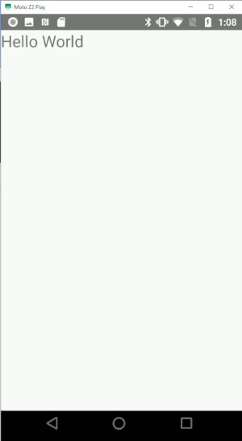

# Hello world


<!-- TOC -->

- [Hello world](#hello-world)
  - [Compilarea aplicatiei](#compilarea-aplicatiei)
  - [Instalarea aplicatiei pe terminal](#instalarea-aplicatiei-pe-terminal)
  - [Structura aplicatiei](#structura-aplicatiei)
    - [Fisierele sursa](#fisierele-sursa)
      - [MainActivity.java](#mainactivityjava)
      - [AndroidManifest.xml](#androidmanifestxml)
    - [Fisierele care configureaza constructia pachetului](#fisierele-care-configureaza-constructia-pachetului)
      - [app/build.gradle](#appbuildgradle)
      - [build.gradle](#buildgradle)
      - [settings.gradle](#settingsgradle)
    - [gradle.properties](#gradleproperties)
  - [Fisierul generat](#fisierul-generat)
  - [Semnarea apk-ului de productie](#semnarea-apk-ului-de-productie)
    - [Creati un keystore cu comanda keytool](#creati-un-keystore-cu-comanda-keytool)
    - [Semnati apk-ul cu ajutorul comenzii jarsigner](#semnati-apk-ul-cu-ajutorul-comenzii-jarsigner)
    - [Utilizati zipalign pentru alinierea apk-ului](#utilizati-zipalign-pentru-alinierea-apk-ului)
  - [Dupa generarea keystore-ului se pot adauga actiunile de semnare si aliniere la fisierul build.grade](#dupa-generarea-keystore-ului-se-pot-adauga-actiunile-de-semnare-si-aliniere-la-fisierul-buildgrade)
  - [Continutul apk-ului](#continutul-apk-ului)
    - [AndroidManifest.xml](#androidmanifestxml-1)
    - [META-INF](#meta-inf)
    - [res/ (Resources)](#res-resources)
    - [assets](#assets)
    - [lib](#lib)
    - [res/drawable/ (Resources - Images)](#resdrawable-resources---images)
    - [res/layout/ (Resources - Layouts)](#reslayout-resources---layouts)
    - [res/values/ (Resources - Strings, Colors, Styles)](#resvalues-resources---strings-colors-styles)
    - [classes.dex (Dalvik Executable)](#classesdex-dalvik-executable)
    - [resources.arsc (Compiled Resources)](#resourcesarsc-compiled-resources)
    - [configurations/ (optional)](#configurations-optional)

<!-- /TOC -->
Aceasta este cea mai simpla aplicatie Android care afiseaza ceva. 



## Compilarea aplicatiei


```sh
 gradle build

> Task :app:lintReportDebug
Wrote HTML report to file:///C:/Users/sorin/AndroidProjects/Android/Projects/001_hello_world/hello_world/app/build/reports/lint-results-debug.html

BUILD SUCCESSFUL in 22s
85 actionable tasks: 85 executed
PS C:\Users\sorin\AndroidProjects\Android\Projects\001_hello_world\hello_world>
```

## Instalarea aplicatiei pe terminal

```
adb devices
List of devices attached
ZY224F8Q2G      device
```

`adb -s ZY224F8Q2G install .\app\build\outputs\apk\debug\app-debug.apk`

`adb uninstall ro.makore.hello_world`


## Structura aplicatiei


    hello_world/
    ├── app
    │   ├── build.gradle
    │   └── src
    │       └── main
    │           ├── AndroidManifest.xml
    │           └── java
    │               └── ro
    │                   └── makore
    │                       └── hello_world
    │                           └── MainActivity.java
    ├── build.gradle
    ├── gradle.properties
    └── settings.gradle

### Fisierele sursa

#### MainActivity.java

MainActivity.java este fisierul principal al proiectului, singurul fragment de cod java disponibil. 

Codul este compus din urmatoarele:

Declaratia pachetului

```java
package ro.makore.hello_world; // Declara pachetul aplicației
```


Blocul de import al pachetelor
```java
import android.os.Bundle; // Importă clasa pentru manipularea Bundle (utilizată la salvarea/restaurarea stării)
import android.widget.LinearLayout; // Importă clasa pentru gestionarea unui container de tip LinearLayout
import android.widget.TextView; // Importă clasa pentru afișarea textului pe ecran
import androidx.appcompat.app.AppCompatActivity; // Importă clasa de bază pentru activități compatibile cu AppCompat
```

Clase MainActivity care extinde AppCompatActivity

Orice aplicatie Android trebuie sa aiba o activitate principala. O activitate este practic o fereastra in Android care ofera o serie de metode care pot fi extinse pentru a controla comportamentul acesteia. 

AppCompatActivity este o clasă de bază din biblioteca AndroidX, utilizată pentru a crea activități compatibile cu versiunile mai vechi de Android. Aceasta extinde funcționalitatea clasei Activity standard, oferind suport pentru elemente moderne ale interfeței utilizator (cum ar fi bara de acțiuni - action bar) și teme din biblioteca AppCompat.Permite utilizarea funcțiilor moderne ale interfeței pe dispozitive cu versiuni mai vechi de Android avand in acelasi timp suport pentru teme și stiluri moderne: Material Design și alte stiluri personalizate.

Este recomandată utilizarea acestei clase în locul clasei Activity, mai ales pentru aplicații care trebuie să ruleze pe mai multe versiuni de Android.

Codul suprascrie functia onCreate care se executa la crearea ferestrei. Continutul ferestrei este organizat folosind ceea ce numeste un "layout "

un layout este o structură de date care definește modul de organizare și dispunere a componentelor vizuale (de obicei numite "view"-uri) pe o interfață grafică. Un layout acționează ca un container pentru diverse elemente vizuale, precum butoane, câmpuri de text, imagini etc., și determină cum acestea sunt plasate pe ecran. Layout-ul poate aplica reguli de poziționare și dimensionare a fiecărui element din interiorul său, de exemplu, plasând elementele într-o coloană verticală, într-o linie orizontală sau într-o grilă.

În funcție de framework-ul folosit, pot exista diferite tipuri de layout-uri (exemplu, LinearLayout, RelativeLayout sau ConstraintLayout în Android), fiecare având un comportament diferit la plasarea elementelor.

De obicei layoutul este definit intr-un fisier .xml dar acesta poate fi initializat programatic. 

Dupa initializarea layoutului, elemnentele vizuale (view-uri) se plaseaza in interiorul acestuia. La terminarea constructiei layoutului, acesta se asociaza cu activitatea prin metoda `setContentView(layout)`. 

```java
// Definirea clasei principale a activității
public class MainActivity extends AppCompatActivity {
    @Override
    protected void onCreate(Bundle savedInstanceState) {
        super.onCreate(savedInstanceState); // Apelează metoda de bază pentru crearea activității

        // Creează un LinearLayout programatic
        LinearLayout layout = new LinearLayout(this); 
        layout.setOrientation(LinearLayout.VERTICAL); // Setează orientarea verticală pentru layout

        // Creează un TextView care afișează "Hello World"
        TextView textView = new TextView(this); 
        textView.setText("Hello World"); // Setează textul afișat
        textView.setTextSize(24); // Setează dimensiunea textului la 24sp

        // Adaugă TextView-ul în cadrul layout-ului
        layout.addView(textView);

        // Setează layout-ul ca vizualizare principală a activității
        setContentView(layout);
    }
}
```

#### AndroidManifest.xml

AndroidManifest.xml este un fisier care contine metadate esentiale pentru aplicatia android. Este utilizat in timpul compilarii aplicatiei precum si in timpul instalarii si rularii. 

```xml
<?xml version="1.0" encoding="utf-8"?>
<manifest xmlns:android="http://schemas.android.com/apk/res/android" xmlns:tools="http://schemas.android.com/tools">
    
    <application
        android:theme="@style/Theme.AppCompat.Light.NoActionBar"
        android:label="HelloWorld"
        tools:targetApi="34">
        <activity
            android:name=".MainActivity"
            android:exported="true">
            <intent-filter>
                <action android:name="android.intent.action.MAIN" />
                <category android:name="android.intent.category.LAUNCHER" />
            </intent-filter>
        </activity>
    </application>
</manifest>
```

Acest fragment defineste modul in care sistemul de operare va porni aplicatia: 

```xml
    <intent-filter>
        <action android:name="android.intent.action.MAIN" />
        <category android:name="android.intent.category.LAUNCHER" />
    </intent-filter>
```            

 intent filter este o componentă din manifestul Android care permite unei activități, servicii sau receiver de broadcast să specifice tipurile de intents (cereri de acțiuni, date sau evenimente) pe care le poate gestiona. Termenul „filtru” vine de la faptul că intent filter-ul acționează ca un mecanism de filtrare. Acesta specifică tipurile de intents (cereri de acțiune, date sau evenimente) pe care o componentă (de exemplu, o activitate) este dispusă să le gestioneze. Când un intent este trimis de către sistem (de exemplu, pentru a lansa o aplicație sau un serviciu), Android verifică filtrele de intent ale componentelor disponibile pentru a vedea care dintre ele poate gestiona intent-ul pe baza acțiunii, categoriei și datelor specificate.


### Fisierele care configureaza constructia pachetului

Constructia pachetului implica o serie mare de operatii. Acestea sunt automatizate cu ajutorul unui sistem de constructie numit gradle. Gradle asteapta doua fisiere de configurare a constructiei: unul la nivel de proiect si altul la nivel de aplicatie (un proiect poate avea mai multe aplicatii)

Fisierele build.gradle sunt scrise in propriul lor limbaj de programare care poate fi groovy sau kotlin. Diferenta nu este foarte mare. 

#### app/build.gradle

```groovy
apply plugin: 'com.android.application'

android {
```

**namespace:** Definește un namespace pentru aplicație, care este un identificator unic folosit pentru a organiza aplicațiile Android. Este similar cu package în Java. În acest caz, aplicația se numește ro.makore.hello_world.

```groovy
    namespace 'ro.makore.hello_world'
```

Specifică versiunea SDK-ului Android pe care aplicația îl va utiliza pentru a compila aplicația. În acest caz, este folosit SDK 34 (versiunea Android 14).
    
```groovy    
    compileSdk 34
```

**applicationId:** ID-ul aplicației, care este utilizat pentru a identifica aplicația pe dispozitivele Android. Acesta ar trebui să fie unic. 

**minSdk:** Versiunea minimă de Android pe care aplicația o va accepta. În acest caz, aplicația va rula pe dispozitive cu Android 9.0 (API 28) sau mai noi. 

**targetSdk:** Versiunea de Android pentru care aplicația este optimizată. De obicei, aceasta ar trebui să fie setată la ultima versiune stabilă a SDK-ului. 

**versionCode:** Un număr de versiune intern folosit pentru a diferenția versiunile aplicației. Acesta este utilizat de Google Play pentru a determina dacă o versiune a aplicației este mai recentă decât alta. 

**versionName:** Numele versiunii aplicației, care este vizibil pentru utilizatori. În acest caz, aplicația are versiunea 1.0. 

**testInstrumentationRunner:** Specifică runner-ul de teste care va fi folosit pentru testarea aplicației. În acest caz, este folosit AndroidJUnitRunner pentru a rula teste instrumentate.

``` groovy
    defaultConfig {
        applicationId "ro.makore.hello_world"
        minSdk 28
        targetSdk 34
        versionCode 1
        versionName "1.0"
        testInstrumentationRunner "androidx.test.runner.AndroidJUnitRunner"
    }
```

**release:** Acesta definește configurațiile pentru versiunea de producție a aplicației (de obicei pentru publicare în Google Play).

**minifyEnabled:** Setat pe false, înseamnă că codul nu va fi obfuscat sau redus (minificat). Dacă ar fi true, codul sursă ar fi redus și obfuscat pentru a micșora dimensiunea fișierului APK și pentru a face mai dificilă decompilarea.

**proguardFiles:** Setează fișierele de configurare pentru ProGuard, un instrument care poate obfusca și micșora aplicația. În acest caz, se folosesc fișierele de configurare implicite ale ProGuard pentru Android și unul personalizat.

```groovy
    buildTypes {
        release {
            minifyEnabled false
            proguardFiles getDefaultProguardFile('proguard-android-optimize.txt'), 'proguard-rules.pro'
        }
    }
```

**sourceCompatibility:** Specifică versiunea de Java care va fi utilizată pentru a compila sursa aplicației. În acest caz, aplicația este compatibilă cu Java 11.

**targetCompatibility:** Specifică versiunea de Java pentru care se va compila bytecode-ul aplicației. În acest caz, aplicația va fi compilată pentru a fi compatibilă cu Java 11.

```groovy
    compileOptions {
        sourceCompatibility JavaVersion.VERSION_11
        targetCompatibility JavaVersion.VERSION_11
    }
}
```

**implementation:** Definește dependențele necesare pentru proiect. În acest caz, aplicația utilizează biblioteca androidx.appcompat (pentru a utiliza componentele de UI compatibile cu diferite versiuni de Android). Versiunea specificată este 1.5.

```groovy
dependencies {
    implementation 'androidx.appcompat:appcompat:1.5.1'
}
```


#### build.gradle

**repositories:** Acesta este blocul care definește depozitele (repository-urile) de unde Gradle va descărca dependențele necesare pentru construirea proiectului.

 - **google():** Acesta este un depozit oficial al Google, care conține biblioteci și pluginuri necesare pentru dezvoltarea aplicațiilor Android. De exemplu, aici sunt stocate pluginurile pentru construirea aplicațiilor Android, inclusiv pluginul com.android.tools.build:gradle.

 - **mavenCentral():** Acesta este un depozit public care conține multe biblioteci Java (și Android). Gradle va căuta și va descărca orice dependență care nu se află în depozitul Google de aici.
  
 - **dependencies:** Blocul dependencies definește toate dependențele necesare pentru a construi proiectul. În acest caz, este definită o dependență pentru pluginul Gradle pentru Android.

```groovy
buildscript {
    repositories {
        google()
        mavenCentral()
    }
    dependencies {
        classpath 'com.android.tools.build:gradle:8.3.0'
    }
}
```

#### settings.gradle

 - **pluginManagement:** Blocul pluginManagement definește configurația pentru gestionarea pluginurilor utilizate în proiectul tău. Acesta specifică depozitele de unde Gradle va descărca pluginurile.

 - **dependencyResolutionManagement:** Blocul dependencyResolutionManagement definește cum se vor gestiona dependențele în proiect, mai ales când vine vorba de depozite.

 - **rootProject.name = "hello_world":** Această linie definește numele proiectului rădăcină al aplicației tale. Numele „hello_world” va fi folosit pentru proiectul principal.

 - **include ':app':** Aceasta include un subproiect numit app în proiectul principal. Subproiectul app este, de obicei, aplicația principală Android a proiectului.

```groovy
pluginManagement {
    repositories {
        google {
            content {
                includeGroupByRegex("com\\.android.*")
                includeGroupByRegex("com\\.google.*")
                includeGroupByRegex("androidx.*")
            }
        }
        mavenCentral()
        gradlePluginPortal()
    }
}
dependencyResolutionManagement {
    repositoriesMode.set(RepositoriesMode.FAIL_ON_PROJECT_REPOS)
    repositories {
        google()
        mavenCentral()
    }
}

rootProject.name = "hello_world"
include ':app'
```

### gradle.properties

org.gradle.jvmargs=-Xmx2048m -Dfile.encoding=UTF-8
Această linie configurează argumentele JVM (Java Virtual Machine) care sunt folosite la rularea Gradle.

- Xmx2048m: Aceasta setează limita maximă de memorie RAM pe care Gradle o poate utiliza la 2048 MB (2 GB). Gradle este un instrument destul de intensiv în utilizarea memoriei, iar această setare poate ajuta la îmbunătățirea performanței, mai ales în proiectele mari.

- Dfile.encoding=UTF-8: Setează setarea de codificare a fișierelor la UTF-8, ceea ce garantează că fișierele sursă și resursele proiectului vor fi procesate corect în ceea ce privește caracterele speciale sau limbi diferite, evitând problemele legate de codificarea textului.

 - android.useAndroidX=true
Această linie setează utilizarea bibliotecilor AndroidX în locul bibliotecilor vechi Support Library. AndroidX este un set de biblioteci moderne care au fost introduse de Google pentru a îmbunătăți performanța și a asigura compatibilitatea pe termen lung. Aceasta înlocuiește bibliotecile Support Library și este acum standardul pentru dezvoltarea Android.

 - android.nonTransitiveRClass=true

android.nonTransitiveRClass=true: Aceasta setează generarea unui fișier R non-transitiv. Astfel, resursele vor fi limitate la proiectul în care sunt definite, iar dependențele nu vor putea accesa resursele din alte module. Aceasta poate ajuta la evitarea conflictelor de resurse și la îmbunătățirea separării modulelor, în special în proiectele mari sau cu mai multe module.


```
org.gradle.jvmargs=-Xmx2048m -Dfile.encoding=UTF-8
android.useAndroidX=true
android.nonTransitiveRClass=true
```

## Fisierul generat

Fisierul generat de procesul de constructie este un fisier cu extensia apk. Procesul de constructie genereaza de obicei doua fisiere apk, unul pentru debugging si unul de "productie". 

Acestea se gasesc de obice in 

app\build\outputs\apk\debug\app-debug.apk


Aspect              |	      APK de debug       |	APK de producție               |
--------------------|----------------------------|---------------------------------|
pozitionarea fisierului | app\build\outputs\apk\debug\app-debug.apk | app\build\outputs\apk\release\app-release-unsigned.apk |
Scop |	Folosit pentru testare și depanare în timpul dezvoltării. |	Folosit pentru distribuirea aplicației către utilizatori. |
Depanare (Debugging) |	Include instrumente precum loguri, breakpoint-uri și opțiuni pentru dezvoltatori. |	Optimizat pentru utilizatori finali; instrumentele de depanare sunt eliminate. |
Semnătura |	Semnat cu o cheie de debug implicită oferită de Android SDK. |	Semnat cu o cheie privată de producție deținută de dezvoltator. |
ProGuard/Obfuscare	| Nu este aplicată.	| Codul este redus și ofuscat pentru protecție. |
Optimizare	| Fără optimizări; construit pentru viteză în timpul testării.	| Optimizat pentru performanță și dimensiune redusă. |
Debuggable |	Setat la android:debuggable="true" în AndroidManifest.xml. |	Setat la android:debuggable="false" pentru securitate. |
Integritatea cheii |	Folosește un keystore implicit (debug.keystore).	| Semnat cu un keystore privat pentru autenticitate. |
Vizibilitatea codului |	Codul sursă este ușor de văzut în APK-ul decompilat.	| Codul este ofuscat, ceea ce îngreunează ingineria inversă. |
Securitatea datelor	| Poate include date de test sau puncte finale de testare.	| Include configurații pregătite pentru producție. |
Viteza build-ului	| Prioritizează viteza de build. |	Prioritizează optimizarea build-ului. |
Optimizarea codului	 | Codul nu este optimizat pentru viteză sau dimensiune. |	Codul este optimizat pentru performanță și utilizarea eficientă a resurselor. |
Raportarea erorilor |	Poate să nu includă raportare adecvată pentru erori. |	Integrează raportare de producție (ex: Firebase Crashlytics). |
Instrumente de performanță |	Include instrumente precum StrictMode sau loguri.	| Aceste instrumente sunt eliminate sau dezactivate. |
API-uri terțe |	Poate folosi chei de testare sau medii sandbox. |	Folosește chei de producție sau medii live. |
Instalare	| Poate fi instalat pe dispozitive cu depanare USB activată. |	Creat pentru distribuirea către utilizatori finali. |
Upload în magazin |	Nu poate fi încărcat în Google Play Store.	| Poate fi încărcat în Google Play Store. |


## Semnarea apk-ului de productie

Semnarea implica urmatoarele etape: 

### Creati un keystore cu comanda keytool

```sh
keytool -genkey -v -keystore C:\Users\smilutinovici\Android\main_develop_2048.keystore -keyalg RSA -keysize 2048 -validity 1000 -alias sorin_mobile_signature
Enter keystore password:

Re-enter new password:

Enter the distinguished name. Provide a single dot (.) to leave a sub-component empty or press ENTER to use the default value in braces.
What is your first and last name?
  [Unknown]:  sorin milutinovici
What is the name of your organizational unit?
  [Unknown]:  mobile development
What is the name of your organization?
  [Unknown]:  big rich organization
What is the name of your City or Locality?
  [Unknown]:  bucharest
What is the name of your State or Province?
  [Unknown]:  bucharest
What is the two-letter country code for this unit?
  [Unknown]:  ro
Is CN=sorin milutinovici, OU=mobile development, O=big rich organization, L=bucharest, ST=bucharest, C=ro correct?
  [no]:  yes

Generating 2.048 bit RSA key pair and self-signed certificate (SHA384withRSA) with a validity of 1.000 days
        for: CN=sorin milutinovici, OU=mobile development, O=big rich organization, L=bucharest, ST=bucharest, C=ro
[Storing C:\Users\smilutinovici\Android\main_develop_2048.keystore]
```

Daca uitati aliasul (care va fi necesar la semnare) il puteti afla cu comanda keytool -list

```sh
 keytool -list -v -keystore C:\Users\smilutinovici\Android\main_develop_2048.keystore
Enter keystore password:

Keystore type: PKCS12
Keystore provider: SUN

Your keystore contains 1 entry

Alias name: sorin_mobile_signature
Creation date: 9 dec. 2024
Entry type: PrivateKeyEntry
Certificate chain length: 1
Certificate[1]:
Owner: CN=sorin milutinovici, OU=mobile development, O=big rich organization, L=bucharest, ST=bucharest, C=ro
Issuer: CN=sorin milutinovici, OU=mobile development, O=big rich organization, L=bucharest, ST=bucharest, C=ro
Serial number: a03b214a3310557d
Valid from: Mon Dec 09 22:53:14 EET 2024 until: Sun Sep 05 23:53:14 EEST 2027
Certificate fingerprints:
         SHA1: 51:CA:B2:29:F8:3D:34:05:AC:18:8A:9A:23:07:8D:B1:F4:C4:9F:C5
         SHA256: 0A:20:D2:9F:65:E8:83:13:88:79:21:24:6F:EB:B0:72:26:10:AF:4D:43:EE:98:56:3F:E1:B2:38:AB:7F:94:9F
Signature algorithm name: SHA384withRSA
Subject Public Key Algorithm: 2048-bit RSA key
Version: 3

Extensions:

#1: ObjectId: 2.5.29.14 Criticality=false
SubjectKeyIdentifier [
KeyIdentifier [
0000: FD 8C C9 BA 95 22 F1 0B   F0 6B 47 8F BE DD 96 B4  ....."...kG.....
0010: 03 FF 9A 68                                        ...h
]
]


*******************************************
*******************************************
```

### Semnati apk-ul cu ajutorul comenzii jarsigner

```sh

 jarsigner -verbose -keystore C:\Users\smilutinovici\Android\main_develop_2048.keystore -signedjar .\app\build\outputs\apk\release\app-release-signed.apk  .\app\build\outputs\apk\release\app-release-unsigned.apk sorin_mobile_signature
Enter Passphrase for keystore:

   adding: META-INF/MANIFEST.MF
   adding: META-INF/SORIN_MO.SF
   adding: META-INF/SORIN_MO.RSA
  signing: META-INF/version-control-info.textproto
  signing: META-INF/androidx.activity_activity.version
  signing: META-INF/androidx.annotation_annotation-experimental.version

  ...

>>> Signer
    X.509, CN=sorin milutinovici, OU=mobile development, O=big rich organization, L=bucharest, ST=bucharest, C=ro
    Signature algorithm: SHA384withRSA, 2048-bit key
    [trusted certificate]

jar signed.

Warning:
The signer's certificate is self-signed.
```

Certificatul self-signed nu poate fi folosit pentru trimiterea aplicatiei pe google play. Pentru a o putea face, exista doua variante: 

1. obtinerea unui certificat de la o autoritate de certificare care apoi va fi importat in keystore, cu comanda: 

```
keytool -importcert -file your_certificate.crt -keystore your_keystore.jks -alias your_alias
```

2. utilizarea serviciului Google Play App Signing. Acesta este un proces care evita necesitatea obtinerii unui certificat de la o alta autoritate. Google va semna automat aplicatia la incarcarea in Google Play Store. 

### Utilizati zipalign pentru alinierea apk-ului

zipalign aliniaza toate datele necomprimate din interiorul apk-ului la multiplu de 4 octeti pentru citirea mai rapida in memorie. Alinierea trebuie facuta dupa semnare pentru ca semnarea schimba structura fisierului. 

```sh
zipalign -v 4 .\app\build\outputs\apk\release\app-release-signed.apk  .\app\build\outputs\apk\release\app-release-aligned.apk
Verifying alignment of .\app\build\outputs\apk\release\app-release-aligned.apk (4)...
      50 META-INF/MANIFEST.MF (OK - compressed)
   21082 META-INF/SORIN_MO.SF (OK - compressed)
   43500 META-INF/SORIN_MO.RSA (OK - compressed)
   44824 META-INF/version-control-info.textproto (OK - compressed)
   44964 META-INF/androidx.activity_activity.version (OK)

   ...
```

## Dupa generarea keystore-ului se pot adauga actiunile de semnare si aliniere la fisierul build.grade

```groovy
apply plugin: 'com.android.application'

android {
    namespace 'ro.makore.hello_world'
    compileSdk 34

    defaultConfig {
        applicationId "ro.makore.hello_world"
        minSdk 28
        targetSdk 34
        versionCode 1
        versionName "1.0"
        testInstrumentationRunner "androidx.test.runner.AndroidJUnitRunner"
    }

    signingConfigs {
        release {
            keyAlias 'your-alias'         // Replace with your keystore alias
            keyPassword 'your-key-pass'  // Replace with your key password
            storeFile file('path/to/your.keystore') // Replace with the path to your keystore
            storePassword 'your-store-pass'  // Replace with your keystore password
        }
    }

    buildTypes {
        release {
            signingConfig signingConfigs.release
            minifyEnabled false
            proguardFiles getDefaultProguardFile('proguard-android-optimize.txt'), 'proguard-rules.pro'
        }
    }

    compileOptions {
        sourceCompatibility JavaVersion.VERSION_11
        targetCompatibility JavaVersion.VERSION_11
    }
}

dependencies {
    implementation 'androidx.appcompat:appcompat:1.5.1'
}
```


## Continutul apk-ului

apk-ul este in realitate o arhiva in format zip care contine urmatoarele: 

### AndroidManifest.xml
Fișierul AndroidManifest.xml este esențial pentru orice aplicație Android. Acesta conține informații importante despre aplicație, cum ar fi permisiunile necesare, activitățile aplicației, serviciile, receiverele de intenții și altele.
Rol: Permite sistemului Android să știe cum să interacționeze cu aplicația și ce componente trebuie să fie utilizate.

### META-INF
Descriere: Acesta este un director care conține fișiere legate de semnătura aplicației.
MANIFEST.MF: Fișierul principal de manifest al aplicației, care listează toate fișierele din APK impreuna cu amprentele digitale (hash-uri) ale tuturor fisierelor.
CERT.SF: Fișier care conține amprente digitale (hash-uri) ale diferitelor sectiuni ale fisierului MANIFEST.MF (securitate suplimentara).
CERT.RSA: Certificatul digital (RSA) folosit pentru a semna aplicația.

### res/ (Resources)
Descriere: Acesta este un director care conține resursele aplicației, cum ar fi imagini, fișiere de tip XML pentru layouturi, șiruri de text pentru localizare (strings), și altele.

### assets
Descriere: Acesta este un director care poate conține fișiere necompresate, utilizate de aplicație (de exemplu, fișiere de configurare, baze de date, fișiere multimedia).

### lib
Descriere: Acest director conține biblioteci native (fișiere .so), care sunt fișiere binare utilizate de aplicație. Aceste biblioteci sunt scrise de obicei în C sau C++ și sunt utilizate pentru a extinde funcționalitatea aplicației.

### res/drawable/ (Resources - Images)
Descriere: Acesta conține imagini și fișiere grafice utilizate în aplicație, cum ar fi icoane, fundaluri sau butoane.
Rol: Furnizează imagini pentru interfața utilizatorului, ajustându-se la diverse dimensiuni de ecran și densități.

### res/layout/ (Resources - Layouts)
Descriere: Conține fișiere XML care definesc structura vizuală a activităților și fragmentelor aplicației (de exemplu, poziționarea butoanelor, textelor etc.).

### res/values/ (Resources - Strings, Colors, Styles)
Descriere: Conține fișiere XML care definesc valori precum șiruri de caractere (strings), culori, stiluri și dimensiuni utilizate în aplicație. Permite centralizarea și reutilizarea valorilor pe parcursul aplicației.

### classes.dex (Dalvik Executable)
Descriere: Acest fișier conține bytecode-ul compilat al aplicației. Pot exista unul sau mai multe fisiere dex, in functie de numarul de clase din codul java initial. un fisier dex poate contine mai multe clase (pana la atingerea numarului de 2 ^ 16 referinte). Daca sunt mai multe clase (si de obicei sunt) se vor crea fisiere dex suplimentare. 

### resources.arsc (Compiled Resources)
Descriere: Acesta este un fișier binar care conține toate resursele precompilate (de exemplu, șiruri de caractere, imagini, layouturi, etc.) într-un format eficient pentru a fi utilizate de aplicație. 

### configurations/ (optional)
Descriere: Acest director poate conține fișiere care sunt utilizate pentru a defini configurații specifice aplicației (de exemplu, resurse diferite pentru diverse limbi sau densități de ecran).

```
.
├── META-INF
│   ├── com
│   │   └── android
│   │       └── build
│   │           └── gradle
│   └── services
├── assets
│   └── dexopt
├── kotlin
│   ├── annotation
│   ├── collections
│   ├── coroutines
│   ├── internal
│   ├── ranges
│   └── reflect
└── res
    ├── color
    └── color-v23
```

de multe ori in apk se gasesc si fisiere kotlin. 