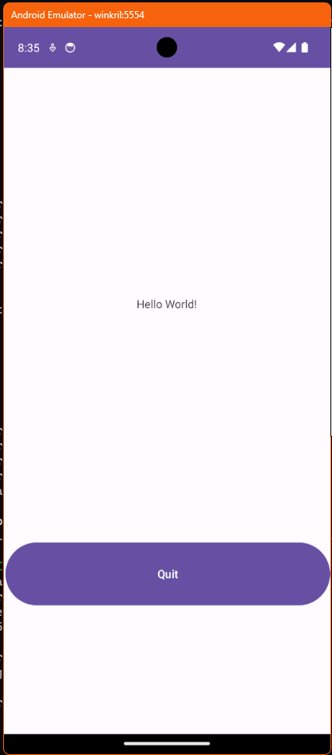

# Simple Hello World cu buton de quit


<!-- TOC -->

- [Simple Hello World cu buton de quit](#simple-hello-world-cu-buton-de-quit)
  - [Compilarea aplicatiei](#compilarea-aplicatiei)
  - [Instalarea aplicatiei pe emulator](#instalarea-aplicatiei-pe-emulator)
  - [Urmarirea procesului aplicatiei](#urmarirea-procesului-aplicatiei)
  - [Dezinstalarea aplicatiei](#dezinstalarea-aplicatiei)
  - [Structura aplicatiei](#structura-aplicatiei)
  - [Fisierele sursa](#fisierele-sursa)
    - [MainActivity.java](#mainactivityjava)
    - [android\_main.xml](#android_mainxml)
    - [AndroidManifest.xml](#androidmanifestxml)
  - [Fisiere care controleaza constructia proiectului](#fisiere-care-controleaza-constructia-proiectului)
    - [app/build.gradle](#appbuildgradle)
    - [build.gradle](#buildgradle)
    - [settings.gradle](#settingsgradle)

<!-- /TOC -->

Aceasta aplicatie afiseaza un text "Hello World" si un buton "Quit" care paraseste aplicatia. 



Aplicatia adauga un layout specificat intr-un fisier xml (nu construit dinamic). Layoutul este de tip "constrained layout". 

## Compilarea aplicatiei

```sh
gradle build
Starting a Gradle Daemon (subsequent builds will be faster)

> Task :app:lintReportDebug
Wrote HTML report to file:///C:/Users/smilutinovici/VisualStudioProjects/UTM/Android/Projects/01_simple/akrilki_01/app/build/reports/lint-results-debug.html

BUILD SUCCESSFUL in 2m 15s
85 actionable tasks: 85 executed
```

## Instalarea aplicatiei pe emulator

```sh
adb devices
List of devices attached
emulator-5554   device
```

```sh
adb -s emulator-5554 install .\app\build\outputs\apk\debug\app-debug.apk
Performing Streamed Install
Success
```

## Urmarirea procesului aplicatiei

```sh
adb shell ps | grep akri
u0_a196       9548   363   14131840 115180 0                   0 S ro.makore.akrilki_01
```
sau 

```sh
 adb shell ps | findstr akrilki_01
```


## Dezinstalarea aplicatiei

```sh
adb uninstall ro.makore.akrilki_01
```

## Structura aplicatiei

```
├── akrilki_01
│   ├── app
│   │   ├── build.gradle
│   │   └── src
│   │       └── main
│   │           ├── AndroidManifest.xml
│   │           ├── java
│   │           │   └── ro
│   │           │       └── makore
│   │           │           └── akrilki_01
│   │           │               └── MainActivity.java
│   │           └── res
│   │               └── layout
│   │                   └── activity_main.xml
│   ├── build.gradle
│   ├── gradle.properties
│   └── settings.gradle
```

## Fisierele sursa

### MainActivity.java

```java

package ro.makore.akrilki_01;

/*
Codul importă clase și interfețe necesare pentru:

Gestionarea activităților (AppCompatActivity).
Gestionarea interfeței grafice și a barelor de sistem (Insets, WindowCompat, ViewCompat, WindowInsetsCompat).
Manipularea componentelor UI precum un buton (Button).
*/

import android.os.Bundle;
import androidx.appcompat.app.AppCompatActivity;
import androidx.core.graphics.Insets;
import androidx.core.view.ViewCompat;
import androidx.core.view.WindowCompat;
import android.widget.Button;
import androidx.core.view.WindowInsetsCompat;

//Declararea clasei principale
public class MainActivity extends AppCompatActivity {

    // Suprascriem metoda onCreate adaugand elementele dorite
    @Override
    protected void onCreate(Bundle savedInstanceState) {
        super.onCreate(savedInstanceState);

        //specifica fisierul de layout care defineste interfata acestei activitati
        setContentView(R.layout.activity_main);

        // Butonul de iesire este declarat in fisierul de layout si se va gasi plasat in clasa R
        Button quitButton = findViewById(R.id.quitButton);


        // Adauga actiunea care va fi executata la apasarea butonului
        quitButton.setOnClickListener(v -> finishAffinity());

        //linia de mai sus se poate scrie si altfel: 
        /*
        quitButton.setOnClickListener(new View.OnClickListener() {
            @Override
            public void onClick(View v) {
                finishAffinity();
            }
        });
        */
    }
}

```

### android_main.xml

Definirea unui layout se face prin setarea unui tag insotit de un set de atribute care sunt parte din anumite namespace-uri. Fiecare proprietate setata in tagul corespunzator trebuie sa fie insotita de namespace-ul din care face parte.  

De exemplu, proprietatea "layout_width" face parte din namespace-ul android care are declaratia "xmlns:android" si url-ul "http://schemas.android.com/apk/res/android".

Namespace-urile acopera si proprietatile componentelor inserate in interiorul layoutului, in acest caz un TextView si un Button. Componentele trebuie sa contina un id daca dorim sa le apelam in orice forma din cod. 

De asemenea, datorita prezentei unui layout de tip constrained, sunt necesare proprietati corespunzatoare acestuia (layout_constraintBotton, etc.)

<?xml version="1.0" encoding="utf-8"?>
<androidx.constraintlayout.widget.ConstraintLayout 
    xmlns:android="http://schemas.android.com/apk/res/android"
    xmlns:app="http://schemas.android.com/apk/res-auto"
    xmlns:tools="http://schemas.android.com/tools"
    android:id="@+id/main"
    android:layout_width="match_parent"
    android:layout_height="match_parent"
    tools:context=".MainActivity">

    <TextView
        android:layout_width="wrap_content"
        android:layout_height="wrap_content"
        android:text="Hello World!"
        app:layout_constraintBottom_toTopOf="@+id/quitButton"
        app:layout_constraintEnd_toEndOf="parent"
        app:layout_constraintStart_toStartOf="parent"
        app:layout_constraintTop_toTopOf="parent" />

    <Button
        android:id="@+id/quitButton"   
        android:layout_width="409dp"
        android:layout_height="87dp"
        android:layout_marginBottom="158dp"
        android:text="Quit"
        app:layout_constraintBottom_toBottomOf="parent"
        app:layout_constraintEnd_toEndOf="parent" />

</androidx.constraintlayout.widget.ConstraintLayout>

### AndroidManifest.xml

daca folosim `@style/Theme.Material3.DayNight.NoActionBar` (un stil mai modern) trebuie sa adaugam la app/build.gradle la dependinte `implementation 'com.google.android.material:material:1.9.0'`

```xml
<?xml version="1.0" encoding="utf-8"?>
<manifest xmlns:android="http://schemas.android.com/apk/res/android" xmlns:tools="http://schemas.android.com/tools">

    <application
        android:label="Alkrilki01"
        android:theme="@style/Theme.AppCompat.Light.NoActionBar" 
        tools:targetApi="31">
        <activity
            android:name=".MainActivity"
            android:exported="true">
            <intent-filter>
                <action android:name="android.intent.action.MAIN" />
                <category android:name="android.intent.category.LAUNCHER" />
            </intent-filter>
        </activity>
    </application>

</manifest>
```

## Fisiere care controleaza constructia proiectului

### app/build.gradle

daca folosim `@style/Theme.Material3.DayNight.NoActionBar` (un stil mai modern) trebuie sa adaugam la app/build.gradle la dependinte `implementation 'com.google.android.material:material:1.9.0'`


```groovy
apply plugin: 'com.android.application'

android {
    namespace 'ro.makore.akrilki_01'
    compileSdk 34

    defaultConfig {
        applicationId "ro.makore.akrilki_01"
        minSdk 28
        targetSdk 34
        versionCode 1
        versionName "1.0"
        testInstrumentationRunner "androidx.test.runner.AndroidJUnitRunner"
    }

    buildTypes {
        release {
            minifyEnabled false
            proguardFiles getDefaultProguardFile('proguard-android-optimize.txt'), 'proguard-rules.pro'
        }
    }
    compileOptions {
        sourceCompatibility JavaVersion.VERSION_11
        targetCompatibility JavaVersion.VERSION_11
    }
}

dependencies {
    implementation 'androidx.appcompat:appcompat:1.5.1'
    implementation 'androidx.constraintlayout:constraintlayout:2.1.4'
}
```
### build.gradle


```groovy
buildscript {
    repositories {
        google()
        mavenCentral()
    }
    dependencies {
        classpath 'com.android.tools.build:gradle:8.3.0'
    }
}
```

### settings.gradle

```groovy
pluginManagement {
    repositories {
        google {
            content {
                includeGroupByRegex("com\\.android.*")
                includeGroupByRegex("com\\.google.*")
                includeGroupByRegex("androidx.*")
            }
        }
        mavenCentral()
        gradlePluginPortal()
    }
}
dependencyResolutionManagement {
    repositoriesMode.set(RepositoriesMode.FAIL_ON_PROJECT_REPOS)
    repositories {
        google()
        mavenCentral()
    }
}

rootProject.name = "akrilki_01"
include ':app'
```


