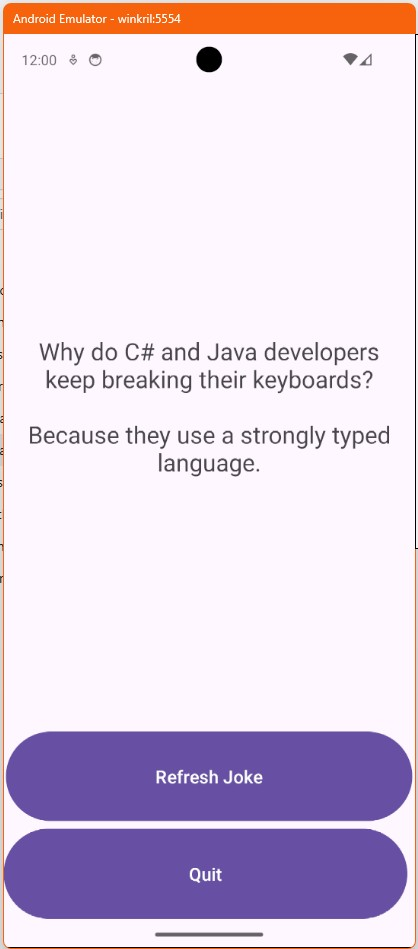

# Aplicatie care interactioneaza cu un API
<!-- TOC -->

- [Aplicatie care interactioneaza cu un API](#aplicatie-care-interactioneaza-cu-un-api)
  - [Compilarea aplicatiei](#compilarea-aplicatiei)
  - [Instalarea aplicatiei pe emulator](#instalarea-aplicatiei-pe-emulator)
  - [Urmarirea procesului aplicatiei](#urmarirea-procesului-aplicatiei)
  - [Dezinstalarea aplicatiei](#dezinstalarea-aplicatiei)
  - [Structura aplicatiei](#structura-aplicatiei)
  - [Fisierele sursa](#fisierele-sursa)
    - [MainActivity.java](#mainactivityjava)
    - [MainViewModel.java](#mainviewmodeljava)
    - [activity\_main.xml](#activity_mainxml)
    - [AndroidManifest.xml](#androidmanifestxml)
      - [Permisiuni](#permisiuni)
      - [Intent filter](#intent-filter)
  - [Fisierele de constructie](#fisierele-de-constructie)
    - [app/build.gradle](#appbuildgradle)
    - [build.gradle](#buildgradle)
    - [settings.gradle](#settingsgradle)

<!-- /TOC -->

Aplicația preia un feed cu glume in format json si le afiseaza in activitatea principala. Exista un buton "Refresh joke" care preia o alta gluma si un buton de "Quit" care paraseste aplicatia. 

Aplicatia nu reface apelul API la rotirea ecranului datorita utilizarii unui ViewModel

ViewModel este o componentă parte din arhitectura recomandată pentru aplicații, care are rolul de a stoca și gestiona datele legate de interfața utilizatorului (UI) într-un mod care să persiste în timpul schimbărilor de configurație, cum ar fi rotația ecranului



## Compilarea aplicatiei

```sh
gradle build

> Task :app:lintReportDebug
Wrote HTML report to file:///C:/Users/smilutinovici/VisualStudioProjects/UTM/Android/Projects/02_simple/akrilki_02/app/build/reports/lint-results-debug.html

BUILD SUCCESSFUL in 1m 10s
85 actionable tasks: 85 executed
```

## Instalarea aplicatiei pe emulator

```sh
adb devices
List of devices attached
emulator-5554   device
```

```sh
adb -s emulator-5554 install .\app\build\outputs\apk\debug\app-debug.apk
Performing Streamed Install
Success
```

## Urmarirea procesului aplicatiei

```sh
adb shell ps | findstr akrilki
u0_a198      11183   363   14136156 120304 0                   0 S ro.makore.akrilki_02
```

## Dezinstalarea aplicatiei

```sh
adb uninstall ro.makore.akrilki_02
```

## Structura aplicatiei

```sh
akrilki_03/
├── app
│   ├── build.gradle
│   └── src
│       └── main
│           ├── AndroidManifest.xml
│           ├── java
│           │   └── ro
│           │       └── makore
│           │           └── akrilki_03
│           │               ├── MainActivity.java
│           │               └── MainViewModel.java
│           └── res
│               └── layout
│                   └── activity_main.xml
├── build
│   └── reports
│       └── problems
│           └── problems-report.html
├── build.gradle
├── gradle.properties
└── settings.gradle
```

## Fisierele sursa

### MainActivity.java

```java

package ro.makore.akrilki_03;

import android.os.Bundle;
import android.widget.Button;
import android.widget.TextView;

import androidx.appcompat.app.AppCompatActivity;
import androidx.lifecycle.ViewModelProvider;

//clasa MainActivity trebuie sa extinda fie AppCompatActivity fie ComponentActivity fie direct Activity. Mentinem AppCompatActivity pentru coerenta si compatibilitate cu dispozitivele mai vechi 

public class MainActivity extends AppCompatActivity {


    private MainViewModel mViewModel;
    private TextView jokeTextView;
    private Button refreshButton;

    @Override
    protected void onCreate(Bundle savedInstanceState) {

        //apelam onCreate din metoda parinte catre care trimitem savedInstanceState
        //care este un obiect de tip sesiune cu perechi cheie valoare care mentine 
        //starea activitatii in timpul recreerii acesteia (ex. rotirea ecranului)
        
        super.onCreate(savedInstanceState);

        //setam layoutul acestei activitati
        setContentView(R.layout.activity_main);

        // Initializeaza o instanta a obiectului MainViewModel. get(MainViewModel.class)
        // va crea si returna o instanta noua daca aceasta nu exista iar daca aceasta 
        // exista, va returna instanta existenta. 
        mViewModel = new ViewModelProvider(this).get(MainViewModel.class);


        //Clasa R (Resources) este o clasă generată automat în Android care conține referințe la toate resursele din aplicație, cum ar fi layout-uri, imagini, șiruri de caractere, culori, etc. Fiecare resursă are un identificator unic (ID) care poate fi folosit în cod pentru a accesa resursele respective

        jokeTextView = findViewById(R.id.jokeTextView);
        refreshButton = findViewById(R.id.refreshButton);

        Button quitButton = findViewById(R.id.quitButton);

        // se poate folosi versiunea clasica a callbackului:
        /* quitButton.setOnClickListener(new View.OnClickListener() {
            @Override
            public void onClick(View v) {
                finishAffinity();
            }
            });
        */

        quitButton.setOnClickListener(v -> finishAffinity());


        // Observa datele din model. Practic creaza un fel de eveniment onChange pe metoda standard LiveData
        // din ViewModel 
        mViewModel.getText().observe(this, joke -> {
            jokeTextView.setText(joke);
        });

        // Solicita reapelarea API-ului si preluarea unei alte glume la apasarea pe butonul refresh. 
        refreshButton.setOnClickListener(v -> mViewModel.fetchJoke());
    }
}


```

### MainViewModel.java

```java

package ro.makore.akrilki_03;

//biblioteci utile pentru gestionarea ciclului de viata al activitatilor
import androidx.lifecycle.LiveData;
import androidx.lifecycle.MutableLiveData;
import androidx.lifecycle.ViewModel;
import android.util.Log;

//biblioteci necesare pentru JSON
import org.json.JSONException;
import org.json.JSONObject;

import java.io.IOException;


// biblioteci necesare pentru apelul http
import okhttp3.Call;
import okhttp3.Callback;
import okhttp3.OkHttpClient;
import okhttp3.Request;
import okhttp3.Response;

public class MainViewModel  extends ViewModel {

    //MutableLiveData este o clasa generica (o clasa cu tipul variabil) de aceea apare 
    //<String>. Definitia inseamna ca se declara o variabila numit mText care este de tip 
    // MutableLiveData<String>. final inseamna ca variabila nu mai poate fi modificata dupa
    //initializare, ceea ce e straniu avand in vedere ca avem un tip care are in el cuvantul 
    // Mutable. Ceea ce este imutabil insa este referinta catre obiectul clasei 
    // MutableLiveData.   
    private final MutableLiveData<String> mText;
    private OkHttpClient client;
    public MainViewModel () {
        // <> - diamond operator declanseaza type inference pentru clasele generice.
        // pentru ca am definit atributul clasei ca fiind String mai sus
        mText = new MutableLiveData<>();
        fetchJoke();
    }


    //Metoda fetchJoke va face urmatoarele:
    // - initializeaza requestul HTTP
    // - lanseaza requestul HTTP cu functii de callback care trimit text in mText

    public void fetchJoke() {
        String url = "https://official-joke-api.appspot.com/random_joke";

        //o solicitare (request) HTTP are diferite componente (headere, metode, url, etc.) 
        // Builderul construieste o instanta a unui astfel de obiect. 
        Request request = new Request.Builder()
                .url(url)
                .build();

        client = new OkHttpClient();    
        
        //executam requestul http in mod asincron, trimitand functiile care sa se execute
        // la definitivarea acestuia (callbackuri)
        // la primirea datelor vom apela mtext.postValue care modifica instanta clasei 
        // MutableLiveData

        client.newCall(request).enqueue(new Callback() {
            @Override
            public void onFailure(Call call, IOException e) {
                Log.e("MainActivity", "Failed to fetch joke", e);
                // timitem eroarea in mText pentru a fi afisata pe ecran. Poate fi bine, poate fi rau
                mText.postValue("Failed to load joke." + e.getMessage());
            }

            @Override
            public void onResponse(Call call, Response response) throws IOException {
                if (!response.isSuccessful()) {
                    // timitem eroarea in mText pentru a fi afisata pe ecran. Poate fi bine, poate fi rau
                    mText.postValue("Failed to load joke.");
                    return;
                }

                try {
                    String responseData = response.body().string();
                    // transformam JSON-ul in obiect (deserializare)
                    JSONObject json = new JSONObject(responseData);
                    String setup = json.getString("setup");
                    String punchline = json.getString("punchline");

                    String joke = setup + "\n\n" + punchline;

                    // trimitem stringul in mText
                    mText.postValue(joke);
                } catch (JSONException e) {
                    Log.e("MainActivity", "Failed to parse joke JSON", e);
                    mText.postValue("Failed to parse joke." + e.getMessage());
                }
            }
        });
    }

    //metoda getText returneaza un obiect de tip LiveData. MutableLiveData este o subclasa
    // a lui LiveData. 
    public LiveData<String> getText() {
        return mText;
    }
}

```


### activity_main.xml

ConstraintLayout este un tip de layout în Android care permite plasarea elementelor UI (interfață utilizator) într-un mod flexibil, folosind constrângeri (restricții) între ele. Acest layout ajută la crearea unor interfețe cu o gestionare mai eficientă a spațiului pe ecran, mai ales pe dispozitive cu dimensiuni diferite.

```xml
<?xml version="1.0" encoding="utf-8"?>
<androidx.constraintlayout.widget.ConstraintLayout xmlns:android="http://schemas.android.com/apk/res/android"
    xmlns:app="http://schemas.android.com/apk/res-auto"
    xmlns:tools="http://schemas.android.com/tools"
    android:id="@+id/main"
    android:layout_width="match_parent"
    android:layout_height="match_parent"
    tools:context=".MainActivity">

    <!-- TextView to display the joke -->
    <TextView
        android:id="@+id/jokeTextView"
        android:layout_width="0dp"
        android:layout_height="wrap_content"
        android:text="Joke will appear here"
        android:textSize="24sp"
        android:textAlignment="center"
        app:layout_constraintTop_toTopOf="parent"
        app:layout_constraintBottom_toTopOf="@+id/refreshButton"
        app:layout_constraintStart_toStartOf="parent"
        app:layout_constraintEnd_toEndOf="parent"
        android:padding="16dp"
        android:gravity="center"
        android:layout_marginTop="16dp"
        android:layout_marginBottom="16dp"/>

    <!-- Refresh Joke Button -->

    <!-- Quit Button -->

    <Button
        android:id="@+id/refreshButton"
        android:layout_width="407dp"
        android:layout_height="97dp"
        android:text="Refresh Joke"
        android:textSize="18sp"
        app:layout_constraintBottom_toTopOf="@+id/quitButton"
        app:layout_constraintEnd_toEndOf="parent"
        app:layout_constraintStart_toStartOf="parent" />

    <Button
        android:id="@+id/quitButton"
        android:layout_width="404dp"
        android:layout_height="98dp"
        android:text="Quit"
        android:textSize="18sp"
        app:layout_constraintBottom_toBottomOf="parent"
        app:layout_constraintEnd_toEndOf="parent"
        app:layout_constraintHorizontal_bias="0.0"
        app:layout_constraintStart_toStartOf="parent" />

</androidx.constraintlayout.widget.ConstraintLayout>
```

### AndroidManifest.xml

AndroidManifest.xml este fișierul principal de configurare al unei aplicații Android. Acest fișier este esențial pentru definirea comportamentului și funcționalității aplicației Android.

#### Permisiuni

Secțiunea <uses-permission android:name="android.permission.INTERNET" /> din fișierul AndroidManifest.xml solicită permisiunea pentru aplicație de a accesa internetul.

Acest tag spune sistemului Android că aplicația va folosi conexiunea la internet pentru a efectua operațiuni precum descărcarea de date, trimiterea de cereri către servere externe sau accesarea unor resurse online.

#### Intent filter

Intent filter-ul specifică ce tipuri de intenții (acțiuni) sunt acceptate de activitatea respectivă, astfel încât aceasta să poată fi lansată corespunzător de către sistemul Android.

În acest exemplu:

<action android:name="android.intent.action.MAIN" />: Definește acțiunea principală a aplicației, adică activitatea care este considerată punctul de intrare al aplicației. android.intent.action.MAIN este acțiunea standard pentru activitatea principală a unei aplicații Android.

<category android:name="android.intent.category.LAUNCHER" />: Aceasta indică faptul că activitatea respectivă este destinată să fie lansată de pe ecranul principal al dispozitivului, adică în launcher-ul aplicației. android.intent.category.LAUNCHER este categoria care marchează activitatea ca fiind "lansabilă" din launcher-ul aplicației.

Astfel, aceste două elemente împreună spun sistemului Android că activitatea respectivă trebuie să fie lansată atunci când utilizatorul deschide aplicația din launcher.


```xml
<?xml version="1.0" encoding="utf-8"?>
<manifest xmlns:android="http://schemas.android.com/apk/res/android"
    xmlns:tools="http://schemas.android.com/tools">
    <uses-permission android:name="android.permission.INTERNET" />

    <application
        android:label="Alkrilki03"
        android:theme="@style/Theme.Material3.DayNight.NoActionBar"
        tools:targetApi="31">
        <activity
            android:name=".MainActivity"
            android:exported="true">
            <intent-filter>
                <action android:name="android.intent.action.MAIN" />
                <category android:name="android.intent.category.LAUNCHER" />
            </intent-filter>
        </activity>
    </application>
</manifest>
```


## Fisierele de constructie


### app/build.gradle

```groovy

//Această linie permite instrumentelor de construire (precum Gradle) 
//să știe că proiectul este o aplicație Android și să aplice setările 
//și configurările necesare pentru compilare, generare de APK 
//și alte funcționalități specifice aplicațiilor Android.

apply plugin: 'com.android.application'

android {
    namespace 'ro.makore.akrilki_03'
    compileSdk 34

    defaultConfig {
        applicationId "ro.makore.akrilki_03"
        minSdk 28
        targetSdk 34
        versionCode 1
        versionName "1.0"

        testInstrumentationRunner "androidx.test.runner.AndroidJUnitRunner"
    }

    //un fisier gradle poate specifica mai multe tipuri de constructie
    // Aici este specificat un tip de constructie numit release

    //minifyEnabled false: Aceasta dezactivează procesul de minificare, care 
    //reduce dimensiunea fișierului final al aplicației eliminând codul nefolositor.

    // proguardFiles: fișierele de reguli pentru ProGuard, un instrument de obfuscare
    // a codului, care este folosit pentru a proteja aplicația de decompilare
    // și pentru a optimiza codul.

    buildTypes {
        release {
            minifyEnabled false
            proguardFiles getDefaultProguardFile('proguard-android-optimize.txt'), 'proguard-rules.pro'
        }
    }
    compileOptions {
        sourceCompatibility JavaVersion.VERSION_11
        targetCompatibility JavaVersion.VERSION_11
    }
}

//implementation - adauga dependențe care sunt necesare aplicației în timpul 
// rulării (runtime). Aceste librării vor fi incluse în aplicația finală și 
// vor fi disponibile atât în timpul dezvoltării, cât și în producție.

// testImplementation - adauga dependențe necesare pentru testele unitare 
// care sunt rulate pe JVM (Java Virtual Machine) - independente de Android. 

// androidTestImplementation - adauga dependențe necesare pentru testele care 
// sunt executate pe un dispozitiv Android sau pe un emulator. 

dependencies {
    implementation 'androidx.lifecycle:lifecycle-viewmodel-ktx:2.6.0'
    implementation 'androidx.lifecycle:lifecycle-livedata-ktx:2.6.0'
    implementation 'androidx.appcompat:appcompat:1.7.0'
    implementation 'com.google.android.material:material:1.12.0'
    implementation 'androidx.activity:activity:1.8.0'
    implementation 'androidx.constraintlayout:constraintlayout:2.2.0'
    implementation 'com.squareup.okhttp3:okhttp:4.10.0'
    testImplementation 'junit:junit:4.13.2' 
    androidTestImplementation 'androidx.test.ext:junit:1.2.1' 
    androidTestImplementation 'androidx.test.espresso:espresso-core:3.6.1' 
}

```

### build.gradle

```groovy
buildscript {
    repositories {
        google()
        mavenCentral()
    }
    dependencies {
        classpath 'com.android.tools.build:gradle:8.3.0'
    }
}
```

### settings.gradle

```groovy

pluginManagement {
    repositories {
        google {
            content {
                includeGroupByRegex("com\\.android.*")
                includeGroupByRegex("com\\.google.*")
                includeGroupByRegex("androidx.*")
            }
        }
        mavenCentral()
        gradlePluginPortal()
    }
}
dependencyResolutionManagement {
    repositoriesMode.set(RepositoriesMode.FAIL_ON_PROJECT_REPOS)
    repositories {
        google()
        mavenCentral()
    }
}

rootProject.name = "akrilki_03"
include ':app'

```
