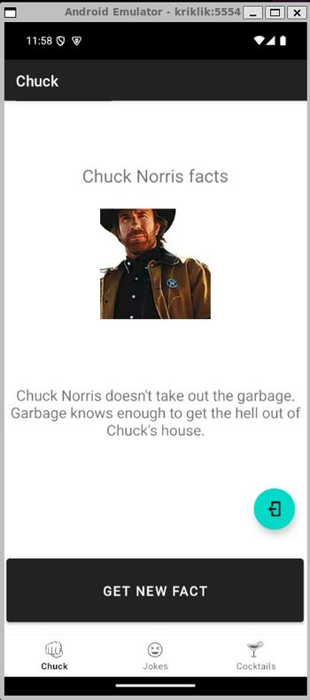
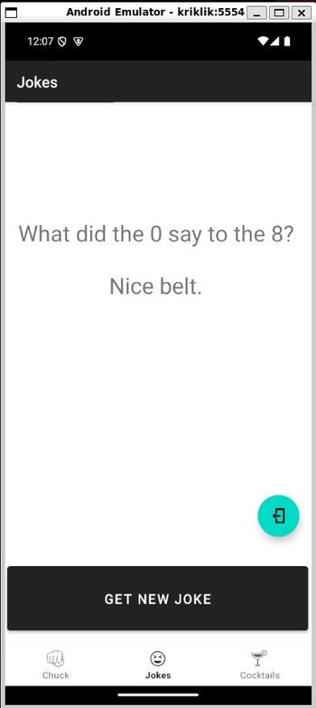
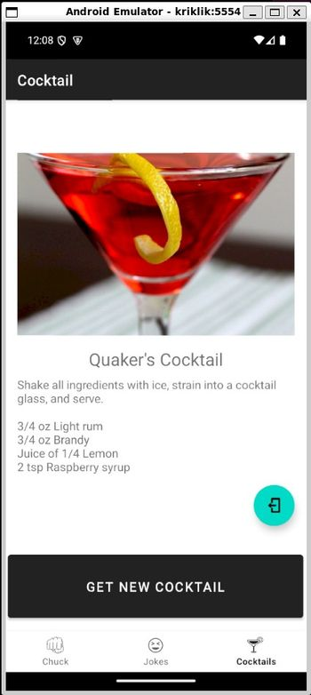

# Aplicatie mobila cu o activitate si trei fragmente
<!-- TOC -->

- [Aplicatie mobila cu o activitate si trei fragmente](#aplicatie-mobila-cu-o-activitate-si-trei-fragmente)
  - [Descrierea aplicatiei](#descrierea-aplicatiei)
    - [Chuck Norris facts](#chuck-norris-facts)
    - [Jokes](#jokes)
    - [Cocktails](#cocktails)
  - [Structura aplicatiei](#structura-aplicatiei)
    - [fisiere cu imagini](#fisiere-cu-imagini)
    - [fisiere de layout](#fisiere-de-layout)
      - [layout/activity\_main.xml](#layoutactivity_mainxml)
      - [layout/fragment\_joke.xml](#layoutfragment_jokexml)
      - [layout/fragment\_chuck.xml](#layoutfragment_chuckxml)
      - [layout/fragment\_cocktail.xml](#layoutfragment_cocktailxml)
    - [Fisiere pentru meniu](#fisiere-pentru-meniu)
    - [Fisiere pentru navigatie](#fisiere-pentru-navigatie)
  - [AndroidManifest.xml](#androidmanifestxml)
  - [Codul JAVA](#codul-java)
    - [MainActivity.java](#mainactivityjava)
    - [ui/ChuckFragment.java](#uichuckfragmentjava)
    - [ui/chuck/ChuckViewModel.java](#uichuckchuckviewmodeljava)
    - [ui/cocktail/CocktailViewModel.java](#uicocktailcocktailviewmodeljava)

<!-- /TOC -->


Aplicatia are o activitate principala care contine trei fragmente distincte, fiecare dintre ele preluand o serie de informatii dintr-un anumit API si afisand-ul intr-un TextView. Componentele sunt urmatoarele: 


## Descrierea aplicatiei

### Chuck Norris facts

Preia date de la URL-ul https://api.chucknorris.io/jokes/random. Acest API returneaza un JSON care arata astfel: 

```json
{
  "categories": [],
  "created_at": "2020-01-05 13:42:25.628594",
  "icon_url": "https://api.chucknorris.io/img/avatar/chuck-norris.png",
  "id": "xlNv9jQvQJ2WNLO3gDe0Jw",
  "updated_at": "2020-01-05 13:42:25.628594",
  "url": "https://api.chucknorris.io/jokes/xlNv9jQvQJ2WNLO3gDe0Jw",
  "value": "Chuck Norris spoke to Helen Keller on the phone"
}
```

Fragmentul preia continutul cheii "value" si o afiseaza in textview. Fragmentul contine de asemenea un buton de refresh care reia procesul. 

### Jokes 

Preia datele de la https://official-joke-api.appspot.com/random_joke care returneaza un json care arata astfel: 

```json
{
  "type": "general",
  "setup": "What is the leading cause of dry skin?",
  "punchline": "Towels",
  "id": 246
}
```

Fragmentul preia continutul cheilor "setup" si "punchline" si le afiseaza in TextView. Butonul de refresh reia procesul

### Cocktails

Preia datele de la url-ul: https://www.thecocktaildb.com/api/json/v1/1/random.php care retunreaza un JSON cu urmatoarea structura: 

```bash
{
  "drinks": [
    {
      "idDrink": "17223",
      "strDrink": "Abbey Martini",
      "strDrinkAlternate": null,
      "strTags": null,
      "strVideo": null,
      "strCategory": "Cocktail",
      "strIBA": null,
      "strAlcoholic": "Alcoholic",
      "strGlass": "Cocktail glass",
      "strInstructions": "Put all ingredients into a shaker and mix, then strain contents into a chilled cocktail glass.",
      "strInstructionsES": "Ponga todos los ingredientes en una coctelera, mézclelos y cuele el contenido en una copa de cóctel fría.",
      "strInstructionsDE": "Alle Zutaten in einen Shaker geben und mischen, dann den Inhalt in ein gekühltes Cocktailglas abseihen.",
      "strInstructionsFR": "Mettre tous les ingrédients dans un shaker et mélanger, puis filtrer le contenu dans un verre à cocktail réfrigéré.",
      "strInstructionsIT": "Mettere tutti gli ingredienti in uno shaker e mescolare, quindi filtrare il contenuto in una coppetta da cocktail fredda.",
      "strInstructionsZH-HANS": null,
      "strInstructionsZH-HANT": null,
      "strDrinkThumb": "https://www.thecocktaildb.com/images/media/drink/2mcozt1504817403.jpg",
      "strIngredient1": "Gin",
      "strIngredient2": "Sweet Vermouth",
      "strIngredient3": "Orange Juice",
      "strIngredient4": "Angostura Bitters",
      "strMeasure1": "2 shots ",
      "strMeasure2": "1 shot ",
      "strMeasure3": "1 shot ",
      "strMeasure4": "3 dashes ",
      "strImageSource": null,
      "strImageAttribution": null,
      "strCreativeCommonsConfirmed": "No",
      "dateModified": "2017-09-07 21:50:03"
    }
  ]
}
```

Fragmentul preia aceste date, inclusiv imaginea din cheia "strDrinkThumb" si le afiseaza in fragment. 








Aplicatia foloseste un model arhitectural numit MVVM (Model-View-ViewModel) care este o arhitectură folosita în dezvoltarea aplicațiilor Android pentru a separa logica aplicației de interfața cu utilizatorul.

Iată ce reprezintă fiecare component a acestui pattern:

Model:

Modelul reprezintă datele aplicației și logica de prelucrare a datelor. Este responsabil pentru manipularea datelor, de obicei obținute din surse externe, cum ar fi API-uri sau baze de date locale. Modelul poate include și operații de validare a datelor sau alte calcule.
În Android, Modelul poate include clase care se ocupă cu accesul la rețea, la baza de date sau chiar cu calcularea anumitor valori.

View:

View-ul este responsabil pentru prezentarea datelor pe ecran și pentru interacțiunea cu utilizatorul. Aceasta reprezintă interfața cu utilizatorul (UI), adică Activitățile sau Fragmentele în Android. View-ul se ocupă cu plasarea elementelor pe ecran (cum ar fi butoane, text, imagini) și cu răspunsul la acțiunile utilizatorului (cum ar fi apăsarea unui buton sau derularea).

ViewModel:

ViewModel-ul acționează ca un mediator între Model și View. Acesta furnizează datele necesare pentru View și se ocupă de logica legată de manipularea acestora. În plus, ViewModel-ul este responsabil pentru menținerea stării aplicației pe durata ciclului de viață al View-ului (de exemplu, pentru a salva datele atunci când utilizatorul schimbă activitatea sau când există o rotație a ecranului).
ViewModel-ul conține datele care sunt observate de View (prin LiveData), iar când aceste date se schimbă, View-ul este automat notificat și își actualizează UI-ul.
ViewModel-ul nu știe nimic despre View – el doar furnizează date și logica necesară, iar View-ul le consumă.

## Structura aplicatiei

Structura aplicatiei este putin mai complexa. 

```
├───akrilki_03
│   └───app
│       └───src
│           └───main
│               ├───java
│               │   └───ro
│               │       └───makore
│               │           └───akrilki_03
│               │               └───ui
│               │                   ├───chuck
│               │                   ├───cocktail
│               │                   └───joke
│               └───res
│                   ├───drawable
│                   ├───layout
│                   ├───menu
│                   └───navigation
```

In plus, fata de aplicatiile anterioare apar urmatoarele: 

### fisiere cu imagini

Exista 5 elemente aici: o imagine in format png (512 x 512 pixeli) si 4 fisiere xml care stocheaza cate un desen vectorial in format svg. 

```sh
├───drawable
│       chuck.png
│       ic_chuck_black_24dp.xml
│       ic_cocktail_color_24dp.xml
│       ic_jokes_color_24dp.xml
│       ic_quit_black_24dp.xml
```

Fiecare SVG este compus din unul sau mai multe path-uri care contin comenzi de desen al formelor (rect, circle, ellipse) sau o instructiune generala numita "path". Android suporta DOAR path in aceste XML-uri. 

```xml
<vector xmlns:android="http://schemas.android.com/apk/res/android"
    android:width="24dp"
    android:height="24dp"
    android:viewportWidth="24.0"
    android:viewportHeight="24.0">
    <path
        android:strokeColor="#FF000000"
        android:fillColor="#FF000000"
        android:pathData=" ... " />
   </vector>

```
Path este o succesiune de puncte care au o serie de coordonate definite prin raportarea la un viewport standard. Afisarea in interfata solicita de obicei redimensionarea desenului (care se face matematic) prin specificarea unor dimensiuni de afisare. Astfel: 

```xml
  android:width="24dp"
  android:height="24dp"
```
reprezinta dimensiunea afisata a desenului iar 

```xml
  android:viewportWidth="24.0"
  android:viewportHeight="24.0"
```

reprezinta dimensiunea de referinta a viewportului in care se face desenul SVG original (de obicei diferita, de cele mai multe ori mai mare). 

### fisiere de layout

Fisierele de layout sunt fisiere xml care vor fi transformate in clase Java la rularea aplicatiei. In aceasta aplicatie avem nevoie de un layout principal si trei layouturi secundare, cate unul pentru fiecare fragment.

Fragmentele sunt schimbate intre ele la apelarea componentului de navigatie

#### layout/activity_main.xml

activity_main.xml defineste un layout constrans care contine trei elemente: 
  - un meniu de navigatie care este pozitionat in partea de jos a ferestrei (BottomNavigationView)
  - Un spatiu pentru fragmentul incarcat (<fragment>) 
  - Un buton flotant pentru iesirea din aplicatie (FloatingActionButton)

```xml
<?xml version="1.0" encoding="utf-8"?>
<androidx.constraintlayout.widget.ConstraintLayout xmlns:android="http://schemas.android.com/apk/res/android"
    xmlns:app="http://schemas.android.com/apk/res-auto"
    android:id="@+id/container"
    android:layout_width="match_parent"
    android:layout_height="match_parent"
    android:paddingTop="?attr/actionBarSize">

    <com.google.android.material.bottomnavigation.BottomNavigationView
        android:id="@+id/nav_view"
        android:layout_width="0dp"
        android:layout_height="wrap_content"
        android:layout_marginStart="0dp"
        android:layout_marginEnd="0dp"
        android:background="?android:attr/windowBackground"
        app:layout_constraintBottom_toBottomOf="parent"
        app:layout_constraintLeft_toLeftOf="parent"
        app:layout_constraintRight_toRightOf="parent"
        app:menu="@menu/bottom_nav_menu" />

    <fragment
        android:id="@+id/nav_host_fragment_activity_main"
        android:name="androidx.navigation.fragment.NavHostFragment"
        android:layout_width="match_parent"
        android:layout_height="match_parent"
        app:defaultNavHost="true"
        app:layout_constraintBottom_toTopOf="@id/nav_view"
        app:layout_constraintLeft_toLeftOf="parent"
        app:layout_constraintRight_toRightOf="parent"
        app:layout_constraintTop_toTopOf="parent"
        app:navGraph="@navigation/mobile_navigation"
        android:paddingBottom="1200dp" />

    <com.google.android.material.floatingactionbutton.FloatingActionButton
        android:id="@+id/fab_quit"
        android:layout_width="wrap_content"
        android:layout_height="wrap_content"
        android:layout_gravity="bottom|end"
        android:layout_marginEnd="16dp"
        android:layout_marginBottom="200dp"
        app:layout_constraintBottom_toBottomOf="@id/nav_view"
        app:layout_constraintEnd_toEndOf="parent"
        android:elevation="16dp"
        android:src="@drawable/ic_quit_black_24dp" /> 

</androidx.constraintlayout.widget.ConstraintLayout>
```
Elementul de navigatie este un component al bibliotecii grafice Android Material Design. Acesta are o serie de proprietati de dimensionare si de pozitionare si in plus, o specificatie a unui fisier xml care va descrie componentele de navigatie propiu-zise (butoane): `app:menu="@menu/bottom_nav_menu"` (vezi mai jos)

#### layout/fragment_joke.xml

Cel mai simplu dintre cele trei fragmente, acesta contine un layout constrans care are urmatoarele elemente: 

- TextView (`android:id="@+id/text_joke"`) care contine setari de formatare si pozitionare si care va fi completat cu continut in mod programatic din cod prin apelul API. 
- Buton (`android:id="@+id/refreshButton"`) care contine setari de formatare si pozitionare si a carui actiune va fi setata in cod.

```xml
<?xml version="1.0" encoding="utf-8"?>
<androidx.constraintlayout.widget.ConstraintLayout xmlns:android="http://schemas.android.com/apk/res/android"
    xmlns:app="http://schemas.android.com/apk/res-auto"
    xmlns:tools="http://schemas.android.com/tools"
    android:layout_width="match_parent"
    android:layout_height="match_parent"
    tools:context=".ui.joke.JokeFragment">

    <TextView
        android:id="@+id/text_joke"
        android:layout_width="401dp"
        android:layout_height="357dp"
        android:layout_marginStart="8dp"
        android:layout_marginTop="8dp"
        android:layout_marginEnd="8dp"
        android:textAlignment="center"
        android:textSize="30sp"
        app:layout_constraintBottom_toBottomOf="parent"
        app:layout_constraintEnd_toEndOf="parent"
        app:layout_constraintHorizontal_bias="1.0"
        app:layout_constraintStart_toStartOf="parent"
        app:layout_constraintTop_toTopOf="parent"
        app:layout_constraintVertical_bias="0.251" />

    <Button
        android:id="@+id/refreshButton"
        android:layout_width="404dp"
        android:layout_height="98dp"
        android:layout_marginBottom="68dp"
        android:text="Get new Joke"
        android:textSize="18sp"
        app:layout_constraintBottom_toBottomOf="parent"
        app:layout_constraintEnd_toEndOf="parent"
        app:layout_constraintHorizontal_bias="0.428"
        app:layout_constraintStart_toStartOf="parent" />

</androidx.constraintlayout.widget.ConstraintLayout>
```

#### layout/fragment_chuck.xml

Acesta este un layout constrans care va fi incarcat pe post de fragment la apelarea unuia dintre butoanele din navigatie. De asemenea, este primul care se incarca automat la pornirea aplicatiei. Contine urmatoarele elemente: 

  - TextView (`android:id="@+id/title_text"`) - titlul fragmentului, de fiecare data acelasi, hardcodat in xml. Contine elemente de pozitionare si formatare
  - ImageView - component care afiseaza o imagine. Contine elemente de dimensionare si pozitionare impreuna cu referinta la imaginea afisata (`android:src="@drawable/chuck"`)
  - Un al doiea TextView, cu un id diferit (`android:id="@+id/text_chuck"`) in care se va afisa textul preluat de la API
  - Button (`android:id="@+id/refreshButton"`) - Un buton care contine elemente de pozitionare si formatare si a carui actiune va fi definita in cod. 


```xml
<?xml version="1.0" encoding="utf-8"?>
<androidx.constraintlayout.widget.ConstraintLayout xmlns:android="http://schemas.android.com/apk/res/android"
    xmlns:app="http://schemas.android.com/apk/res-auto"
    xmlns:tools="http://schemas.android.com/tools"
    android:layout_width="match_parent"
    android:layout_height="match_parent"
    tools:context=".ui.chuck.ChuckFragment">

    <TextView
        android:id="@+id/title_text"
        android:layout_width="wrap_content"
        android:layout_height="wrap_content"
        android:text="Chuck Norris facts"
        android:textSize="24sp"
        android:textAlignment="center"
        app:layout_constraintBottom_toTopOf="@id/imageView"
        app:layout_constraintEnd_toEndOf="parent"
        app:layout_constraintStart_toStartOf="parent"
        app:layout_constraintTop_toTopOf="parent" />

    <ImageView
        android:id="@+id/imageView"
        android:layout_width="150dp"
        android:layout_height="150dp"
        android:src="@drawable/chuck"
        app:layout_constraintBottom_toTopOf="@id/text_chuck"
        app:layout_constraintEnd_toEndOf="parent"
        app:layout_constraintStart_toStartOf="parent"
        app:layout_constraintTop_toTopOf="parent" />

    <TextView
        android:id="@+id/text_chuck"
        android:layout_width="match_parent"
        android:layout_height="wrap_content"
        android:layout_marginStart="8dp"
        android:layout_marginTop="8dp"
        android:layout_marginEnd="8dp"
        android:textAlignment="center"
        android:textSize="20sp"
        app:layout_constraintBottom_toBottomOf="parent"
        app:layout_constraintEnd_toEndOf="parent"
        app:layout_constraintStart_toStartOf="parent"
        app:layout_constraintTop_toTopOf="parent" />

    <Button
        android:id="@+id/refreshButton"
        android:layout_width="404dp"
        android:layout_height="98dp"
        android:layout_marginBottom="68dp"
        android:text="Get New Fact"
        android:textSize="18sp"
        app:layout_constraintBottom_toBottomOf="parent"
        app:layout_constraintEnd_toEndOf="parent"
        app:layout_constraintHorizontal_bias="0.428"
        app:layout_constraintStart_toStartOf="parent" />

</androidx.constraintlayout.widget.ConstraintLayout>
```

#### layout/fragment_cocktail.xml

Cel mai complex dintre cele trei fragmente. Contine un layout constrans in interiorul caruia se gaseste un alt element de tip container, scrollview. In interiorul acestuia se gaseste un alt element de tip container, un layout liniar. 

- Scrollview (`android:id="@+id/scrollView") - container care permite scroll-ul pe ecran in cazul in care continutul acestuia este mai mare decat dimensiunea ecranulului. 
  - LinearLayout - in interiorul ScrollView, pectru ca acesta sa poata calcula corect inaltimea continutului, se introduce un ale view de tip container. 
    - ImageView (`android:id="@+id/cocktail_image"`) - view de tip imagine unde se va incarca programatic imaginea care vine de la API
    - TextView (`android:id="@+id/cocktail_name"`) - view de tip text in care se va incarca programatic continutul de tip text care reprezinta numele cocktailului si care vine de la API
    - TextView (`android:id="@+id/instructions"`) - view de tip text unde se vor incarca instructiunile de preparare a cocktailului, instructiuni venite de la API
    - TextView (`android:id="@+id/ingredients"`) - view de tip text unde se vor incarca informatiile cu privire la ingredientele cocktailului, venite de la API
- Button (`android:id="@+id/refreshButton"`) Buton pentru solicitarea unui nou cocktail, a carui actiune va fi setata programatic din cod.

```xml
<?xml version="1.0" encoding="utf-8"?>
<androidx.constraintlayout.widget.ConstraintLayout xmlns:android="http://schemas.android.com/apk/res/android"
    xmlns:app="http://schemas.android.com/apk/res-auto"
    xmlns:tools="http://schemas.android.com/tools"
    android:layout_width="match_parent"
    android:layout_height="match_parent"
    tools:context=".ui.cocktail.CocktailFragment">

    <ScrollView
        android:id="@+id/scrollView"
        android:layout_width="match_parent"
        android:scrollbars="vertical"
        android:layout_height="0dp"
        app:layout_constraintBottom_toTopOf="@id/refreshButton"
        app:layout_constraintTop_toTopOf="parent">

        <LinearLayout
            android:layout_width="match_parent"
            android:layout_height="wrap_content"
            android:orientation="vertical"
            android:padding="16dp">

            <!-- Cocktail Image -->
            <ImageView
                android:id="@+id/cocktail_image"
                android:layout_width="match_parent"
                android:layout_height="250dp"
                android:layout_marginBottom="16dp"
                android:scaleType="centerCrop" />

            <!-- Cocktail Name -->
            <TextView
                android:id="@+id/cocktail_name"
                android:layout_width="match_parent"
                android:layout_height="wrap_content"
                android:text="Cocktail Name"
                android:textSize="24sp"
                android:textAlignment="center"
                android:layout_marginBottom="8dp" />

            <!-- Cocktail Instructions -->
            <TextView
                android:id="@+id/instructions"
                android:layout_width="match_parent"
                android:layout_height="wrap_content"
                android:text="Instructions"
                android:textSize="16sp"
                android:layout_marginBottom="16dp" />

            <!-- Cocktail Ingredients -->
            <TextView
                android:id="@+id/ingredients"
                android:layout_width="match_parent"
                android:layout_height="wrap_content"
                android:text="Ingredients"
                android:textSize="16sp" />

        </LinearLayout>
    </ScrollView>

    <Button
        android:id="@+id/refreshButton"
        android:layout_width="404dp"
        android:layout_height="98dp"
        android:layout_marginBottom="68dp"
        android:text="Get New Cocktail"
        android:textSize="18sp"
        app:layout_constraintBottom_toBottomOf="parent"
        app:layout_constraintEnd_toEndOf="parent"
        app:layout_constraintHorizontal_bias="0.428"
        app:layout_constraintStart_toStartOf="parent" />

</androidx.constraintlayout.widget.ConstraintLayout>

```

### Fisiere pentru meniu

Meniul reprezinta un component vizual compus, special proiectat pentru navigatie. Nu este un view, chiar daca are elemente vizuale. Meniul definit intr-un XML, contine informatii despre elementele de navigatie, tinta lor si textul/imaginea afisata. : 


```xml
<?xml version="1.0" encoding="utf-8"?>
<menu xmlns:android="http://schemas.android.com/apk/res/android">

    <item
        android:id="@+id/navigation_chuck"
        android:icon="@drawable/ic_chuck_black_24dp"
        android:tint="@null"
        android:title="Chuck" />

    <item
        android:id="@+id/navigation_joke"
        android:icon="@drawable/ic_jokes_color_24dp"
        android:tint="@null"
        android:title="Jokes" />

    <item
        android:id="@+id/navigation_cocktail"
        android:icon="@drawable/ic_cocktail_color_24dp"
        android:tint="@null"
        android:title="Cocktails" />

</menu>
```

### Fisiere pentru navigatie

Un graf de navigare (în engleză, navigation graph) în Android este o reprezentare vizuală și logică a structurilor de navigare ale unei aplicații, care definește cum utilizatorul se poate deplasa între diferitele fragmente (ecrane) sau activități ale aplicației. Este folosit pentru a organiza și gestiona tranzacțiile de navigare între aceste componente.

Un graf de navigare este un fișier XML care conține informații despre ecranele (fragmentele sau activitățile) aplicației și despre modul în care utilizatorul poate naviga între ele.
Acest fișier este folosit de Navigation Component din Android pentru a gestiona logica de navigare într-o aplicație, eliminând necesitatea de a scrie manual tranzacțiile de navigare (cum ar fi adăugarea și înlăturarea fragmentelor din stiva de back).

Componentele unui graf de navigare:

Fragmente (sau activități): Fiecare element din graf reprezintă o destinație, adică un fragment sau o activitate, care poate fi un ecran în aplicație.

Tranziții: Reprezintă mișcările între destinații (de exemplu, navigarea de la un fragment la altul).

Destinația de început: Un fragment sau o activitate care este vizibilă atunci când aplicația este deschisă pentru prima dată. Se definește prin atributul app:startDestination.
Acțiuni (actions): Reprezintă modalitățile prin care se poate naviga între fragmente. De exemplu, o acțiune poate fi un buton care, atunci când este apăsat, duce utilizatorul la un alt fragment.

Cum funcționează un graf de navigare?

NavHostFragment este un fragment special care găzduiește graficele de navigare și gestionează tranzacțiile între fragmentele definite în graf.
NavController este un obiect care controlează navigarea între fragmente, folosind graficele de navigare. Acesta navighează între fragmente sau activități, înlocuind manual tranzacțiile complexe cu o abordare mai simplă și mai organizată.

Fiecare fragment face referire la o clasa JAVA care trebuie implementata: 
- android:name="ro.makore.akrilki_03.ui.chuck.ChuckFragment"
- android:name="ro.makore.akrilki_03.ui.joke.JokeFragment"
- android:name="ro.makore.akrilki_03.ui.cocktail.CocktailFragment"

Deci, ne asteptam ca in codul JAVA sa avem aceste clase. 

```xml
<?xml version="1.0" encoding="utf-8"?>
<navigation xmlns:android="http://schemas.android.com/apk/res/android"
    xmlns:app="http://schemas.android.com/apk/res-auto"
    xmlns:tools="http://schemas.android.com/tools"
    android:id="@+id/mobile_navigation"
    app:startDestination="@+id/navigation_chuck">

    <fragment
        android:id="@+id/navigation_chuck"
        android:name="ro.makore.akrilki_03.ui.chuck.ChuckFragment"
        android:label="Chuck"
        tools:layout="@layout/fragment_chuck" />

    <fragment
        android:id="@+id/navigation_joke"
        android:name="ro.makore.akrilki_03.ui.joke.JokeFragment"
        android:label="Jokes"
        tools:layout="@layout/fragment_joke" />

    <fragment
        android:id="@+id/navigation_cocktail"
        android:name="ro.makore.akrilki_03.ui.cocktail.CocktailFragment"
        android:label="Cocktail"
        tools:layout="@layout/fragment_cocktail" />
</navigation>
```

Conectarea dintre graful de navigare si meniul specificat in bottom_nav_menu.xml se face in MainActivity.java, la pornirea aplicatiei: 

```java

//Cautam view-ul cu ID-ul nav_view din layout-ul activității curente și se face referire la el printr-o variabilă navView de tip BottomNavigationView. 

BottomNavigationView navView = findViewById(R.id.nav_view);

// Se creează o configurație pentru AppBar (bara de acțiuni), specificând care dintre elementele de navigare (fragmente) sunt considerate destinații "de top". Acest lucru este important pentru a determina cum va interacționa AppBar cu NavController în timpul navigării între fragmente. În acest caz, fragmentele definite de R.id.navigation_chuck, R.id.navigation_joke, și R.id.navigation_cocktail sunt considerate destinații de nivel superior.

AppBarConfiguration appBarConfiguration = new AppBarConfiguration.Builder(
                R.id.navigation_chuck, R.id.navigation_joke, R.id.navigation_cocktail)
                .build();

// Se creează un NavController care va fi folosit pentru a gestiona navigarea între fragmente. NavController este //conectat la fragmentul host (sau containerul de navigare), definit în layout cu ID-ul nav_host_fragment_activity_main. Acesta controlează care fragment este activat pe ecran și face tranzițiile între fragmente conform graficului de navigare definit anterior.

NavController navController = Navigation.findNavController(this, R.id.nav_host_fragment_activity_main);

// Aici, se configurează bara de acțiuni (ActionBar) pentru a lucra cu NavController și pentru a reflecta schimbările de navigare. Se folosesc detaliile configurate anterior în appBarConfiguration, ceea ce ajută la stabilirea comportamentului barei de acțiuni atunci când utilizatorul navighează între fragmente. De obicei, aceasta include actualizarea titlurilor și comportamentele de back (înapoi).

NavigationUI.setupActionBarWithNavController(this, navController, appBarConfiguration);

// Această linie asociază BottomNavigationView (binding.navView) cu NavController. Astfel, când utilizatorul face o selecție din BottomNavigationView, NavController va naviga automat la fragmentul corespunzător conform graficului de navigare. De asemenea, acest lucru actualizează automat starea selecției din meniul de navigare pentru a reflecta fragmentul activ.

NavigationUI.setupWithNavController(binding.navView, navController);

```

## AndroidManifest.xml

AndroidManifest solicita o serie de permisiuni

```xml

<?xml version="1.0" encoding="utf-8"?>
<manifest xmlns:android="http://schemas.android.com/apk/res/android"
    xmlns:tools="http://schemas.android.com/tools">

    <uses-permission android:name="android.permission.INTERNET" />

    <application
        android:label="Akrilki_03"
        android:theme="@style/Theme.MaterialComponents.DayNight.DarkActionBar"
        tools:targetApi="31">
        <activity
            android:name=".MainActivity"
            android:exported="true"
            android:label="Akrilki_03">
            <intent-filter>
                <action android:name="android.intent.action.MAIN" />

                <category android:name="android.intent.category.LAUNCHER" />
            </intent-filter>
        </activity>
    </application>

</manifest>
```

## Codul JAVA

### MainActivity.java

```java
package ro.makore.akrilki_03;

import android.os.Bundle;

import com.google.android.material.bottomnavigation.BottomNavigationView;

import androidx.appcompat.app.AppCompatActivity;
import androidx.navigation.NavController;
import androidx.navigation.Navigation;
import androidx.navigation.ui.AppBarConfiguration;
import androidx.navigation.ui.NavigationUI;
import com.google.android.material.floatingactionbutton.FloatingActionButton;


import ro.makore.akrilki_03.databinding.ActivityMainBinding;

public class MainActivity extends AppCompatActivity {

    private ActivityMainBinding binding;

    @Override
    protected void onCreate(Bundle savedInstanceState) {
        super.onCreate(savedInstanceState);

        //conectarea layoutului principal
        binding = ActivityMainBinding.inflate(getLayoutInflater());
        setContentView(binding.getRoot());

        //definirea actiunii pe butonul flotatn care apare tot timpul
        FloatingActionButton fabQuit = findViewById(R.id.fab_quit);
        fabQuit.setOnClickListener(v -> finishAffinity());

        //setarea navigatiei principale a aplicatiei
        BottomNavigationView navView = findViewById(R.id.nav_view);
        AppBarConfiguration appBarConfiguration = new AppBarConfiguration.Builder(
                R.id.navigation_chuck, R.id.navigation_joke, R.id.navigation_cocktail)
                .build();
        NavController navController = Navigation.findNavController(this, R.id.nav_host_fragment_activity_main);
        NavigationUI.setupActionBarWithNavController(this, navController, appBarConfiguration);
        NavigationUI.setupWithNavController(binding.navView, navController);
    }

}

```

### ui/ChuckFragment.java

```java

// Importarea claselor necesare pentru utilizarea fragmentelor și a ViewModel-ului

import androidx.annotation.NonNull;
import androidx.fragment.app.Fragment;
import androidx.lifecycle.ViewModelProvider;

// Importarea legăturii cu fișierul de layout generat automat pentru fragment

import ro.makore.akrilki_03.databinding.FragmentChuckBinding;

public class ChuckFragment extends Fragment {

    // Declarația unei variabile pentru legătura cu binding-ul fragmentului

    private FragmentChuckBinding binding;

    // Metoda care este apelată pentru a crea  layout-ul fragmentului
    @Override
    public View onCreateView(@NonNull LayoutInflater inflater,
                             ViewGroup container, Bundle savedInstanceState) {
        ChuckViewModel chuckViewModel = new ViewModelProvider(this).get(ChuckViewModel.class);

        binding = FragmentChuckBinding.inflate(inflater, container, false);
        View root = binding.getRoot();

        final TextView textView = binding.textChuck;

        // Crearea instanței ViewModel-ului pentru ChuckFragment
        chuckViewModel.getText().observe(getViewLifecycleOwner(), textView::setText);

        Button refreshButton = binding.refreshButton;
        // Set an OnClickListener for the refresh button
        refreshButton.setOnClickListener(v -> {
            // Call the fetchJoke method when the button is clicked
            chuckViewModel.fetchCNFact();
        });

        return root;
    }

    @Override
    public void onDestroyView() {
        super.onDestroyView();
        binding = null;
    }
}

```

### ui/chuck/ChuckViewModel.java

ViewModel este un component al arhitecturii moderne Android, parte din AndroidX (pachetul androidx.lifecycle). Scopul său principal este să gestioneze datele legate de interfața utilizatorului (UI) într-un mod eficient și reactiv. Acesta ajută la păstrarea datelor atunci când apar schimbări de configurație, precum rotația ecranului (care declanseaza recrearea activitatii/fragmentului), prevenind pierderea datelor și reducând nevoia de a le reîncărca sau recalcula. În AndroidX, clasa ViewModel este deja implementată, iar aceasta poate fi utilizată pentru a separa logica de gestionare a datelor de interfața utilizatorului, creând o aplicație mai clară și mai ușor de întreținut.

În aplicația locala, trebuie instanțiat un obiect ViewModel specific pentru fiecare fragment sau activitate care necesită gestionarea datelor, folosind ViewModelProvider. Acest lucru permite crearea unui ViewModel care va supraviețui schimbărilor de configurație și va fi disponibil pe parcursul ciclului de viață al fragmentului sau activității. În codul tău, vei observa că ViewModel-ul se ocupă de logica de manipulare a datelor (de exemplu, încărcarea sau actualizarea datelor), iar UI-ul va doar să observe și să afișeze acele date prin LiveData.

In mod normal, in patternul MVVM exista o clasa separata care preia datele din stratul de stocare si care le trimite catre ViewModel. In cazul nostru, modelul este implementat ca o parte a ViewModelului, simplificand patternul. Daca am fi dorit sa completam patternul, ar fi trebuit sa avem o clasa separata pentru accesul la API, care ar fi aratat cam asa: 

```java
public class ChuckModel {
    private OkHttpClient client;

    public ChuckModel() {
        client = new OkHttpClient();
    }

    public void fetchCNFact(final (String result) -> void callback) {
       ... callbacks ...

        @Override
        public void onResponse(Call call, Response response) throws IOException {
                if (!response.isSuccessful()) {
                    callback.onError("Failed to load joke.");
                    return;
                }
                try {
                    String responseData = response.body().string();
                    JSONObject json = new JSONObject(responseData);
                    String cnfact = json.getString("value");
                    callback.onSuccess(cnfact);
                } catch (JSONException e) {
                    callback.onError("Failed to parse joke.");
                }
            }
    }
}
```

Combinand insa modelul si VewModelul pentru simplificarea codului, obtinem urmatoarea clasa: 

```java
package ro.makore.akrilki_03.ui.chuck;

import androidx.lifecycle.LiveData;
import androidx.lifecycle.MutableLiveData;
import androidx.lifecycle.ViewModel;

//componente pentru procesarea JSON
import org.json.JSONException;
import org.json.JSONObject;

import java.io.IOException;

//Componente pentru apelul HTTP
import okhttp3.Call;
import okhttp3.Callback;
import okhttp3.OkHttpClient;
import okhttp3.Request;
import okhttp3.Response;

public class ChuckViewModel extends ViewModel {

    private final MutableLiveData<String> mText;
    private OkHttpClient client;
    
    public ChuckViewModel() {
        //mText este un obiect de tip MutableLiveData<String>, care va stoca gluma obținută din API și va fi observat de către activitățile sau fragmentele care folosesc acest ViewModel.
        // În constructor, mText este inițializat ca un nou obiect de tip MutableLiveData.


        mText = new MutableLiveData<>();
        fetchCNFact();
    }

    public void fetchCNFact() {
        String url = "https://api.chucknorris.io/jokes/random";

        // Create the request
        Request request = new Request.Builder()
                .url(url)
                .build();

        //instantiaza un client OkHTTP
        client = new OkHttpClient();
        // Executa apelul HTTP in mod asincron
        client.newCall(request).enqueue(new Callback() {

            // Daca solicitarea esueaza, se va executa aceasta functie
            @Override
            public void onFailure(Call call, IOException e) {
                mText.postValue("Failed to load joke." + e.getMessage());
            }

            //callback care se va executa la primirea unui raspuns corect si care va seta containerul de informatie mText
            @Override
            public void onResponse(Call call, Response response) throws IOException {
                if (!response.isSuccessful()) {
                    mText.postValue("Failed to load joke.");
                    return;
                }
                try {
                    String responseData = response.body().string();
                    JSONObject json = new JSONObject(responseData);
                    String cnfact = json.getString("value");
                    mText.postValue(cnfact);
                } catch (JSONException e) {
                    mText.postValue("Failed to parse joke.");
                }
            }
        });
    }

    // Această metodă returnează mText ca un LiveData, permițând componentelor UI să observe schimbările din datele gestionate de ChuckViewModel. Aceasta metoda este apelata de componentele UI de cate ori este nevoie de continutul ei, actionand , variabila mText ca un fel de container permanent al carui continut este modificat doar atunci cand este accesata metoda postValue . 

    public LiveData<String> getText() {
        return mText;
    }
}
```

### ui/cocktail/CocktailViewModel.java

CocktailVewiModel este diferit fata de componentul anterior pentru ca trebuie sa mentina informatia din mai multe campuri, unul de tip imagine si trei de tip text. 

```java

package ro.makore.akrilki_03.ui.cocktail;

import android.os.Bundle;
import android.view.LayoutInflater;
import android.view.View;
import android.view.ViewGroup;
import android.widget.Button;
import android.widget.TextView;
import android.widget.ImageView;
import androidx.annotation.NonNull;
import androidx.fragment.app.Fragment;
import androidx.lifecycle.ViewModelProvider;
import com.squareup.picasso.Picasso;

//databindings sunt componente initializate automat de Android la cerere. in momentul in care se solicita aceasta in graddle

import ro.makore.akrilki_03.databinding.FragmentCocktailBinding;

public class CocktailFragment extends Fragment {

    private FragmentCocktailBinding binding;

    @Override
    public View onCreateView(@NonNull LayoutInflater inflater,
                             ViewGroup container, Bundle savedInstanceState) {

        CocktailViewModel cocktailViewModel =
                new ViewModelProvider(this).get(CocktailViewModel.class);

        binding = FragmentCocktailBinding.inflate(inflater, container, false);
        View root = binding.getRoot();


        TextView cocktailTextView = binding.cocktailName;
        TextView cocktailInstructions = binding.instructions;
        TextView cocktailIngredients = binding.ingredients;
        ImageView cocktailImageView = binding.cocktailImage;

        // Observe LiveData from the ViewModel
        cocktailViewModel.getCocktailLiveData().observe(getViewLifecycleOwner(), cocktailData -> {
            // Update the UI with the fetched cocktail data
            if (cocktailData != null) {
                cocktailTextView.setText(cocktailData.getName()); // Assuming CocktailData has a getName method
                cocktailInstructions.setText(cocktailData.getInstructions());
                cocktailIngredients.setText(cocktailData.getIngredients());

                if (cocktailData.getImageUrl() != null && !cocktailData.getImageUrl().isEmpty()) {
                    Picasso.get().load(cocktailData.getImageUrl()).into(cocktailImageView);
                }

            } else {
                cocktailTextView.setText("No data available");
            }
        });

        // Button to trigger data fetching
        Button refreshButton = binding.refreshButton;
        refreshButton.setOnClickListener(v -> {
            cocktailViewModel.fetchCocktailData(); // Fetch new data
        });

        return root;
    }

    @Override
    public void onDestroyView() {
        super.onDestroyView();
        binding = null; // Avoid memory leaks
    }
}


```
