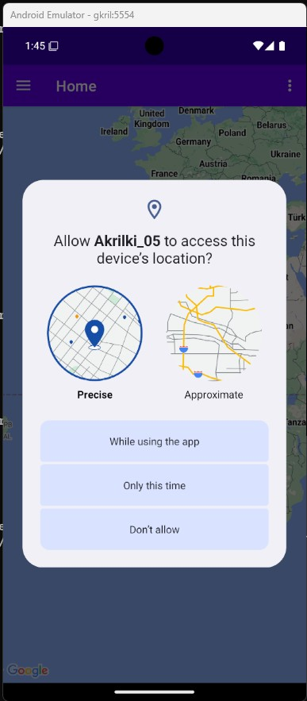
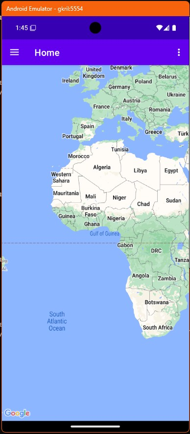
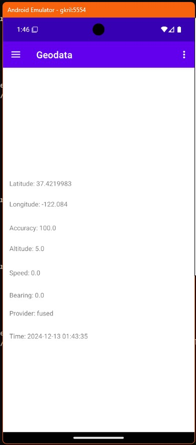
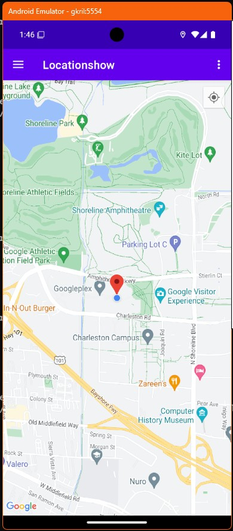
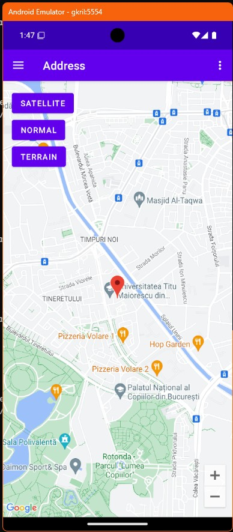
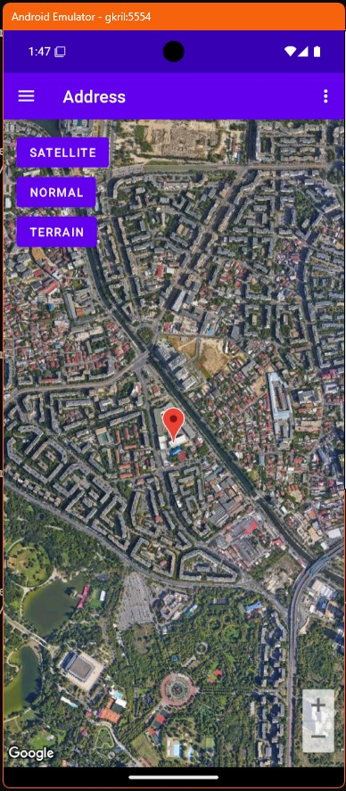

# Aplicatie care prezinta diferse utilizari ale hartilor

Aplicatia este un alt exemplu de navigatie pe fragmente in care meniul nu este la baza ecranului ci este un panou rulant in stanga.  









## Structura aplicatiei

```sh
akrilki_05/
├── app
│   ├── build.gradle
│   ├── proguard-rules.pro
│   └── src
│       └── main
│           ├── AndroidManifest.xml
│           ├── java
│           │   └── ro
│           │       └── makore
│           │           └── akrilki_05
│           │               ├── MainActivity.java
│           │               └── ui
│           │                   ├── address
│           │                   │   └── AddressFragment.java
│           │                   ├── geodata
│           │                   │   └── GeodataFragment.java
│           │                   ├── home
│           │                   │   └── HomeFragment.java
│           │                   └── location
│           │                       └── LocationFragment.java
│           └── res
│               ├── drawable
│               │   ├── ic_cocktail_color.xml
│               │   ├── ic_menu_address.xml
│               │   ├── ic_menu_camera.xml
│               │   ├── ic_menu_geodata.xml
│               │   ├── ic_menu_location.xml
│               │   └── side_nav_bar.xml
│               ├── layout
│               │   ├── activity_main.xml
│               │   ├── app_bar_main.xml
│               │   ├── content_main.xml
│               │   ├── fragment_address.xml
│               │   ├── fragment_geodata.xml
│               │   ├── fragment_home.xml
│               │   ├── fragment_location.xml
│               │   └── nav_header_main.xml
│               ├── menu
│               │   ├── activity_main_drawer.xml
│               │   └── main.xml
│               ├── navigation
│               │   └── mobile_navigation.xml
│               └── values
│                   ├── colors.xml
│                   ├── dimens.xml
│                   ├── strings.xml
│                   └── themes.xml
├── build.gradle
├── gradle.properties
└── settings.gradle
```

### Fișiere de layout  

#### activity_main.xml

XML-ul definește un layout pentru o activitate Android de tip DrawerLayout - un container utilizat pentru a implementa un meniu lateral glisant (navigation drawer). De asemenea, xml-ul folosește `include` pentru a include un alt xml, definit în fișierul app_bar_main.xml. 

proprietațile drawer-ului sunt urmatoarele: 

 - **android:id="@+id/nav_view"**: Identificatorul unic al acestui element.
 - **android:layout_width="wrap_content"**: Lățimea este setată să se potrivească cu conținutul meniului.
 - **android:layout_height="match_parent"**: Înălțimea ocupă tot spațiul vertical al ecranului.
 - **android:layout_gravity="start"**: Poziționează meniul lateral în partea stângă.
 - **android:fitsSystemWindows="true"**: Asigură adaptarea la marginea ferestrei sistemului.
 - **app:headerLayout="@layout/nav_header_main"**: Specifică un layout separat pentru antetul meniului lateral.
 - **app:menu="@menu/activity_main_drawer"**: Specifică un fișier de resurse care definește elementele meniului.

```xml
<?xml version="1.0" encoding="utf-8"?>
<androidx.drawerlayout.widget.DrawerLayout xmlns:android="http://schemas.android.com/apk/res/android"
    xmlns:app="http://schemas.android.com/apk/res-auto"
    xmlns:tools="http://schemas.android.com/tools"
    android:id="@+id/drawer_layout"
    android:layout_width="match_parent"
    android:layout_height="match_parent"
    android:fitsSystemWindows="true"
    tools:openDrawer="start">

    <include
        android:id="@+id/app_bar_main"
        layout="@layout/app_bar_main"
        android:layout_width="match_parent"
        android:layout_height="match_parent" />

    <com.google.android.material.navigation.NavigationView
        android:id="@+id/nav_view"
        android:layout_width="wrap_content"
        android:layout_height="match_parent"
        android:layout_gravity="start"
        android:fitsSystemWindows="true"
        app:headerLayout="@layout/nav_header_main"
        app:menu="@menu/activity_main_drawer" />
</androidx.drawerlayout.widget.DrawerLayout>

```
#### app_bar_main.xml

CoordinatorLayout este un container special din biblioteca Android Jetpack, conceput pentru a coordona interacțiunile între elementele copil. Este foarte util pentru crearea interfețelor dinamice și a comportamentelor complexe, precum derularea (scrolling), animațiile și alte interacțiuni personalizate. Permite definirea comportamentelor personalizate (ex.: ascunderea unei bare de navigare în timp ce utilizatorul derulează). 

În finalul xml-ului este inclus un alt fisier, content_main.xml

```xml
<?xml version="1.0" encoding="utf-8"?>
<androidx.coordinatorlayout.widget.CoordinatorLayout xmlns:android="http://schemas.android.com/apk/res/android"
    xmlns:app="http://schemas.android.com/apk/res-auto"
    xmlns:tools="http://schemas.android.com/tools"
    android:layout_width="match_parent"
    android:layout_height="match_parent"
    tools:context=".MainActivity">

    <com.google.android.material.appbar.AppBarLayout
        android:layout_width="match_parent"
        android:layout_height="wrap_content"
        android:theme="@style/Theme.Akrilki_05.AppBarOverlay">

        <androidx.appcompat.widget.Toolbar
            android:id="@+id/toolbar"
            android:layout_width="match_parent"
            android:layout_height="?attr/actionBarSize"
            android:background="?attr/colorPrimary"
            app:popupTheme="@style/Theme.Akrilki_05.PopupOverlay" />

    </com.google.android.material.appbar.AppBarLayout>

    <include layout="@layout/content_main" />

</androidx.coordinatorlayout.widget.CoordinatorLayout>
```

#### content_main.xml

Content_main.xml este fisierul care conține plasamentul pentru fragmentele noastre. Acesta este similar cu ce am mai vazut pana acum, având un component unde vor fi încarcate fragmentele (nav_host_fragment_content_main).  

```xml
<?xml version="1.0" encoding="utf-8"?>
<androidx.constraintlayout.widget.ConstraintLayout xmlns:android="http://schemas.android.com/apk/res/android"
    xmlns:app="http://schemas.android.com/apk/res-auto"
    xmlns:tools="http://schemas.android.com/tools"
    android:layout_width="match_parent"
    android:layout_height="match_parent"
    app:layout_behavior="@string/appbar_scrolling_view_behavior"
    tools:showIn="@layout/app_bar_main">

    <fragment
        android:id="@+id/nav_host_fragment_content_main"
        android:name="androidx.navigation.fragment.NavHostFragment"
        android:layout_width="match_parent"
        android:layout_height="match_parent"
        app:defaultNavHost="true"
        app:layout_constraintLeft_toLeftOf="parent"
        app:layout_constraintRight_toRightOf="parent"
        app:layout_constraintTop_toTopOf="parent"
        app:navGraph="@navigation/mobile_navigation" />
</androidx.constraintlayout.widget.ConstraintLayout>
```

#### fragment_home.xml

Fragment_home.xml conține un component de tip mapView - un component care afiseaza o harta si permite 

```xml
<?xml version="1.0" encoding="utf-8"?>
<androidx.constraintlayout.widget.ConstraintLayout xmlns:android="http://schemas.android.com/apk/res/android"
    xmlns:app="http://schemas.android.com/apk/res-auto"
    xmlns:tools="http://schemas.android.com/tools"
    android:layout_width="match_parent"
    android:layout_height="match_parent"
    tools:context=".ui.home.HomeFragment">

    <com.google.android.gms.maps.MapView
        android:id="@+id/map_view"
        android:layout_width="0dp"
        android:layout_height="0dp"
        app:layout_constraintStart_toStartOf="parent"
        app:layout_constraintEnd_toEndOf="parent"
        app:layout_constraintTop_toTopOf="parent"
        app:layout_constraintBottom_toBottomOf="parent" />

</androidx.constraintlayout.widget.ConstraintLayout>

```

#### fragment_geodata.xml

Acest layout contine o serie de TextView-uri care afișeaza date pe care le putem obtine de la API-ul `fusedLocationProviderClient`: Latitudine, Longitudine, acuratete, viteza, directie, providerul si data si momentul. 

```xml

<?xml version="1.0" encoding="utf-8"?>
<androidx.constraintlayout.widget.ConstraintLayout xmlns:android="http://schemas.android.com/apk/res/android"
    xmlns:app="http://schemas.android.com/apk/res-auto"
    xmlns:tools="http://schemas.android.com/tools"
    android:layout_width="match_parent"
    android:layout_height="match_parent"
    tools:context=".ui.geodata.GeodataFragment">

    <!-- Scrollable container for displaying location properties -->

    <LinearLayout
        android:layout_width="match_parent"
        android:layout_height="match_parent"
        android:layout_marginTop="148dp"
        android:orientation="vertical"
        android:padding="16dp"
        app:layout_constraintTop_toTopOf="parent"
        app:layout_constraintStart_toStartOf="parent"
        app:layout_constraintEnd_toEndOf="parent"
        app:layout_constraintBottom_toBottomOf="parent"        
        tools:layout_editor_absoluteX="-1dp">

        <!-- TextViews for displaying different location data -->
        <TextView
            android:id="@+id/tvLatitude"
            android:layout_width="match_parent"
            android:layout_height="44dp"
            android:text="Latitude: " />

        <TextView
            android:id="@+id/tvLongitude"
            android:layout_width="match_parent" 
            android:layout_height="51dp"
            android:text="Longitude: " />

        <TextView
            android:id="@+id/tvAccuracy"
            android:layout_width="match_parent"
            android:layout_height="44dp"
            android:text="Accuracy: " />

        <TextView
            android:id="@+id/tvAltitude"
            android:layout_width="match_parent"
            android:layout_height="52dp"
            android:text="Altitude: " />

        <TextView
            android:id="@+id/tvSpeed"
            android:layout_width="match_parent"
            android:layout_height="48dp"
            android:text="Speed: " />

        <TextView
            android:id="@+id/tvBearing"
            android:layout_width="match_parent"
            android:layout_height="39dp"
            android:text="Bearing: " />

        <TextView
            android:id="@+id/tvProvider"
            android:layout_width="match_parent"
            android:layout_height="49dp"
            android:text="Provider: " />

        <TextView
            android:id="@+id/tvTime"
            android:layout_width="match_parent"
            android:layout_height="44dp"
            android:text="Time: " />

    </LinearLayout>

</androidx.constraintlayout.widget.ConstraintLayout>
```

#### fragment_address.xml

Contine un layout identic cu fragment_home care însa va fi initializat cu pozitia curenta a dispozitivului

```xml
<?xml version="1.0" encoding="utf-8"?>
<androidx.constraintlayout.widget.ConstraintLayout xmlns:android="http://schemas.android.com/apk/res/android"
xmlns:app="http://schemas.android.com/apk/res-auto"
xmlns:tools="http://schemas.android.com/tools"
android:layout_width="match_parent"
android:layout_height="match_parent"
tools:context=".ui.location.LocationFragment">

<com.google.android.gms.maps.MapView
    android:id="@+id/places_map_view"
    android:layout_width="0dp"
    android:layout_height="0dp"
    app:layout_constraintStart_toStartOf="parent"
    app:layout_constraintEnd_toEndOf="parent"
    app:layout_constraintTop_toTopOf="parent"
    app:layout_constraintBottom_toBottomOf="parent" />

</androidx.constraintlayout.widget.ConstraintLayout>

```

#### fragment_address.xml

Conține un mapView (la fel ca layoutul anterior) la care se adauga trei butoane care vor declansa modificarea continutului acestuia (in mod traditional, cu imagini din satelit, harta si teren). La incarcare, harta va fi centrata intr-o anumita adresa (sediul UTM). 

<?xml version="1.0" encoding="utf-8"?>
<androidx.constraintlayout.widget.ConstraintLayout xmlns:android="http://schemas.android.com/apk/res/android"
xmlns:app="http://schemas.android.com/apk/res-auto"
xmlns:tools="http://schemas.android.com/tools"
android:layout_width="match_parent"
android:layout_height="match_parent"
tools:context=".ui.address.AddressFragment">

<com.google.android.gms.maps.MapView
    android:id="@+id/map_view"
    android:layout_width="0dp"
    android:layout_height="0dp"
    app:layout_constraintStart_toStartOf="parent"
    app:layout_constraintEnd_toEndOf="parent"
    app:layout_constraintTop_toTopOf="parent"
    app:layout_constraintBottom_toBottomOf="parent" />

    <LinearLayout
        android:orientation="vertical"
        android:padding="16dp"
        android:gravity="start"
        android:layout_width="wrap_content"
        android:layout_height="wrap_content"
        app:layout_constraintTop_toTopOf="parent"
        app:layout_constraintStart_toStartOf="parent">

        <Button
            android:id="@+id/satelliteButton"
            android:text="Satellite"
            android:layout_width="wrap_content"
            android:layout_height="wrap_content" />

        <Button
            android:id="@+id/normalButton"
            android:text="Normal"
            android:layout_width="wrap_content"
            android:layout_height="wrap_content" />

        <Button
            android:id="@+id/terrainButton"
            android:text="Terrain"
            android:layout_width="wrap_content"
            android:layout_height="wrap_content" />
    </LinearLayout>
</androidx.constraintlayout.widget.ConstraintLayout>


### Fișiere pentru meniu

Meniul reprezinta un component vizual compus, special proiectat pentru navigatie. Nu este un view, chiar daca are elemente vizuale. Meniul definit intr-un XML, contine informatii despre elementele de navigatie, tinta lor si textul/imaginea afisata. 

Aplicația noastra are doua meniuri: unul lateral care permite tranziția de la un fragment la altul și unul de tip dropdown care se declanșeaza la apasarea butonului cu trei puncte aliniate vertical din dreapta sus și care conduce la parasirea aplicației. Deci, vom avea doua fișiere de meniu. 

#### Meniul drop-down

```xml
<?xml version="1.0" encoding="utf-8"?>
<menu xmlns:android="http://schemas.android.com/apk/res/android"
    xmlns:app="http://schemas.android.com/apk/res-auto">
    <item
        android:id="@+id/action_quit"
        android:orderInCategory="100"
        android:title="Quit"
        app:showAsAction="never" />
</menu>
```

#### Meniul lateral

```xml
<?xml version="1.0" encoding="utf-8"?>
<menu xmlns:android="http://schemas.android.com/apk/res/android"
    xmlns:tools="http://schemas.android.com/tools"
    tools:showIn="navigation_view">

    <group android:checkableBehavior="single">
        <item
            android:id="@+id/nav_home"
            android:icon="@drawable/ic_menu_camera"
            android:title="Home" />
        <item
            android:id="@+id/nav_geodata"
            android:icon="@drawable/ic_menu_geodata"
            android:title="Geodata" />
        <item
            android:id="@+id/nav_location"
            android:icon="@drawable/ic_menu_location"
            android:title="Location" />
        <item
            android:id="@+id/nav_address"
            android:icon="@drawable/ic_menu_address"
            android:title="Address" />
    </group>
</menu>
```

### Fișiere pentru navigație

Un graf de navigare (în engleză, navigation graph) în Android este o reprezentare vizuală și logică a structurilor de navigare ale unei aplicații, care definește cum utilizatorul se poate deplasa între diferitele fragmente (ecrane) sau activități ale aplicației. Este folosit pentru a organiza și gestiona tranzacțiile de navigare între aceste componente.

Un graf de navigare este un fișier XML care conține informații despre ecranele (fragmentele sau activitățile) aplicației și despre modul în care utilizatorul poate naviga între ele. Acest fișier este folosit de Navigation Component din Android pentru a gestiona logica de navigare într-o aplicație, eliminând necesitatea de a scrie manual tranzacțiile de navigare (cum ar fi adăugarea și înlăturarea fragmentelor din stiva de back).

Componentele unui graf de navigare:

Fragmente (sau activități): Fiecare element din graf reprezintă o destinație, adică un fragment sau o activitate, care poate fi un ecran în aplicație.

Tranziții: Reprezintă mișcările între destinații (de exemplu, navigarea de la un fragment la altul).

Destinația de început: Un fragment sau o activitate care este vizibilă atunci când aplicația este deschisă pentru prima dată. Se definește prin atributul app:startDestination. Acțiuni (actions): Reprezintă modalitățile prin care se poate naviga între fragmente. De exemplu, o acțiune poate fi un buton care, atunci când este apăsat, duce utilizatorul la un alt fragment.

Cum funcționează un graf de navigare?

NavHostFragment este un fragment special care găzduiește graficele de navigare și gestionează tranzacțiile între fragmentele definite în graf. NavController este un obiect care controlează navigarea între fragmente, folosind graficele de navigare. Acesta navighează între fragmente sau activități, înlocuind manual tranzacțiile complexe cu o abordare mai simplă și mai organizată.

Fiecare fragment face referire la o clasa JAVA care trebuie implementata:

android:name="ro.makore.akrilki_05.ui.home.HomeFragment"
android:name="ro.makore.akrilki_05.ui.geodata.GeodataFragment"
android:name="ro.makore.akrilki_05.ui.location.LocationFragment"
android:name="ro.makore.akrilki_05.ui.address.AddressFragment"

Deci, ne asteptam ca in codul JAVA sa avem aceste clase.

```xml
<?xml version="1.0" encoding="utf-8"?>
<navigation xmlns:android="http://schemas.android.com/apk/res/android"
    xmlns:app="http://schemas.android.com/apk/res-auto"
    xmlns:tools="http://schemas.android.com/tools"
    android:id="@+id/mobile_navigation"
    app:startDestination="@+id/nav_home">
    <fragment
        android:id="@+id/nav_home"
        android:name="ro.makore.akrilki_05.ui.home.HomeFragment"
        android:label="Home"
        tools:layout="@layout/fragment_home" />
    <fragment
        android:id="@+id/nav_geodata"
        android:name="ro.makore.akrilki_05.ui.geodata.GeodataFragment"
        android:label="Geodata"
        tools:layout="@layout/fragment_geodata" />
    <fragment
        android:id="@+id/nav_location"
        android:name="ro.makore.akrilki_05.ui.location.LocationFragment"
        android:label="Locationshow"
        tools:layout="@layout/fragment_location" />
    <fragment
        android:id="@+id/nav_address"
        android:name="ro.makore.akrilki_05.ui.address.AddressFragment"
        android:label="Address"
        tools:layout="@layout/fragment_address" />
</navigation>
```


## MainActivity.java

```java

package ro.makore.akrilki_05;

import android.os.Bundle;
import android.view.View;
import android.view.Menu;
import android.view.MenuItem;

import com.google.android.material.snackbar.Snackbar;
import com.google.android.material.navigation.NavigationView;

import androidx.navigation.NavController;
import androidx.navigation.Navigation;
import androidx.navigation.ui.AppBarConfiguration;
import androidx.navigation.ui.NavigationUI;
import androidx.drawerlayout.widget.DrawerLayout;
import androidx.appcompat.app.AppCompatActivity;
```

Urmatorul import permite utilizarea legaturilor automate intre clasele java si fișierele xml (vezi mai jos):

```java
import ro.makore.akrilki_05.databinding.ActivityMainBinding;
```

```java
public class MainActivity extends AppCompatActivity {

    private AppBarConfiguration mAppBarConfiguration;
    private ActivityMainBinding binding;

    @Override
    protected void onCreate(Bundle savedInstanceState) {
        super.onCreate(savedInstanceState);

```

La alte proiecte obțineam referințele catre elemente de layout folosind clasa R și metoda findViewById. O varianta alternativa este utilizarea ViewBinding:

View Binding este o caracteristică introdusă în Android pentru a facilita lucrul cu elementele din layout-urile XML. Aceasta generează automat o clasă de legatura (binding) pentru fiecare fișier XML de layout din aplicație, permițând accesul direct și sigur la elementele definite în acel layout.

Pentru fiecare fișier XML de layout, Android generează o clasă de binding. Numele clasei este derivat din numele fișierului XML: Daca numele fișierului XML este activity_main.xml atunci clasa de legatura este ActivityMainBinding. Pentru generarea automata a acestei clase trebuie sa specificam în fișierul build.gradle: 

```groovy
android {
    buildFeatures {
        viewBinding true
    }
}
```

Daca avem clasele de legatura activate atunci putem înlocui declarații de genul: 
```java
setContentView(R.layout.activity_main);
setSupportActionBar((Toolbar) findViewById(R.id.toolbar));
DrawerLayout drawer = findViewById(R.id.drawer_layout);
NavigationView navigationView = findViewById(R.id.nav_view);
```
cu urmatoarele: 

```java
        binding = ActivityMainBinding.inflate(getLayoutInflater());
        setContentView(binding.getRoot());
        setSupportActionBar(binding.appBarMain.toolbar);
        DrawerLayout drawer = binding.drawerLayout;
        NavigationView navigationView = binding.navView;
```

In continuare configuram "bara" de navigatie principala (cea care trece de la un fragment la altul), la fel ca în proiectele anterioare cu exceptia adaugarii  metodei `setOpenableLayout(drawer)` necesara pentru ca acest meniu nu ramane constant pe ecran 

```java
        
        mAppBarConfiguration = new AppBarConfiguration.Builder(
                R.id.nav_home, R.id.nav_geodata, R.id.nav_location, R.id.nav_address)
                .setOpenableLayout(drawer)
                .build();
```

Se creează un NavController care va fi folosit pentru a gestiona navigarea între fragmente. NavController este conectat la fragmentul host (sau containerul de navigare), definit în layout cu ID-ul nav_host_fragment_activity_main. Acesta controlează care fragment este activat pe ecran și face tranzițiile între fragmente conform graficului de navigare definit anterior. Folosim R - clasa binding nu genereaza referințe și pentru fragmente. 

```java
        NavController navController = Navigation.findNavController(this, R.id.nav_host_fragment_content_main);
```

Ae configurează bara de acțiuni (ActionBar) pentru a lucra cu NavController și pentru a reflecta schimbările de navigare. Se folosesc detaliile configurate anterior în mappBarConfiguration, ceea ce ajută la stabilirea comportamentului barei de acțiuni atunci când utilizatorul navighează între fragmente. 

```java
        NavigationUI.setupActionBarWithNavController(this, navController, mAppBarConfiguration);
```

Această linie asociază NavigationView (binding.navView) cu NavController. Astfel, când utilizatorul face o selecție din NavigationView, NavController va naviga automat la fragmentul corespunzător conform graficului de navigare. 

```java
        NavigationUI.setupWithNavController(navigationView, navController);
```
    }

Metoda onCreateOptionsMenu(Menu menu) face parte din metodele activității în Android și este folosită pentru a defini meniul de opțiuni (meniul care apare atunci când se apasa pe icoana cu trei puncte sau pe butonul hardware/menu al dispozitivului Android) pentru o activitate. 

```java
    @Override
    public boolean onCreateOptionsMenu(Menu menu) {
        // Inflate the menu; this adds items to the action bar if it is present.
        getMenuInflater().inflate(R.menu.main, menu);
        return true;
    }
```

Suprascriem metoda care reactioneaza la apasarea uneia dintre optiunile de meniu principal. 

```java
    @Override
    public boolean onOptionsItemSelected(MenuItem item) {
        int id = item.getItemId();
        if (id == R.id.action_quit) {
            finish(); // Closes the current activity
            System.exit(0); // Terminates the app process
            return true;
        }
    
        return super.onOptionsItemSelected(item);
    }
```

Avem nevoie de suprascrierea acestei metode pentru a deschide automat meniul la apasarea pe meniul hamburger din stanga sus. 
```java

    @Override
    public boolean onSupportNavigateUp() {
        NavController navController = Navigation.findNavController(this, R.id.nav_host_fragment_content_main);
        return NavigationUI.navigateUp(navController, mAppBarConfiguration)
                || super.onSupportNavigateUp();
    }
}

```