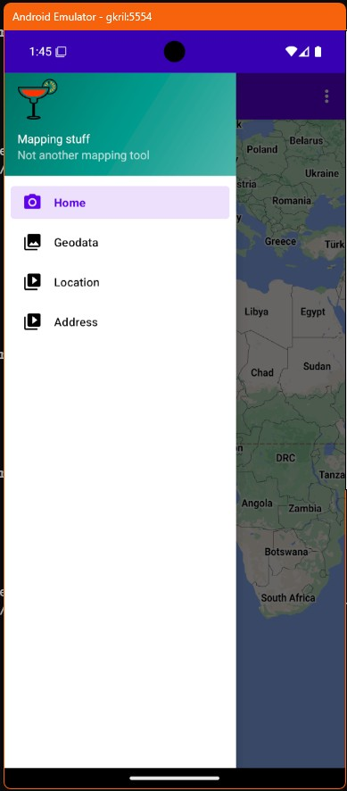

# Aplicatie care prezinta diferse utilizari ale hartilor

Aplicatia este un alt exemplu de navigatie pe fragmente in care meniul nu este la baza ecranului ci este un panou rulant in stanga.  





## Structura aplicatiei

```sh
akrilki_05/
├── app
│   ├── build.gradle
│   ├── proguard-rules.pro
│   └── src
│       └── main
│           ├── AndroidManifest.xml
│           ├── java
│           │   └── ro
│           │       └── makore
│           │           └── akrilki_05
│           │               ├── MainActivity.java
│           │               └── ui
│           │                   ├── address
│           │                   │   └── AddressFragment.java
│           │                   ├── geodata
│           │                   │   └── GeodataFragment.java
│           │                   ├── home
│           │                   │   └── HomeFragment.java
│           │                   └── location
│           │                       └── LocationFragment.java
│           └── res
│               ├── drawable
│               │   ├── ic_cocktail_color.xml
│               │   ├── ic_menu_address.xml
│               │   ├── ic_menu_camera.xml
│               │   ├── ic_menu_geodata.xml
│               │   ├── ic_menu_location.xml
│               │   └── side_nav_bar.xml
│               ├── layout
│               │   ├── activity_main.xml
│               │   ├── app_bar_main.xml
│               │   ├── content_main.xml
│               │   ├── fragment_address.xml
│               │   ├── fragment_geodata.xml
│               │   ├── fragment_home.xml
│               │   ├── fragment_location.xml
│               │   └── nav_header_main.xml
│               ├── menu
│               │   ├── activity_main_drawer.xml
│               │   └── main.xml
│               ├── navigation
│               │   └── mobile_navigation.xml
│               └── values
│                   ├── colors.xml
│                   ├── dimens.xml
│                   ├── strings.xml
│                   └── themes.xml
├── build.gradle
├── gradle.properties
└── settings.gradle
```