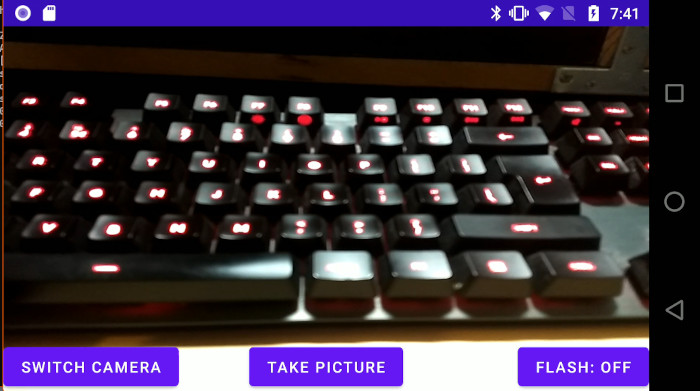
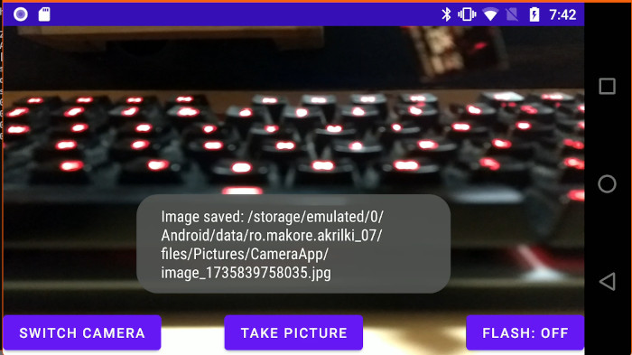

<!-- TOC -->

- [Structura aplicației](#structura-aplicației)
  - [MainActivity.java](#mainactivityjava)
  - [layout](#layout)

<!-- /TOC -->
<!-- /TOC -->


Aceasta este o aplicație simplă care demonstrează interacțiunea cu camera unui dispozitiv Android. Aplicația are trei butoane, 

- **btnSwitchCamera** care determină schimbarea între cele două camere (față - spate)
- **btnTakePicture** face o fotografie și o salvează într-un fișier.
- **btnFlashMode** modifică modul flashului (On, Auto, Off)


 Implementarea are un singur fișier (o singură activitate)

În Android, accesul la cameră se face prin intermediul mai multor API-uri care permit dezvoltatorilor să acceseze și să controleze camera dispozitivului. Există două seturi principale de API-uri pentru accesarea camerei: Camera API și Camera2 API. În plus, există și cameraX - un API suplimentar construit peste Camera2. 

**Camera:** Acesta este API-ul original pentru accesarea camerei, disponibil în versiunile anterioare de Android (până la Android 5.0 - Lollipop). Permite captarea de imagini și videoclipuri, setarea diverselor parametri ai camerei (cum ar fi expunerea, focalizarea, etc.), și vizualizarea fluxului video pe un SurfaceView.

**Camera2:** Introducerea în Android 5.0 (Lollipop), Camera2 API oferă un control mai detaliat și mai flexibil asupra camerei, permițând accesul la caracteristici avansate, cum ar fi setarea manuală a expunerii, controlul focalizării, etc. Este mult mai puternic și mai flexibil decât Camera API-ul vechi dar semnificativ mai complicat de utilizat.

**CameraX** Este un API de nivel înalt introdus în Android pentru a simplifica utilizarea camerei. Este un API ușor de utilizat care este construit pe baza Camera2 API, dar cu o interfață mult mai simplă. Scopul său este de a ajuta dezvoltatorii să creeze aplicații de cameră compatibile cu o gamă largă de dispozitive Android.





## Structura aplicației

```sh
akrilki_07
    └───app
        └───src
            └───main
                ├───java
                │   └───ro
                │       └───makore
                │           └───akrilki_07
                └───res
                    ├───drawable
                    ├───layout
                    └───values
```

### MainActivity.java


SurfaceView este un component specializat care permite redarea de conținut, cum ar fi video, animații sau grafice complexe. Spre deosebire de vizualizările standard, care sunt desenate pe threadul principal, SurfaceView permite redarea conținutului pe un thread separat. Este folosit atunci pentru afișarea conținutului video în timp real sau a animațiilor și este de asemene utilizat pentru a deschide preview-ul camerei.

SurfaceHolder este o interfață pentru SurfaceView. Aceasta oferă metode pentru a controla suprafața.

```java

public class MainActivity extends AppCompatActivity {
    
    private Camera camera;
    private int currentCameraId = 0; // 0 = back camera, 1 = front camera
    private Camera.Parameters parameters;
    private SurfaceView surfaceView;
    private SurfaceHolder surfaceHolder;
    private static final int CAMERA_PERMISSION_CODE = 100;    
    private boolean isSurfaceReady = false; // Track surface readiness
    private boolean isPermissionRequested = false; // Track if permissions were just requested

    private Button btnSwitchCamera, btnTakePicture, btnFlashMode;
    
    @Override
```


```java
    protected void onCreate(Bundle savedInstanceState) {
        super.onCreate(savedInstanceState);
        setContentView(R.layout.activity_main);
```
Blocul de cod următor verifică dacă dispozitivul rulează Android 6.0 (Marshmallow) sau o versiune mai nouă și, dacă permisiunea pentru cameră nu a fost acordată, o solicită utilizatorului. Dacă dispozitivul are o versiune compatibilă, se verifică dacă permisiunea CAMERA este acordată. Dacă nu este, se cere permisiunea folosind requestPermissions.

Solicitarea permisiunilor în timpul rulării aplicației a fost introdusă în versiunea 6.0 de Android (Marshmallow) - versiune indicată de constanta Build.VERSION_CODES.M. Alte constante sunt, de exemplu: 

 - Build.VERSION_CODES.KITKAT (API level 19) - Android 4.4
 - Build.VERSION_CODES.LOLLIPOP (API level 21-22) - Android 5.0 - 5.1
 - Build.VERSION_CODES.M (API level 23) - Android 6.0 (Marshmallow)
 - Build.VERSION_CODES.N (API level 24) - Android 7.0 (Nougat)
 - Build.VERSION_CODES.O (API level 26) - Android 8.0 (Oreo)

```java
        if (Build.VERSION.SDK_INT >= Build.VERSION_CODES.M) {
            if (checkSelfPermission(android.Manifest.permission.CAMERA) != PackageManager.PERMISSION_GRANTED) {
                requestPermissions(new String[]{android.Manifest.permission.CAMERA}, 100);
            }
        }

```

În continuare se construiesc referințe ale componentelor de interfață.

```java
        btnSwitchCamera = findViewById(R.id.btnSwitchCamera);
        btnTakePicture = findViewById(R.id.btnTakePicture);
        btnFlashMode = findViewById(R.id.btnFlashMode);
        surfaceView = (SurfaceView)this.findViewById(R.id.surface_view);
```

Acest cod gestionează previzualizarea camerei pe un SurfaceView, prin intermediul interfeței surfaceHolder. SurfaceNew nu poate fi accesată direct, interacțiunea se face prin adăugarea unui SurfaceHolder.Callback care răspunde la evenimentele suprafeței (creare, schimbare, distrugere). Callbackul implementează o serie de metode: 


**surfaceCreated(SurfaceHolder holder)**: Când suprafața este creată, se deschide camera și se începe previzualizarea dacă permisiunile sunt acordate.

**surfaceChanged(SurfaceHolder holder, int format, int width, int height)**: Când suprafața se schimbă, se oprește previzualizarea camerei, se setează noua suprafață și se repornește previzualizarea.

**surfaceDestroyed(SurfaceHolder holder)**: Când suprafața este distrusă, se oprește camera pentru a elibera resursele.

```java
        surfaceHolder = surfaceView.getHolder(); 

        surfaceHolder.addCallback(new SurfaceHolder.Callback() {
            @Override
            public void surfaceCreated(@NonNull SurfaceHolder holder) {
                isSurfaceReady = true;
                if (hasCameraPermission()) {
                    openCamera(currentCameraId);
                }
            }

            @Override
            public void surfaceChanged(@NonNull SurfaceHolder holder, int format, int width, int height) {
                if (camera != null) {
                    camera.stopPreview();
                    try {
                        camera.setPreviewDisplay(holder);
                        camera.startPreview();
                    } catch (Exception e) {
                        Toast.makeText(MainActivity.this, "Error restarting camera preview: " + e.getMessage(), Toast.LENGTH_LONG).show();
                    }
                }
            }

            @Override
            public void surfaceDestroyed(@NonNull SurfaceHolder holder) {
                isSurfaceReady = false;
                stopCamera();
            }
        });
```
In continuare, conectăm metodele care vor fi apelate la click pe cele trei butoane din interfața de comandă.

```java
        btnSwitchCamera.setOnClickListener(v -> switchCamera());
        btnTakePicture.setOnClickListener(v -> takePicture());
        btnFlashMode.setOnClickListener(v -> toggleFlashMode());
        
    }
```

Este preferabilă pornirea camerei în metoda onResume() care este apelată atunci când activitatea devine vizibilă și capabilă de interacțiuni, asigurându-se că resursele, cum ar fi suprafața pentru previzualizarea camerei și permisiunile necesare, sunt disponibile.

onCreate() este utilizată pentru inițializări generale și nu garantează că suprafața este gata sau că permisiunile au fost acordate. 

```java
    @Override
    protected void onResume()
    {
        super.onResume(); 
        if (!hasCameraPermission() && !isPermissionRequested) {
            // Request permissions
            isPermissionRequested = true;
            ActivityCompat.requestPermissions(this, new String[]{Manifest.permission.CAMERA}, CAMERA_PERMISSION_CODE);
        } else if (hasCameraPermission() && isSurfaceReady) {
            // Start the camera if permissions are already granted
            openCamera(currentCameraId);
        }
    }
```

Returnează True dacă permisiunile au fost deja acordate.

```java
    private boolean hasCameraPermission() {
        return ContextCompat.checkSelfPermission(this, Manifest.permission.CAMERA) == PackageManager.PERMISSION_GRANTED;
    }
```

Această metodă pornește camera și setează starea flashului. Primește ca argument cameraId. Aceasta este setată cu ajutorul butonului btnSwitchCamera. La instanțierea activității aceasta este setată pe 0 (camera din spate): private int currentCameraId = 0;

```java
    private void openCamera(int cameraId) {
        try {
            // Release the previous camera if exists
            if (camera != null) {
                camera.stopPreview();
                camera.release();
            }

            // Open the selected camera (0 for back camera, 1 for front camera)
            camera = Camera.open(cameraId);
            Camera.Parameters params = camera.getParameters();

            if (isFlashSupported()) {
                updateFlashButtonText();
            }

            camera.setParameters(params);
            camera.setPreviewDisplay(surfaceHolder);
            camera.startPreview();
        } catch (Exception e) {
            e.printStackTrace();
            Toast.makeText(this, "Failed to open camera", Toast.LENGTH_SHORT).show();
        }
    }
```

Următoarea metodă modifică textul butonului btnFlashMode. Acesta este singurul buton al cărui text se modifică în timpul rulării programului. Această metodă este apelată de metoda **toggleFlashMode** care este declanșată la apăsarea butonului btnFlashMode. 

Metoda interoghează camera obținând parametrii acesteia (printre care se află și FlashMode) și în funcție de conținutul acesteia modifică textul butonului.

```java
    private void updateFlashButtonText() {
        if (camera != null) {
            Camera.Parameters params = camera.getParameters();
            String currentMode = params.getFlashMode();
    
            // Set button text based on current mode
            if (Camera.Parameters.FLASH_MODE_OFF.equals(currentMode)) {
                btnFlashMode.setText("Flash: Off");
            } else if (Camera.Parameters.FLASH_MODE_AUTO.equals(currentMode)) {
                btnFlashMode.setText("Flash: Auto");
            } else if (Camera.Parameters.FLASH_MODE_ON.equals(currentMode)) {
                btnFlashMode.setText("Flash: On");
            }
        }
    }

```

Această funcție schimbă camera. API-ul folosit de acest program a fost conceput pentru modelele de dispozitive cu două camere (spate și față) - motiv pentru care id-ul camerei este un număr întreg. 

```java

    private void switchCamera() {
        currentCameraId = (currentCameraId == 0) ? 1 : 0; // Toggle between front and back
        openCamera(currentCameraId);
    }
```   

takePicture este metoda care declansează procesul de fotografiere propriu-zis. Aceasta se face prin apelarea metodei cu același nume a instanței camerei: 

**camera.takePicture(null, null, (data, camera) -> { ... }): **

 - Primul parametru (null) reprezintă un obiect de tip ShutterCallback, care ar fi folosit pentru a implementa un sunet personalizat sau o acțiune atunci când declanșatorul camerei este apăsat. 

 - Al doilea parametru (null) reprezintă un obiect de tip PictureCallback, care ar fi folosit pentru a manipula imaginea imediat după ce este capturată (cum ar fi procesarea imaginii înainte de a o salva). 

 - Al treilea parametru este un obiect de tip PictureCallback, care primește datele imaginii capturate în formatul byte[] și obiectul camera ca argumente. Acesta este folosit pentru a salva imaginea și pentru a reporni previzualizarea camerei.

**saveImage(data):** Aici, data reprezintă datele imaginii capturate sub formă de tablou de octeți (byte[]). Aceste date sunt trimise către metoda saveImage() pentru a fi salvate pe dispozitivul utilizatorului.

**camera.startPreview():** După ce fotografia a fost capturată și salvată, camera reîncepe fluxul de previzualizare, permițând utilizatorului să vadă din nou ce captează camera.

```java
    private void takePicture() {
        if (camera != null) {
            Camera.Parameters params = camera.getParameters();
            String currentFlashMode = params.getFlashMode();

            if (Camera.Parameters.FLASH_MODE_ON.equals(currentFlashMode)) {
                params.setFlashMode(Camera.Parameters.FLASH_MODE_ON);
            } else {
                params.setFlashMode(Camera.Parameters.FLASH_MODE_OFF);
            }
            camera.setParameters(params);

            new android.os.Handler(Looper.getMainLooper()).postDelayed(() -> {
                camera.takePicture(null, null, (data, camera) -> {
                    saveImage(data); // Save the image data
                    camera.startPreview(); // Restart the preview
                });
            }, 200); 
        }
    }
```

Această funcție modifică starea flashului cu ajutorul metodei camera.setParameters(params). Funcția ciclează între AUTO, ON și OFF. 

```java
    private void toggleFlashMode() {
        if (camera != null && isFlashSupported()) {
            Camera.Parameters params = camera.getParameters();
            String currentMode = params.getFlashMode();
            String nextMode;
    
            // Cycle through flash modes
            if (Camera.Parameters.FLASH_MODE_OFF.equals(currentMode)) {
                nextMode = Camera.Parameters.FLASH_MODE_AUTO;
            } else if (Camera.Parameters.FLASH_MODE_AUTO.equals(currentMode)) {
                nextMode = Camera.Parameters.FLASH_MODE_ON;
            } else {
                nextMode = Camera.Parameters.FLASH_MODE_OFF;
            }
    
            camera.stopPreview();

            // Set the new flash mode
            params.setFlashMode(nextMode);
            camera.setParameters(params);
    
            camera.startPreview();
            // Update button text
            updateFlashButtonText();
        } else {
            Toast.makeText(this, "Flash not supported", Toast.LENGTH_SHORT).show();
        }
    }
```

Metoda retunează True dacă dispozitivul suportă flash prin interogarea parametrilor camerei.

```java
    private boolean isFlashSupported() {
        if (camera != null) {
            Camera.Parameters params = camera.getParameters();
            List<String> supportedModes = params.getSupportedFlashModes();
            return supportedModes != null && !supportedModes.isEmpty();
        }
        return false;
    }
```

Această metodă face parte din metodele standard ale activității in Android și se execută când activitatea este pusă pe pauză. În această situație camera trebuie oprită pentru a nu rămâne blocată. 

```java
    @Override
    protected void onPause() {
        super.onPause();
        if (camera != null) {
            camera.stopPreview();
            camera.release();
            camera = null;
        }
    }
```

saveImage este o metodă care preia imaginea de la cameră și o salvează într-un fișier. Imaginea va fi salvată într-un director asociat aplicației - dependent de sistem dar de forma: `/storage/emulated/0/Android/data/ro.makore.akrilki_07/files/Pictures/` la care se adaugă subdirectorul CameraApp. 

Dacă directorul nu există, acesta este creat. Fiecare imagine va fi salvată cu un nume de fișier compus din particula "image" la care se adaugă un timestamp la nivel de milisecunde in format epoch. Rezultatul operației este afișat într-un mesaj folosind obiectul Toast. 

```java
    private void saveImage(byte[] data) {
        FileOutputStream fos = null;
        try {
            // Use getExternalFilesDir to store the image in the app's external directory
            File directory = new File(getExternalFilesDir(Environment.DIRECTORY_PICTURES), "CameraApp");
            if (!directory.exists()) {
                directory.mkdirs(); // Create the directory if it doesn't exist
            }
    
            // Create a unique file name
            String fileName = "image_" + System.currentTimeMillis() + ".jpg";
            File pictureFile = new File(directory, fileName);
    
            // Save the image to the file
            fos = new FileOutputStream(pictureFile);
            fos.write(data);
            fos.flush();
    
            Toast.makeText(this, "Image saved: " + pictureFile.getAbsolutePath(), Toast.LENGTH_SHORT).show();
        } catch (IOException e) {
            e.printStackTrace();
            Toast.makeText(this, "Failed to save image", Toast.LENGTH_SHORT).show();
        } finally {
            if (fos != null) {
                try {
                    fos.close();
                } catch (IOException e) {
                    e.printStackTrace();
                }
            }
        }
    }

```

Metoda stopCamera este apelată de callbackul înregistrat în surfaceHolder, metoda surfaceDestroy executată în cazul în care componentul de tip surfaceView este închis .

```java

    private void stopCamera() {
        if (camera != null) {
            camera.stopPreview();
            camera.release();
            camera = null;
        }
    }
```
**onRequestPermissionsResult** este apelată atunci când utilizatorul răspunde la o cerere de permisiune pe care a făcut-o aplicația. Este o metodă a Android API, care se activează atunci când dialogul de permisiune este închis (fie prin acordarea permisiunii, fie prin refuzarea acesteia).

```java
    @Override
    public void onRequestPermissionsResult(int requestCode, String[] permissions, int[] grantResults) {
        super.onRequestPermissionsResult(requestCode, permissions, grantResults);
        if (requestCode == 100) {
            if (grantResults.length > 0 && grantResults[0] == PackageManager.PERMISSION_GRANTED) {
                // Permission granted, initialize the camera
                openCamera(currentCameraId);
            } else {
                Toast.makeText(this, "Camera permission denied", Toast.LENGTH_SHORT).show();
            }
        }
    }
}

```

### layout

Layout-ul conține un component de tip surfaceView care va primi imaginea live de la cameră, împreună cu cele trei butoane de control al flashului, al camerei principale si al procesului de fotografiere. 

```xml
<?xml version="1.0" encoding="utf-8"?>
<RelativeLayout xmlns:android="http://schemas.android.com/apk/res/android"
    android:layout_width="match_parent"
    android:layout_height="match_parent">

    <SurfaceView
        android:id="@+id/surface_view"
        android:layout_width="match_parent"
        android:layout_height="match_parent" />

    <Button
        android:id="@+id/btnSwitchCamera"
        android:layout_width="wrap_content"
        android:layout_height="wrap_content"
        android:text="Switch Camera"
        android:layout_alignParentBottom="true"
        android:layout_alignParentLeft="true" />

    <Button
        android:id="@+id/btnTakePicture"
        android:layout_width="wrap_content"
        android:layout_height="wrap_content"
        android:text="Take Picture"
        android:layout_alignParentBottom="true"
        android:layout_centerHorizontal="true" />

    <Button
        android:id="@+id/btnFlashMode"
        android:layout_width="wrap_content"
        android:layout_height="wrap_content"
        android:text="Flash Mode"
        android:layout_alignParentBottom="true"
        android:layout_alignParentRight="true" />
</RelativeLayout>

```
